A modern, C++17-native, single-file header-only dense 2D matrix library.

### Contents

- [Example usage](#example-usage)
    + [creating matrices](#creating-matrices)
    + [basic operations](#basic)
      + [row, col, size, shape, clear](#create-row-col-size-shape-clear)
      + [element access](#element-access-using-operator--or-operator-)
      + [range based for](#range-based-for-access)
      + [copy, resize, reshape](#copying-resizing-and-reshaping)
      + [slicing](#matrix-slicing)
   + [built-in functions](#functions)
     - [clone -- matrix slicing](#clone----matrix-slicing)
     - [astype -- converting matrix value type](#astype)
     - [data -- accessing raw memory](#data----raw-memory-access)
     - [det -- matrix determinant](#det----matrix-determinant)
     - [operator `/=`](#operator-divide-equal)
     - [inverse](#matrix-inverse)
     - [save matrix to images with colormap](#save-matrix-to-images-with-colormap)
     - [save/load bmp](#save-load-bmp)
     - [save/load](#save-load)
     - [plot](#plot)
     - [minus equal](#operator-minus-equal)
     - [multiply equal](#operator-multiply-equal)
     - [plus equal](#operator-plus-equal)
     - [prefix](#operator-prefix)
     - MORE TODO
   + [Common mathematical functions -- elementwise](#elementwise-mathematical-functions)
     - [elementwise sin](#elementwise-sin)
     - [elementwise sinh](#elementwise-sinh)
   + [Common functions](#common-functions)
     - [eye](#eye-function)
     - [linspace](#linspace)
     - [magic](#magic-function)
     - [matrix convolution](#matrix-convolution)
     - [make_view](#make-view-function)
     - [lu_decomposition](#lu-decomposition)
     - [guass_jordan_elimination](#gauss-jordan-elimination)
     - [singular_value_decomposition](#singular-value-decomposition)
     - [pooling](#pooling)
     - [meshgrid](#meshgrid)
     - [arange](#arange)
     - [clip](#clip)
    + [iterations](#iterations)
      - [element-wise apply](#elementwise-apply)
      - [head->tail iteration](#iteration-from-head-to-tail)
      - [tail->head iteration](#iteration-from-tail-to-head)
      - [row iteration](#iteration-through-a-selected-row)
      - [reversed row iteration](#reverse-iteration-through-a-selected-row)
      - [column iteration](#iteration-through-a-selected-column)
      - [reversed column iteration](#reverse-iteration-through-a-selected-column)
      - [diagonal iteration](#iteration-through-diagonal)
      - [reversed diagonal iteration](#reverse-iteration-through-diagonal)
      - [upper diagonal iteration](#iteration-through-upper-diagonal)
      - [reversed upper diagonal iteration](#reverse-iteration-through-upper-diagonal)
      - [lower diagonal iteration](#iteration-through-lower-diagonal)
      - [reversed lower diagonal iteration](#reverse-iteration-through-lower-diagonal)
      - [anti-diagonal iteration](#iteration-through-anti-diagonal)
      - [reversed anti-diagonal iteration](#reverse-iteration-through-anti-diagonal)
      - [upper anti-diagonal iteration](#iterator-through-upper-anti-diagonal)
      - [reversed upper anti-diagonal iteration](#reverse-iteration-through-upper-anti-diagonal)
      - [lower anti-diagonal iteration](#iteration-through-lower-anti-diagonal)
      - [reversed lower anti-diagonal iteration](#reverse-iteration-through-lower-anti-diagonal)


- [License](#license)
- [Dependency](#dependency)
- [Installation](#installation)
- [Building tests and examples](#building-tests-and-examples)
- [Notes and references](#notes-and-references)
+ [Design](#esign)
    - [Requirements](#requirements)
    - [Synopsis](#header-matrix-synopsis)

------

## Example usage

#### including the header file

```cpp
//your_source_code.cpp
#include "matrix.hpp"
```

#### typical compile and link command

```bash
g++ -o your_exe_file your_source_code.cpp -std=c++17 -O2 -pthread -lstdc++fs
```

Please note [`std::thread`](https://en.cppreference.com/w/cpp/header/thread) is enabled by default, and option `-pthread` is necesary under Linux/Unix/Mac platform. If you prefer single thread mode, pass `-DNPARALLEL` option to compiler.
Please also [`std::filesystem`](https://en.cppreference.com/w/cpp/filesystem/path) is used,  make sure corresponding library option is passed during link time.

### basic

#### creating matrices

+ generating matrix

    - creating a matrix of size `12 X 34`:

    ```cpp
    feng::matrix<double> m{ 12, 34 };
    ```
    - creating a random matrix of size `12 X 34`, in range `[0.0, 1.0]`:

    ```cpp
    auto rand = feng::rand<double>(12, 34);
    ```

    - creating a matrix of size `12 X 34`, with all elements to be `0`:

    ```cpp
    auto zero = feng::zeros<double>(12, 34);
    ```
    - creating a matrix of size `12 X 34`, with all elements to be `1`:

    ```cpp
    auto one = feng::ones<double>(12, 34);
    ```

    - and `ones_like`:

    ```cpp
    auto another_one = feng::ones_like( one );
    ```

    - creating a matrix of size `12 X 34`, with all elements to be uninitialized:
    ```cpp
    auto one = feng::empty<double>(12, 34);
    ```

    - creating a matrix of size `1 X (12*34)`, with all elements from `0` to `12x34`, then reshape to `12 X 34`:
    ```cpp
    auto one = feng::arange<double>(12*34);
    one.reshape( 12, 34 );
    ```

    - loading matrix from a local txt file `./mat.txt`, the delimiter can be either of ` `, `,`, `\t` or `;`, the line end is `\n`:

    ```cpp
    feng::matrix<double> mat;
    mat.load_txt( './mat.txt' );
    ```

+ others
     - [eye](#eye-function)
     - [magic](#magic-function)


#### create, row, col, size, shape, clear

```cpp
feng::matrix<double> m{ 64, 256 };
m.save_as_bmp( "./images/0002_create.bmp" );

assert( m.row() == 64 );
assert( m.col() == 256 );
assert( m.size() == m.row() * m.col() );

auto const [r,c] = m.shape();
assert( r == m.row() );
assert( c == m.col() );

m.clear();
assert( 0 == m.row() );
assert( 0 == m.col() );
```


------

### element access using `operator []` or `operator ()`

```cpp
feng::matrix<double> m{ 64, 256 };
for ( auto r = 12; r != 34; ++r )
    for ( auto c = 34; c != 45; ++c )
        m[r][c] = 1.0;

for ( auto r = 34; r != 45; ++r )
    for ( auto c = 123; c != 234; ++c )
        m(r, c) = -1.0;

m.save_as_bmp( "./images/0019_create.bmp" );
```


----------


#### range-based for access

```cpp
feng::matrix<double> m{ 64, 256 };
int starter = 0;
double const keys[] = { 1, 2, 3, 4, 5, 6, 7, 8 };
for ( auto& x : m )
{
    int val = starter++ & 0x7;
    x = keys[val];
}
m.save_as_bmp( "./images/0000_access.bmp" );
```

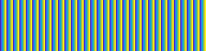

-------------------------

#### copying, resizing and reshaping

```cpp
feng::matrix<double> m{ 64, 256 };
for ( auto r = 12; r != 34; ++r )
    for ( auto c = 12; c != 34; ++c )
        m[r][c] = 1.0;
m.save_as_bmp( "./images/0020_create.bmp" );
```

created matrix m:


```cpp
feng::matrix<double> n = m; //copying
n.save_as_bmp( "./images/0021_create.bmp" );
```

copied matrix n:


```cpp
n.resize( 63, 244 );
n.save_as_bmp( "./images/0022_create.bmp" );
```

resized matrix n:


```cpp
m.reshape( m.col(), m.row() );
m.save_as_bmp( "./images/0023_create.bmp" );
```

reshaped matrix m:


----------

#### matrix slicing

```cpp
feng::matrix<double> m{ 64, 256 };
std::fill( m.upper_diag_begin(1), m.upper_diag_end(1), 1.0 );
std::fill( m.diag_begin(), m.diag_end(), 1.0 );
std::fill( m.lower_diag_begin(1), m.lower_diag_end(1), 1.0 );
m.save_as_bmp( "./images/0000_slicing.bmp" );
```


```cpp
feng::matrix<double> n{ m, 0, 32, 0, 64 };
n.save_as_bmp( "./images/0001_slicing.bmp" );
```


```cpp
feng::matrix<double> p{ m, {16, 48}, {0, 64} };
p.save_as_bmp( "./images/0002_slicing.bmp" );
```


#### meshgrid

meshgrid returns 2-D grid coordinates based on the coordinates contained in interger x and y.

```cpp
auto const& [X, Y] = feng::meshgrid( 3, 5 );
std::cout << X << std::endl;
std::cout << Y << std::endl;
```

This will produce

```
0       1       2
0       1       2
0       1       2
0       1       2
0       1       2

0       0       0
1       1       1
2       2       2
3       3       3
4       4       4
```

while the code below

```cpp
auto const& [X, Y] = feng::meshgrid( 384, 512 );
X.save_as_bmp( "./images/0000_meshgrid_x.bmp", "grey" );
Y.save_as_bmp( "./images/0000_meshgrid_y.bmp", "grey" );
```

generates two images


#### arange

```cpp
arange<Type>([start, ]stop, [step, ])
```

Return evenly spaced row matrix within a given interval.

```cpp
auto m = feng::arange<double>( 256*256 );
m.reshape( 256, 256 );
m.save_as_bmp( "./images/0000_arange.bmp" );
```


#### clip

For an normal matrix `m`

```cpp
    feng::matrix<double> m{ 64, 256 };
    std::generate( m.begin(), m.end(),  [](){ double init = 0.0; return [init]() mutable { init += 0.1; return init; }; }() );
    m.save_as_bmp( "./images/0000_clip.bmp" );
```


it can be transformed to range `[0, 1]` by applying `sin` on it

```cpp
    m = feng::sin(m);
    m.save_as_bmp( "./images/0001_clip.bmp" );
```


then this matrix can be clipped to range `[0.1, 0.9]`

```cpp
    auto const& cm0 = feng::clip( 0.1, 0.9 )( m );
    cm0.save_as_bmp( "./images/0002_clip.bmp" );
```


or even to range `[0.4, 0.6]`

```cpp
    auto const& cm1 = feng::clip( 0.4, 0.6 )( m );
    cm1.save_as_bmp( "./images/0003_clip.bmp" );
```


----------------------------------------


### iterations


#### elementwise apply

```cpp
feng::matrix<double> m{ 64, 256 };
std::generate( m.begin(), m.end(),  [](){ double init = 0.0; return [init]() mutable { init += 0.1; return init; }; }() );
m.save_as_bmp( "./images/0000_apply.bmp" );
```

before apply:


```cpp
m.apply( [](auto& x) { x = std::sin(x); } );
m.save_as_bmp( "./images/0001_apply.bmp" );
```

after apply:


---------------------

#### iteration from head to tail

```cpp
feng::matrix<double> m{ 64, 256 };
std::generate( m.begin(), m.end(),  [](){ double init = 0.0; return [init]() mutable { init += 0.1; return init; }; }() );
m.save_as_bmp( "./images/0000_create.bmp" );
```


------
#### iteration from tail to head

```cpp
feng::matrix<double> m{ 64, 256 };
std::generate( m.rbegin(), m.rend(),  [](){ double init = 0.0; return [init]() mutable { init += 0.1; return init; }; }() );
m.save_as_bmp( "./images/0006_create.bmp" );
```


------
#### iteration through a selected row

```cpp
feng::matrix<double> m{ 64, 256 };
std::generate( m.row_begin(17), m.row_end(17),  [](){ double init = 0.0; return [init]() mutable { init += 0.1; return init; }; }() );
m.save_as_bmp( "./images/0001_create.bmp" );
```


------
#### reverse iteration through a selected row

```cpp
feng::matrix<double> m{ 64, 256 };
std::generate( m.row_rbegin(17), m.row_rend(17),  [](){ double init = 0.0; return [init]() mutable { init += 0.1; return init; }; }() );
m.save_as_bmp( "./images/0003_create.bmp" );
```


------
#### iteration through a selected column

```cpp
feng::matrix<double> m{ 64, 256 };
std::generate( m.col_begin(17), m.col_end(17),  [](){ double init = 0.0; return [init]() mutable { init += 0.1; return init; }; }() );
m.save_as_bmp( "./images/0004_create.bmp" );

```


------
#### reverse iteration through a selected column

```cpp
feng::matrix<double> m{ 64, 256 };
std::generate( m.col_rbegin(17), m.col_rend(17),  [](){ double init = 0.0; return [init]() mutable { init += 0.1; return init; }; }() );
m.save_as_bmp( "./images/0003_create.bmp" );
```


------
#### iteration through diagonal

```cpp
feng::matrix<double> m{ 64, 256 };
std::generate( m.diag_begin(), m.diag_end(),  [](){ double init = 0.0; return [init]() mutable { init += 0.1; return init; }; }() );
m.save_as_bmp( "./images/0011_create.bmp" );
```


------
#### reverse iteration through diagonal

```cpp
feng::matrix<double> m{ 64, 256 };
std::generate( m.diag_rbegin(), m.diag_rend(),  [](){ double init = 0.0; return [init]() mutable { init += 0.1; return init; }; }() );
m.save_as_bmp( "./images/0012_create.bmp" );
```


------
#### iteration through upper diagonal

```cpp
feng::matrix<double> m{ 64, 256 };
std::generate( m.upper_diag_begin(17), m.upper_diag_end(17),  [](){ double init = 0.0; return [init]() mutable { init += 0.1; return init; }; }() );
m.save_as_bmp( "./images/0007_create.bmp" );
```


------
#### reverse iteration through upper diagonal

```cpp
feng::matrix<double> m{ 64, 256 };
std::generate( m.upper_diag_rbegin(17), m.upper_diag_rend(17),  [](){ double init = 0.0; return [init]() mutable { init += 0.1; return init; }; }() );
m.save_as_bmp( "./images/0008_create.bmp" );
```


------

#### iteration through lower diagonal

```cpp
feng::matrix<double> m{ 64, 256 };
std::generate( m.lower_diag_begin(17), m.lower_diag_end(17),  [](){ double init = 0.0; return [init]() mutable { init += 0.1; return init; }; }() );
m.save_as_bmp( "./images/0009_create.bmp" );
```


------
#### reverse iteration through lower diagonal

```cpp
feng::matrix<double> m{ 64, 256 };
std::generate( m.lower_diag_rbegin(17), m.lower_diag_rend(17),  [](){ double init = 0.0; return [init]() mutable { init += 0.1; return init; }; }() );
m.save_as_bmp( "./images/0010_create.bmp" );
```


------


#### iteration through anti diagonal

```cpp
feng::matrix<double> m{ 64, 256 };
std::generate( m.anti_diag_begin(), m.anti_diag_end(),  [](){ double init = 0.0; return [init]() mutable { init += 0.1; return init; }; }() );
m.save_as_bmp( "./images/0017_create.bmp" );
```


------

#### reverse iteration through anti diagonal

```cpp
feng::matrix<double> m{ 64, 256 };
iag_rbegin(), m.anti_diag_rend(),  [](){ double init = 0.0; return [init]() mutable { init += 0.1; return init; }; }() );
m.save_as_bmp( "./images/0018_create.bmp" );
```


------

#### iterator through upper anti diagonal


```cpp
feng::matrix<double> m{ 64, 256 };
std::generate( m.upper_anti_diag_begin(17), m.upper_anti_diag_end(17),  [](){ double init = 0.0; return [init]() mutable { init += 0.1; return init; }; }() );
m.save_as_bmp( "./images/0013_create.bmp" );
```


------

#### reverse iteration through upper anti diagonal

```cpp
feng::matrix<double> m{ 64, 256 };
std::generate( m.upper_anti_diag_rbegin(17), m.upper_anti_diag_rend(17),  [](){ double init = 0.0; return [init]() mutable { init += 0.1; return init; }; }() );
m.save_as_bmp( "./images/0014_create.bmp" );
```


------

#### iteration through lower anti diagonal

```cpp
feng::matrix<double> m{ 64, 256 };
std::generate( m.lower_anti_diag_begin(17), m.lower_anti_diag_end(17),  [](){ double init = 0.0; return [init]() mutable { init += 0.1; return init; }; }() );
m.save_as_bmp( "./images/0015_create.bmp" );
```


------

#### reverse iteration through lower anti diagonal

```cpp
feng::matrix<double> m{ 64, 256 };
std::generate( m.lower_anti_diag_rbegin(17), m.lower_anti_diag_rend(17),  [](){ double init = 0.0; return [init]() mutable { init += 0.1; return init; }; }() );
m.save_as_bmp( "./images/0016_create.bmp" );
```


------

### functions

#### clone -- matrix slicing


```cpp
feng::matrix<double> m{ 64, 256 };
std::fill( m.diag_begin(), m.diag_end(), 1.1 );
m.save_as_bmp( "./images/0000_clone.bmp" );
```

matrix m:


```cpp
auto n = m.clone( 0, 32, 0, 64 );
n.save_as_bmp( "./images/0001_clone.bmp" );
```

m slicing of [0:32, 0:64]:


```cpp
n.clone( m, 32, 64, 0, 64 );
n.save_as_bmp( "./images/0002_clone.bmp" );
```

m slicing of [32:64, 0:64]:


#### astype

For a normal matrix such like

```cpp
feng::matrix<double> m{ 64, 256 };
std::generate( m.begin(), m.end(),  [](){ double init = 0.0; return [init]() mutable { init += 0.1; return std::sin(init); }; }() );
m.save_as_bmp( "./images/0000_astype.bmp" );
```

There are many colors in its visualization.


`astype` can convert it to `3` colors:

```cpp
m = m * 2.0;
auto const& mm = m.astype<int>();
mm.save_as_bmp( "./images/0001_astype.bmp" );
```


-------------------

#### data -- raw memory access

```cpp
feng::matrix<double> m{ 64, 256 };
m.save_as_bmp( "./images/0000_data.bmp" );
```


original matrix


```cpp
auto ptr = m.data();
for (  auto idx = 0UL; idx != m.size(); ++idx )
    ptr[idx] = std::sin( idx*idx*0.1 );
m.save_as_bmp( "./images/0001_data.bmp" );
```

after modification

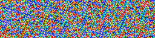


--------------------

#### det -- matrix determinant

```cpp
feng::matrix<double> m{ 128, 128 };
std::generate( m.diag_begin(), m.diag_end(), [](){ double x = 0.9; return [x]() mutable { x+= 0.156; return x; }(); } );
double det1 = m.det();
double det2 = std::accumulate( m.diag_begin(), m.diag_end(), 1.0, []( double x, double y ){ return x*y; } );
std::cout << det1 << "\t:\t" << det2 << std::endl;
```
generated output is
```
1069.00941294551	:	1069.0094129455
```

-------------

#### operator divide-equal

```cpp
auto m = feng::rand<double>( 197, 197 );
auto n = m;
n /= 2.0;
m /= n;
m.save_as_bmp( "images/0000_divide_equal.bmp" );
```


---------------------------------------------

#### matrix inverse

```cpp
auto const& m = feng::rand<double>( 128, 128 );
auto const& n = m.inverse();
auto const& identity = m * n;
identity.save_as_bmp( "./images/0000_inverse.bmp" );
```


----------------------------------------

#### save matrix to images with colormap

Here we demonstrate how to save matrix to images with specified colormap.
There are 18 builtin colormaps:

+ autumn
+ bluehot
+ bone
+ cool
+ copper
+ default
+ gray
+ hotblue
+ hot
+ hsv
+ jet
+ lines
+ obscure
+ parula
+ pink
+ spring
+ summer
+ winter
+ gray

First we load the matrix from a '.txt' file

```cpp
feng::matrix<double> m;
m.load_txt( "./images/Lenna.txt" );
```

Then we can save this matrix to a '.bmp' file with `default` colormap:


``` cpp
m.save_as_bmp( "./images/0000_save_with_colormap_default.bmp" );
```

The `default` image looks like:


```cpp
m.save_as_bmp( "./images/0000_save_with_colormap_parula.bmp", "parula" );
```

The `parula` image looks like:


```cpp
m.save_as_bmp( "./images/0000_save_with_colormap_bluehot.bmp", "bluehot" );
```

The `bluehot` image looks like:


```cpp
m.save_as_bmp( "./images/0000_save_with_colormap_hotblue.bmp", "hotblue" );
```

The `hotblue` image looks like:


```cpp
m.save_as_bmp( "./images/0000_save_with_colormap_jet.bmp", "jet" );
```

The `jet` image looks like:


```cpp
m.save_as_bmp( "./images/0000_save_with_colormap_obscure.bmp", "obscure" );
```

The `obscure` image looks like:


```cpp
m.save_as_bmp( "./images/0000_save_with_colormap_gray.bmp", "gray" );
```

The `gray` image looks like:


```cpp
m.save_as_bmp( "./images/0000_save_with_colormap_hsv.bmp", "hsv" );
```

The `hsv` image looks like:


```cpp
m.save_as_bmp( "./images/0000_save_with_colormap_hot.bmp", "hot" );
```

The `hot` image looks like:


```cpp
m.save_as_bmp( "./images/0000_save_with_colormap_cool.bmp", "cool" );
```

The `cool` image looks like:


```cpp
m.save_as_bmp( "./images/0000_save_with_colormap_spring.bmp", "spring" );
```

The `spring` image looks like:


```cpp
m.save_as_bmp( "./images/0000_save_with_colormap_summer.bmp", "summer" );
```

The `summer` image looks like:


```cpp
m.save_as_bmp( "./images/0000_save_with_colormap_autumn.bmp", "autumn" );
```

The `autumn` image looks like:


```cpp
m.save_as_bmp( "./images/0000_save_with_colormap_winter.bmp", "winter" );
```

The `winter` image looks like:


```cpp
m.save_as_bmp( "./images/0000_save_with_colormap_bone.bmp", "bone" );
```

The `bone` image looks like:


```cpp
m.save_as_bmp( "./images/0000_save_with_colormap_copper.bmp", "copper" );
```

The `copper` image looks like:


```cpp
m.save_as_bmp( "./images/0000_save_with_colormap_pink.bmp", "pink" );
```

The `pink` image looks like:


```cpp
m.save_as_bmp( "./images/0000_save_with_colormap_lines.bmp", "lines" );
```

The `lines` image looks like:

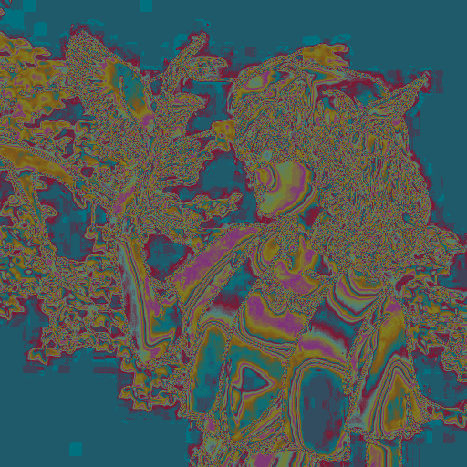


For sparse data such as particles, it is highly recommended to use colormap `bluehot`:

```cpp
feng::matrix<double> m;
m.load_txt( "./images/star.txt" );
m.save_as_bmp( "./images/0001_star_bluehot.bmp", "bluehot" );
```

The starry image generate is demonstrated below:


#### save load

To load an image from a txt file, we can use `.load_txt` method:

```cpp
feng::matrix<double> m;
m.load_txt( "./images/Lenna.txt" );
m.save_as_txt( "./images/0000_save_load.txt" );
m.save_as_binary( "./images/0000_save_load.bin" );
m.save_as_bmp( "./images/0000_save_load.bmp" );
```


The image loaded is


```cpp
feng::matrix<double> n;
n.load_txt( "./images/0000_save_load.txt" );
n.save_as_bmp( "./images/0001_save_load.bmp" );
```

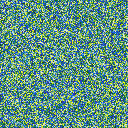

```cpp
n.load_binary( "./images/0000_save_load.bin" );
n.save_as_pgm( "./images/0002_save_load.pgm" );
```


#### save load bmp

To load an image from a bmp file, we can use `feng::load_bmp` function, which will return an oject of type `std::optional<std::array<feng::matrix<std::uint8_t>,3>>`:

```cpp
std::optional<std::array<matrix<std::uint8_t>,3>> load_bmp( std::string const& file_path ) {...}
```

We first generate an image of Lenna:

```cpp
feng::matrix<double> m;
m.load_txt( "./images/Lenna.txt" );
m.save_as_bmp( "./images/Lenna.bmp", "gray" );
```

which looks like:


Then we can try to load it directly:

```
auto const& mat_3 = feng::load_bmp( "./images/Lenna.bmp" );
```

if successfull, ``mat_3` with hold a channel-first image. To access `mat_3` we need to verify it is accessible first by:

```cpp
if ( mat_3 )
{
```


Then we can visualize its red channel:

```cpp
(*mat_3)[0].save_as_bmp( "./images/0001_save_load_julia_red.bmp", "gray" );
```


green channel:


```cpp
(*mat_3)[1].save_as_bmp( "./images/0001_save_load_julia_green.bmp", "gray" );
```


and blue channel:

```cpp
(*mat_3)[2].save_as_bmp( "./images/0001_save_load_julia_blue.bmp", "gray" );
```


#### operator minus equal

```cpp
    feng::matrix<double> image;
    image.load_txt( "images/Lenna.txt" );
    image.save_as_bmp("images/0000_minus_equal.bmp", "gray");
```


```cpp
    double const min = *std::min_element( image.begin(), image.end() );
    image -= min;
    image.save_as_bmp("images/0001_minus_equal.bmp", "jet");
```


```cpp
    image -= image;
    image.save_as_bmp("images/0002_minus_equal.bmp");
```


#### plot

`plot` is an alias name of `save_as_bmp`:

```cpp
feng::matrix<double> m;
m.load_txt( "./images/Lenna.txt" );
m.plot( "./images/0000_plot_default.bmp" );
```


```cpp
m.plot( "./images/0000_plot_jet.bmp", "jet" );
```


#### operator multiply equal

```cpp
auto m = feng::rand( 127, 127 );
m *= m.inverse();
m.save_as_bmp("images/0001_multiply_equal.bmp");
```


#### operator plus equal

```cpp
    feng::matrix<double> image;
    image.load_txt( "images/Lenna.txt" );
    image.save_as_bmp("images/0000_plus_equal.bmp", "gray");
```


```cpp
    double const mn = *std::min_element( image.begin(), image.end() );
    double const mx = *std::max_element( image.begin(), image.end() );
    image = (image - mn)/(mx - mn);

    auto const& noise = feng::rand<double>( image.row(), image.col() );
    image += 0.1*noise;
    image.save_as_bmp("images/0001_plus_equal.bmp", "gray");
```


#### operator prefix

```cpp
auto const& m = feng::random<double>( 127, 127 );
auto const& pp = +m;
auto const& pm = -m;
auto const& shoule_be_zero = pp + pm;
shoule_be_zero.save_as_bmp("images/0000_prefix.bmp");
```


-------------------------------------------

### elementwise mathematical functions

Most [common mathematical functions](http://en.cppreference.com/w/cpp/numeric/math) are supported as elementwise matrix operator. Here only `sin` and `sinh` are demonstrated


#### elementwise sin

```cpp
feng::matrix<double> m{ 64, 256 };
std::generate( m.begin(), m.end(),  [](){ double init = 0.0; return [init]() mutable { init += 0.1; return init; }; }() );
m.save_as_bmp( "./images/0000_sin.bmp" );
```


```cpp
m = feng::sin(m);
m.save_as_bmp( "./images/0001_sin.bmp" );
```
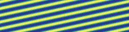

#### elementwise sinh

```cpp
feng::matrix<double> m{ 64, 256 };
std::generate( m.begin(), m.end(),  [](){ double init = 0.0; return [init]() mutable { init += 0.1; return init/500.0; }; }() );
m.save_as_bmp( "./images/0000_sinh.bmp" );
```


```cpp
m = feng::sinh(m);
m.save_as_bmp( "./images/0001_sinh.bmp" );
```


### common functions
#### eye function

```cpp
auto const& m = feng::eye<double>( 128, 128 );
m.save_as_bmp( "./images/0000_eye.bmp" );
```


#### linspace

```cpp
auto const& m = feng::linspace<double>( 1, 10, 10 );
std::cout << "linspace<double>(1, 10, 10):\n" << m << std::endl;
```

gives out an array of size 1 x 10:

> linspace<double>(1, 10, 10):
> 1       2       3       4       5       6       7       8       9       10


```cpp
auto const& m = feng::linspace<double>( 1, 10, 10, false );
std::cout << "linspace<double>(1, 10, 10, false):\n" << m << std::endl;

```

gives out an array of size 1 x 9:

> linspace<double>(1, 10, 10, false):
> 1       1.89999999999999991     2.79999999999999982     3.69999999999999973     4.59999999999999964     5.5     6.40000000000000036     7.30000000000000071     8.20000000000000107     9.10000000000000142

And the prototype of  `linspace` is:

```cpp
matrix<T> linspace( T start, T stop, const std::uint_least64_t num = 50ULL, bool end_point=true )
```


#### magic function


Calling `magic` method is quite straightforward:


```cpp
std::cout << "Magic 3\n" << feng::magic( 3 ) << std::endl;
std::cout << "Magic 4\n" << feng::magic( 4 ) << std::endl;
std::cout << "Magic 5\n" << feng::magic( 5 ) << std::endl;
std::cout << "Magic 6\n" << feng::magic( 6 ) << std::endl;
```


This will produce a series of magic matrices:

```

Magic 3
 8      1       6
3       5       7
4       9       2

Magic 4
 16     3       2       13
5       10      11      8
9       6       7       12
4       15      14      1

Magic 5
 17     24      1       8       15
23      5       7       14      16
4       6       13      20      22
10      12      19      21      3
11      18      25      2       9

Magic 6
 32     29      4       1       24      21
30      31      2       3       22      23
12      9       17      20      28      25
10      11      18      19      26      27
13      16      33      36      8       5
14      15      34      35      6       7

```

Also we can expand it a bit to do a better visualization:

```cpp
unsigned long n = 38;
unsigned long pixs = 16;

auto const& mat = feng::magic( n );

feng::matrix<double> v_mat( n*pixs, n*pixs );

for ( auto r = 0UL; r != n; ++r )
    for ( auto c = 0UL; c != n; ++c )
        for ( auto rr = 0UL; rr != pixs; ++rr )
            for ( auto cc = 0UL; cc != pixs; ++cc )
                v_mat[r*pixs+rr][c*pixs+cc] = mat[r][c];

v_mat.save_as_bmp("./images/0001_magic.bmp");

```

This produces an image looks like:


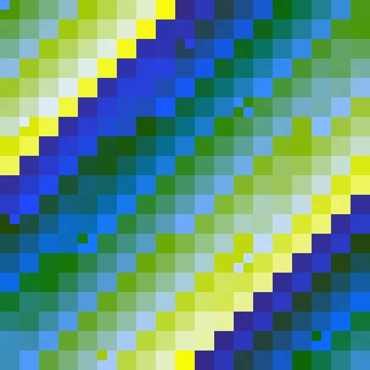


#### matrix convolution


```cpp
feng::matrix<double> m;
m.load_txt( "./images/Lenna.txt" );
m.save_as_bmp( "./images/0000_conv.bmp", "gray" );
```


Full 2D matrix convolution with zero-paddings is given by `conv` or `conv2` :


```cpp
feng::matrix<double> filter{3, 3, {0.0, 1.0, 0.0,
                                   1.0,-4.0, 1.0,
                                   0.0, 1.0, 0.0}};
auto const& edge = feng::conv( m, filter );
edge.save_as_bmp( "./images/0001_conv.bmp", "gray" );
```


The convolution has three modes: `valid`, `same`, and `full`

The valid mode gives out convolution result without zero-paddings:

```cpp
auto const& edge_valid = feng::conv( m, filter, "valid" );
edge_valid.save_as_bmp( "./images/0001_conv_valid.bmp", "gray" );
```


The `same` mode returns the central part of the convolution result with zero-paddings, of the same size as the larger matrix passed to  function `conv`

```cpp
auto const& edge_same = feng::conv( m, filter, "same" );
edge_same.save_as_bmp( "./images/0001_conv_same.bmp", "gray" );
```


`full` mode is the default mode:

```cpp
auto const& edge_full = feng::conv( m, filter, "full" );
edge_full.save_as_bmp( "./images/0001_conv_full.bmp", "gray" );
```


#### make view function

```cpp
feng::matrix<double> m;
m.load_txt( "./images/Lenna.txt" );
m.save_as_bmp( "./images/0000_make_view.bmp" );
```


```cpp
auto const[r,c] = m.shape();
auto const& v = feng::make_view( m, {r>>2, (r>>2)*3}, {c>>2, (c>>2)*3} );

v.save_as_bmp( "./images/0001_make_view.bmp" );
```


And creating new matrix from a view

```cpp
auto new_matrix{v};
new_matrix.save_as_bmp( "./images/0002_make_view.bmp" );
```


A matrix view has several methods, `row()`, `col()`, `shape()` and `operator[]()`:

```cpp
feng::matrix<double> n{ v.row(), v.col() }; // row() and col() of a matrix view
for ( auto r = 0UL; r != n.row(); ++r )
    for ( auto c = 0UL; c != n.col(); ++c )
        n[r][c] = v[r][c]; // accessing matrix elements using operator [], read-only
n.save_as_bmp( "./images/0003_make_view.bmp", "gray" );
```


#### singular value decomposition

We first Load an image from hardisk and normalize it to range `[0,1]`

```cpp
// load
feng::matrix<double> m;
m.load_txt( "./images/Teacher.txt" );
// normalize
auto const mx = *std::max_element( m.begin(), m.end() );
auto const mn = *std::min_element( m.begin(), m.end() );
m = ( m - mn ) / ( mx - mn + 1.0e-10 );
// take a snapshot
m.save_as_bmp( "./images/0000_singular_value_decomposition.bmp", "gray" );
```

This image looks like:


Then we add some white noise to remove possible singularity in it:


```cpp
// adding noise
auto const[r, c] = m.shape();
m += feng::rand<double>( r, c );
// record noisy matrix
m.save_as_bmp( "./images/0001_singular_value_decomposition.bmp", "gray" );
```

The noisy image now looks like


We execute Singular Value Decomposition by calling function `std::optional<std::tuple<matrix, matrix, matrix>> singular_value_decomposition( matrix const& )`, or `svd`


```cpp
// execute svd
auto const& svd = feng::singular_value_decomposition( m );
```

If the svd is successfully, we can verify the accuricy by reconstructing the noisy image by matrix multiplications


```
// check svd result
if (svd) // case successful
{
	// extracted svd result matrices, u, v w
	auto const& [u, v, w] = (*svd);
	// try to reconstruct matrix using  u * v * w'
	auto const& m_ = u * v * (w.transpose());
	// record reconstructed matrix
	m_.save_as_bmp( "./images/0002_singular_value_decomposition.bmp", "gray" );
```

The reconstructed image looks like:


One interesting application of SVD is data compression. In the code above, we use full rank to restore the original noisy image.
However, we can select only 1/2 or 1/4 or even less ranks to approximate the original image.
The code below demonstrates how:

```cpp
	auto dm = std::min( r, c );
	auto factor = 2UL;
	while ( dm >= factor )
	{
		auto new_dm = dm / factor;

		feng::matrix<double> const new_u{ u, std::make_pair(0UL, r), std::make_pair(0UL, new_dm) };
		feng::matrix<double> const new_v{ v, std::make_pair(0UL, new_dm), std::make_pair(0UL, new_dm) };
		feng::matrix<double> const new_w{ w, std::make_pair(0UL, c), std::make_pair(0UL, new_dm) };

		auto const& new_m = new_u * new_v * new_w.transpose();

		new_m.save_as_bmp( "./images/0003_singular_value_decomposition_"+std::to_string(new_dm)+".bmp", "gray" );

		factor *= 2UL;
	}
}
else
{
	std::cout << "Failed to execute Singular Value Decomposition for this matrix!\n";
}

```

When using `256` ranks, the reconstructed image lookes like:


When using `128` ranks, the reconstructed image lookes like:


When using `64` ranks, the reconstructed image lookes like:


When using `32` ranks, the reconstructed image lookes like:


When using `16` ranks, the reconstructed image lookes like:


When using `8` ranks, the reconstructed image lookes like:

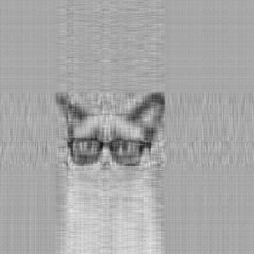

When using `4` ranks, the reconstructed image lookes like:


When using `2` ranks, the reconstructed image lookes like:

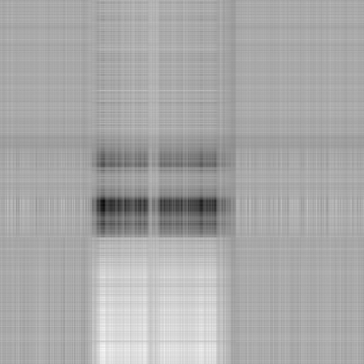

When using `1` ranks, the reconstructed image lookes like:

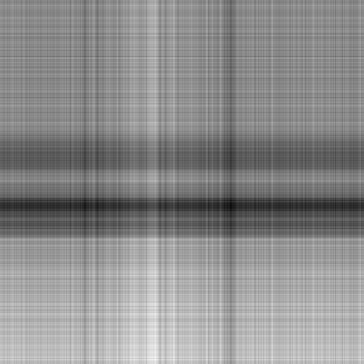

#### pooling

We are able to pooling an image with function `pooling( matrix, dim_row, dim_col, option )`, where `option` can be either of `mean`, `max`, or `min`, if no option provided, then `mean` is applied.

For an normal image

```cpp
feng::matrix<double> m;
m.load_txt( "./images/Lenna.txt" );
m.save_as_bmp( "./images/0000_pooling.bmp", "gray" );
```


A `2X2` mean pooling looks like:

```cpp
auto const& pooling_2 = feng::pooling( m, 2 );
pooling_2.save_as_bmp( "./images/0000_pooling_2.bmp", "gray" );
```


And a `4X4` pooling is

```cpp
auto const& pooling_4 = feng::pooling( m, 4 );
pooling_4.save_as_bmp( "./images/0000_pooling_4.bmp", "gray" );
```


For hyterdyne pooling of `2X4`

```cpp
auto const& pooling_2_4 = feng::pooling( m, 2, 4 );
pooling_2_4.save_as_bmp( "./images/0000_pooling_2_4.bmp", "gray" );
```


And `4X2`

```cpp
auto const& pooling_4_2 = feng::pooling( m, 4, 2 );
pooling_4_2.save_as_bmp( "./images/0000_pooling_4_2.bmp", "gray" );
```


Also `min` pooling is possible

```cpp
auto const& pooling_min = feng::pooling( m, 2, "min" );
pooling_min.save_as_bmp( "./images/0000_pooling_2_min.bmp", "gray" );
```


And `max` pooling

```cpp
auto const& pooling_max = feng::pooling( m, 2, "max" );
pooling_max.save_as_bmp( "./images/0000_pooling_2_max.bmp", "gray" );
```


#### gauss jordan elimination

for a random matrix

```cpp
auto const& m = feng::rand<double>( 64, 128);
m.save_as_bmp( "./images/0000_gauss_jordan_elimination.bmp", "gray" );
```

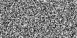


```cpp
auto const& n = feng::gauss_jordan_elimination( m ); //<- also `feng::rref(m);`, alias name from Matlab

if (n)
    (*n).save_as_bmp( "./images/0001_gauss_jordan_elimination.bmp", "gray" );
else
    std::cout << "Failed to execute Gauss-Jordan Elimination for matrix m.\n";
```

after applying Gauss Jordan elimination, the matrix is reduced to a form of


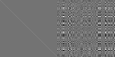


#### lu decomposition

We load a Lena from harddisk file `./images/Lenna.txt` using function `load_txt(std::string const&)`:

```cpp
    // initial matrix
    feng::matrix<double> m;
    m.load_txt( "./images/Lenna.txt" );
    m.save_as_bmp( "./images/0000_lu_decomposition.bmp", "gray" );
```


The loaded image lookes like below:


Then we scale this image to range `[0,1]` and add some uniform random noise to it (to remove singularity of the original image)

```cpp
    // adding noise
    double mn = *std::min_element( m.begin(), m.end() );
    double mx = *std::max_element( m.begin(), m.end() );
    m = (m-mn) / (mx - mn + 1.0e-10);
    auto const& [row, col] = m.shape();
    m += feng::rand<double>( row, col );
    m.save_as_bmp( "./images/0001_lu_decomposition.bmp", "gray" );
```

The noised image lookes like:


we can do LU decomposition simply with `std::optional<std::tuple<matrix, matrix>>lu_decomposition( matrix const& )` function


```cpp
    // lu decomposition
    auto const& lu = feng::lu_decomposition( m );
    if (lu)
    {
        auto const& [l, u] = lu.value();
        l.save_as_bmp( "./images/0002_lu_decomposition.bmp", "jet" );
```

the result of the LU decompositon is a Maybe monad of a tuple of two matrices, i.e., `std::optional<std::tuple<feng::matrix<Type, Allocator>, feng::matrix<Type, Allocator>>>`,
therefor, we need to check its value before using it.

Then we can draw the lower matrix `L`


```cpp
        u.save_as_bmp( "./images/0003_lu_decomposition.bmp", "jet" );
```

And the upper matrix `U`


```cpp

        auto const& reconstructed = l * u;
        reconstructed.save_as_bmp( "./images/0004_lu_decomposition.bmp", "gray" );
```

We can multiply `L` and `U` back to see if the decomposition is correct or not.


```cpp
    }
    else
    {
        std::cout << "Error: Failed to execute lu decomposition for matrix m!\n";
    }

```

A typical use of LU Decomposition is to solve an equation in the form of `Ax=b`,
this is done by calling `auto const& x = feng::lu_solver(A,b)`, and, again, the returned value is a Maybe monad, `std::optional<matrix> lu_solver( matrix const&, matrix const& )`,
therefore we need to check its value before using it.


```cpp
    auto const X = feng::rand<double>( row, 1 );
    auto const b = m * X;
    auto const& ox = feng::lu_solver( m, b );

    if (ox)
    {
        auto const& diff = ox.value() - X;
        auto const mae = std::sqrt( std::inner_product(diff.begin(), diff.end(), diff.begin(), 0.0) / diff.size() );
        std::cout << "mean absolute error for lu solver is " << mae << "\n";
    }
    else
    {
        std::cout << "Error: Failed to solve equation with lu solver!\n";
    }
```

And we can also evaluate the solver's accuracy with the mean absolute value error; the output as small as


 ```
 mean absolute error for lu solver is 2.34412875135465e-10
 ```


## License

```
Copyright <2018> <Feng Wang>

Redistribution and use in source and binary forms, with or without modification, are permitted provided that the following conditions are met:

1. Redistributions of source code must retain the above copyright notice, this list of conditions and the following disclaimer.

2. Redistributions in binary form must reproduce the above copyright notice, this list of conditions and the following disclaimer in the documentation and/or other materials provided with the distribution.

3. Neither the name of the copyright holder nor the names of its contributors may be used to endorse or promote products derived from this software without specific prior written permission.

THIS SOFTWARE IS PROVIDED BY THE COPYRIGHT HOLDERS AND CONTRIBUTORS "AS IS" AND ANY EXPRESS OR IMPLIED WARRANTIES, INCLUDING, BUT NOT LIMITED TO, THE IMPLIED WARRANTIES OF MERCHANTABILITY AND FITNESS FOR A PARTICULAR PURPOSE ARE DISCLAIMED. IN NO EVENT SHALL THE COPYRIGHT HOLDER OR CONTRIBUTORS BE LIABLE FOR ANY DIRECT, INDIRECT, INCIDENTAL, SPECIAL, EXEMPLARY, OR CONSEQUENTIAL DAMAGES (INCLUDING, BUT NOT LIMITED TO, PROCUREMENT OF SUBSTITUTE GOODS OR SERVICES; LOSS OF USE, DATA, OR PROFITS; OR BUSINESS INTERRUPTION) HOWEVER CAUSED AND ON ANY THEORY OF LIABILITY, WHETHER IN CONTRACT, STRICT LIABILITY, OR TORT (INCLUDING NEGLIGENCE OR OTHERWISE) ARISING IN ANY WAY OUT OF THE USE OF THIS SOFTWARE, EVEN IF ADVISED OF THE POSSIBILITY OF SUCH DAMAGE.
```

## Dependency

This library only depends on a C++-17 standards.

## Installation
This is a single-file header-only library. Put `matrix.hpp` directly into the project source tree or somewhere reachable from your project.


## [Synopsis](#header-matrix-synopsis)

## Building tests and examples

Simple execute `make` or `make test` or `make example` at the root folder.

## Notes and references


## Design

### Requirements


In the table below, `M` denotes a matrix of type `T` using allocator of type `A`, `m` is a value of type `A`, `a` and `b` denote values of type `M`, `u` denotes an identifier, `r` denotes a non-constant value of type `M`, and `rv` denotes a non-const rvalue of type `M`.


| Expression  | ReturnType  | Operational Sematics  | Assertion, pre-/post-condition  | Complexity  |
|---|---|---|---|---|
| `M::value_type`  | `T`   |   | `T` is Erasable from `M`  | compile time  |
| `M::reference`  | `T&`  |   |   | compile time  |
| `M::const_reference`  | `T cosnt&`   |   |   | compile time  |
| `M::difference_type`  | signed integer type  |   | identical to the difference type of `M::iterator` and `M::const_iterator`  |  compile time |
| `M::size_type`  | unsigned integer type  |   | any type that can represent non-negative value of `difference_type`  | compile time  |
| `M::allocator_type`  | `A`  |   | `M::allocator_type::value_type` is identical to `M::value_type`  | compile time  |
| `M::iterator`  | iterator type whose value type is `T`  |   | any iterator category that meets the RandomAccessIterator requirements, convertible to `M::const_iterator`  | compile time  |
| `M::reverse_iterator`  | iterator type whose value type is `T`  |   | `reverse_iterator<iterator>`  | compile time  |
| `M::const_iterator`  | constant iterator type whose value type is `T`  |   | any iterator category that meets the RandomAccessIterator requirements  | compile time  |
| `M::const_reverse_iterator` | constant iterator type whose value type is `T`   |   | `reverse_iterator<const_iterator>`  | compile time  |
| `M::row_iterator`  | iterator type whose value type is `T`  |   | any iterator category that meets the RandomAccessIterator requirements, convertible to `M::const_row_iterator`  | compile time  |
| `M::reverse_row_iterator`  | iterator type whose value type is `T`  |   | `reverse_iterator<row_iterator>`  | compile time  |
| `M::const_row_iterator`  | constant iterator type whose value type is `T`  |   | any iterator category that meets the RandomAccessIterator requirements  | compile time  |
| `M::const_reverse_row_iterator` | constant iterator type whose value type is `T`   |   | `reverse_iterator<const_row_iterator>`  | compile time  |
| `M::col_iterator`  | iterator type whose value type is `T`  |   | any iterator category that meets the RandomAccessIterator requirements, convertible to `M::const_col_iterator`  | compile time  |
| `M::reverse_col_iterator`  | iterator type whose value type is `T`  |   | `reverse_iterator<col_iterator>`  | compile time  |
| `M::const_col_iterator`  | constant iterator type whose value type is `T`  |   | any iterator category that meets the RandomAccessIterator requirements  | compile time  |
| `M::const_reverse_col_iterator` | constant iterator type whose value type is `T`   |   | `reverse_iterator<const_col_iterator>`  | compile time  |
| `M::diag_iterator`  | iterator type whose value type is `T`  |   | any iterator category that meets the RandomAccessIterator requirements, convertible to `M::const_diag_iterator`  | compile time  |
| `M::reverse_diag_iterator`  | iterator type whose value type is `T`  |   | `reverse_iterator<diag_iterator>`  | compile time  |
| `M::const_diag_iterator`  | constant iterator type whose value type is `T`  |   | any iterator category that meets the RandomAccessIterator requirements  | compile time  |
| `M::const_reverse_diag_iterator` | constant iterator type whose value type is `T`   |   | `reverse_iterator<const_diag_iterator>`  | compile time  |
| `M::diag_iterator`  | iterator type whose value type is `T`  |   | any iterator category that meets the RandomAccessIterator requirements, convertible to `M::const_diag_iterator`  | compile time  |
| `M::reverse_diag_iterator`  | iterator type whose value type is `T`  |   | `reverse_iterator<diag_iterator>`  | compile time  |
| `M::const_diag_iterator`  | constant iterator type whose value type is `T`  |   | any iterator category that meets the RandomAccessIterator requirements  | compile time  |
| `M::const_reverse_diag_iterator` | constant iterator type whose value type is `T`   |   | `reverse_iterator<const_diag_iterator>`  | compile time  |
| `M::anti_diag_iterator`  | iterator type whose value type is `T`  |   | any iterator category that meets the RandomAccessIterator requirements, convertible to `M::const_anti_diag_iterator`  | compile time  |
| `M::reverse_anti_diag_iterator`  | iterator type whose value type is `T`  |   | `reverse_iterator<anti_diag_iterator>`  | compile time  |
| `M::const_anti_diag_iterator`  | constant iterator type whose value type is `T`  |   | any iterator category that meets the RandomAccessIterator requirements  | compile time  |
| `M::const_reverse_anti_diag_iterator` | constant iterator type whose value type is `T`   |   | `reverse_iterator<const_anti_diag_iterator>`  | compile time  |
|   |   |   |   |   |
|   |   |   |   |   |
|   |   |   |   |   |
|   |   |   |   |   |


### Header `<matrix>` synopsis

```cpp
namespace xxx
{

    template < typename T, class Allocator = allocator<T> >
    struct matrix
    {
    	//types:
        typedef T 								                        value_type;
        typedef Allocator                                               allocator_type;
        typedef value_type& 					                        reference;
        typedef value_type const&                                       const_reference;
        typedef implementation-defined                                  iterator;
        typedef implementation-defined                                  const_iterator;
        typedef implementation-defined                                  row_iterator;
        typedef implementation-defined                                  const_row_iterator;
        typedef implementation-defined                                  col_iterator;
        typedef implementation-defined                                  const_col_iterator;
        typedef implementation-defined                                  diag_iterator;
        typedef implementation-defined                                  const_diag_iterator;
        typedef implementation-defined                                  anti_diag_iterator;
        typedef implementation-defined                                  const_anti_diag_iterator;
        typedef implementation-defined                                  size_type;
        typedef implementation-defined                                  difference_type;
        typedef typename allocator_trait<allocator_type>::pointer       pointer;
        typedef typename allocator_trait<allocator_type>::const_pointer const_pointer;
        typedef std::reverse_iterator<iterator>                         reverse_iterator;
        typedef std::reverse_iterator<const_iterator>                   const_reverse_iterator;
        typedef std::reverse_iterator<row_iterator>                     row_reverse_iterator;
        typedef std::reverse_iterator<const_row_iterator>               const_row_reverse_iterator;
        typedef std::reverse_iterator<col_iterator>                     col_reverse_iterator;
        typedef std::reverse_iterator<const_col_iterator>               const_col_reverse_iterator;
        typedef std::reverse_iterator<diag_iterator>                    diag_reverse_iterator;
        typedef std::reverse_iterator<const_diag_iterator>              const_diag_reverse_terator;
        typedef std::reverse_iterator<anti_diag_iterator>               anti_diag_reverse_iterator;
        typedef std::reverse_iterator<const_anti_diag_iterator>         const_anti_diag_reverse_terator;


        // construct, copy and destroy
        matrix() noexcept;
        explicit matrix ( allocator_type const& ) noexcept;
        explicit matrix ( size_type row_, size_type col_, allocator_type const& = Allocator() );
        matrix( matrix const& );
        matrix( matrix&& ) noexcept;
        matrix( matrix const&, allocator_type const& );
        matrix( matrix&&, allocator_type const& );
        ~matrix();

        matrix& operator = ( matrix const& );
        matrix& operator = ( matrix && ) noexcept( allocator_traits<allocator_type>::propagate_on_container_move_assignment::value || allocator_traits<allocator_type>::is_always_equal::value );

        allocator_type get_allocator() const noexcept;


        //iterators
        iterator                                begin() noexcept;
        const_iterator                          begin() const noexcept;
        iterator                                end() noexcept;
        const_iterator                          end() const noexcept;
        row_iterator                            row_begin(size_type) noexcept;
        const_row_iterator                      row_begin(size_type) const noexcept;
        row_iterator                            row_end(size_type) noexcept;
        const_row_iterator                      row_end(size_type) const noexcept;
        col_iterator                            col_begin(size_type) noexcept;
        const_col_iterator                      col_begin(size_type) const noexcept;
        col_iterator                            col_end(size_type) noexcept;
        const_col_iterator                      col_end(size_type) const noexcept;
        diag_iterator                           diag_begin(difference_type) noexcept;
        const_diag_iterator                     diag_begin(difference_type) const noexcept;
        diag_iterator                           diag_end(difference_type) noexcept;
        const_diag_iterator                     diag_end(difference_type) const noexcept;

        //reverse iterators
        reverse_iterator                        rbegin() noexcept;
        const_reverse_iterator                  rbegin() const noexcept;
        reverse_iterator                        rend() noexcept;
        const_reverse_iterator                  rend() const noexcept;
        row_reverse_iterator                    row_rbegin(size_type) noexcept;
        const_row_reverse_iterator              row_rbegin(size_type) const noexcept;
        row_reverse_iterator                    row_rend(size_type) noexcept;
        const_row_reverse_iterator              row_rend(size_type) const noexcept;
        col_reverse_iterator                    col_rbegin(size_type) noexcept;
        const_col_reverse_iterator              col_rbegin(size_type) const noexcept;
        col_reverse_iterator                    col_rend(size_type) noexcept;
        const_col_reverse_iterator              col_rend(size_type) const noexcept;
        diag_reverse_iterator                   diag_rbegin(difference_type) noexcept;
        const_diag_reverse_iterator             diag_rbegin(difference_type) const noexcept;
        diag_reverse_iterator                   diag_rend(difference_type) noexcept;
        const_diag_reverse_iterator             diag_rend(difference_type) const noexcept;

        //const iterators
        const_iterator                          cbegin() const noexcept;
        const_iterator                          cend() const noexcept;
        const_row_iterator                      row_cbegin(size_type) const noexcept;
        const_row_iterator                      row_cend(size_type) const noexcept;
        const_col_iterator                      col_cbegin(size_type) const noexcept;
        const_col_iterator                      col_cend(size_type) const noexcept;
        const_diag_iterator                     diag_cbegin(difference_type) const noexcept;
        const_diag_iterator                     diag_cend(difference_type) const noexcept;
        const_reverse_iterator                  crbegin() const noexcept;
        const_reverse_iterator                  crend() const noexcept;
        const_row_reverse_iterator              row_crbegin(size_type) const noexcept;
        const_row_reverse_iterator              row_crend(size_type) const noexcept;
        const_col_reverse_iterator              col_crbegin(size_type) const noexcept;
        const_col_reverse_iterator              col_crend(size_type) const noexcept;
        const_diag_reverse_iterator             diag_crbegin(difference_type) const noexcept;
        const_diag_reverse_iterator             diag_crend(difference_type) const noexcept;

        //capacity and shape
        size_type                               size() const noexcept;
        size_type                               row() const noexcept;
        size_type                               col() const noexcept;
        void                                    resize( size_type row_, size_type col_ );
        void                                    resize( size_type row_, size_type col_, value_type const& value_ );
        void                                    reshape( size_type row_, size_type col_ );
        void                                    transpose();


        //element access
        iterator                                operator[](size_type row_ );
        const_iterator                          operator[](size_type row_ ) const; //TODO
        reference                               operator()( size_type row_, size_type col_ );
        const_reference                         operator()( size_type row_, size_type col_ ) const;
        reference                               at( size_type row_, size_type col_ );
        const_reference                         at( size_type row_, size_type col_ ) const;


        //data access
        pointer                                 data() noexcept;
        const_pointer                           data() const noexcept;

        //modifiers
        void                                    clean() noexcept;
        void                                    swap( matrix& ) noexcept( allocator_traits<allocator_type>::propagate_on_container_move_assignment::value || allocator_traits<allocator_type>::is_always_equal::value );

        //loader, saver and ploter
        void                                    load( string const& file_name_ );
        void                                    save_as( string const& file_name_ );
        void                                    plot( string const& file_name_ ) const;
        void                                    plot( string const& file_name_, string const& builtin_color_scheme_name_ ) const;

        //unary operators
        matrix const                            operator+() const;
        matrix const                            operator-() const;
        matrix const                            operator~() const;
        matrix const                            operator~() const; //bool only

        //computed assignment
        //TODO: return optional<matrix>?
        matrix&                                 operator*=( matrix const& );
        matrix&                                 operator/=( matrix const& );
        matrix&                                 operator+=( matrix const& );
        matrix&                                 operator-=( matrix const& );
        matrix&                                 operator*=( value_type const );
        matrix&                                 operator/=( value_type const );
        matrix&                                 operator%=( value_type const );
        matrix&                                 operator+=( value_type const );
        matrix&                                 operator-=( value_type const );
        matrix&                                 operator^=( value_type const );
        matrix&                                 operator&=( value_type const );
        matrix&                                 operator|=( value_type const );
        matrix&                                 operator<<=( value_type const );
        matrix&                                 operator>>=( value_type const );


        //basic numeric operations
        value_type                              det() const;
        value_type                              tr() const;


    };

    //building functions
    template< typename T, typename A > matrix<T,A> const make_eye( size_type row_, size_type col_, A const& alloc_ );
    template< typename T > matrix<T,std::allocator<T>> const make_eye( size_type row_, size_type col_ );
    template< typename T, typename A > matrix<T,A> const make_zeros( size_type row_, size_type col_, A const& alloc_ );
    template< typename T > matrix<T,std::allocator<T>> const make_zeros( size_type row_, size_type col_ );
    template< typename T, typename A > matrix<T,A> const make_ones( size_type row_, size_type col_, A const& alloc_ );
    template< typename T > matrix<T,std::allocator<T>> const make_ones( size_type row_, size_type col_ );
    template< typename T, typename A > matrix<T,A> const make_diag( matrix<T,A> const );
    template< typename T, typename A > matrix<T,A> const make_triu( matrix<T,A> const );
    template< typename T, typename A > matrix<T,A> const make_tril( matrix<T,A> const );
    template< typename T, typename A > matrix<T,A> const make_rand( size_type row_, size_type col_, A const& alloc_ );
    template< typename T > matrix<T,std::allocator<T>> const make_rand( size_type row_, size_type col_ );
    template< typename T, typename A > matrix<T,A> const make_hilb( size_type n_, A const& alloc_ );
    template< typename T > matrix<T,std::allocator<T>> const make_hilb( size_type n_ );
    template< typename T, typename A > matrix<T,A> const make_magic( size_type n_, A const& alloc_ );
    template< typename T > matrix<T,std::allocator<T>> const make_magic( size_type n_ );
    template< typename T, typename A, typename Input_Itor_1, typename Input_Iterator_2 > matrix<T, A> const make_toeplitz( Input_Iterator_1 begin_, Input_Iterator_1 end_, Input_Iterator_2 begin_2_, A const alloc_ );
    template< typename T, typename A, typename Input_Itor > matrix<T, A> const make_toeplitz( Input_Iterator begin_, Input_Iterator end_, A const alloc_ );
    template< typename T, typename Input_Itor_1, typename Input_Iterator_2 > const matrix<T, std::allocator<T> > make_toeplitz( Input_Iterator_1 begin_, Input_Iterator_1 end_, Input_Iterator_2 begin_2_ ):
    template< typename T, typename Input_Itor > matrix<T, std::allocator<T>> const make_toeplitz( Input_Iterator begin_, Input_Iterator end_ );
    template< typename T, typename A > matrix<T,A> const make_horizontal_cons( matrix<T,A> const&, matrix<T,A> const& );
    template< typename T, typename A > matrix<T,A> const make_vertical_cons( matrix<T,A> const&, matrix<T,A> const& );


    //binary operation
    //TODO: return optional<matrix>?
    template< typename T, typename A > matrix<T,A> const operator * ( matrix<T,A> const&, matrix<T,A> const& );
    template< typename T, typename A > matrix<T,A> const operator * ( matrix<T,A> const&, T const& );
    template< typename T, typename A > matrix<T,A> const operator * ( T const&, matrix<T,A> const& );

    template< typename T, typename A > matrix<T,A> const operator / ( matrix<T,A> const&, matrix<T,A> const& );
    template< typename T, typename A > matrix<T,A> const operator / ( matrix<T,A> const&, T const& );
    template< typename T, typename A > matrix<T,A> const operator / ( T const&, matrix<T,A> const& );

    template< typename T, typename A > matrix<T,A> const operator + ( matrix<T,A> const&, matrix<T,A> const& );
    template< typename T, typename A > matrix<T,A> const operator + ( matrix<T,A> const&, T const& );
    template< typename T, typename A > matrix<T,A> const operator + ( T const&, matrix<T,A> const& );

    template< typename T, typename A > matrix<T,A> const operator - ( matrix<T,A> const&, matrix<T,A> const& );
    template< typename T, typename A > matrix<T,A> const operator - ( matrix<T,A> const&, T const& );
    template< typename T, typename A > matrix<T,A> const operator - ( T const&, matrix<T,A> const& );

    template< typename T, typename A > matrix<T,A> const operator % ( matrix<T,A> const&, T const& );
    template< typename T, typename A > matrix<T,A> const operator ^ ( matrix<T,A> const&, T const& );
    template< typename T, typename A > matrix<T,A> const operator & ( matrix<T,A> const&, T const& );
    template< typename T, typename A > matrix<T,A> const operator | ( matrix<T,A> const&, T const& );
    template< typename T, typename A > matrix<T,A> const operator << ( matrix<T,A> const&, T const& );
    template< typename T, typename A > matrix<T,A> const operator >> ( matrix<T,A> const&, T const& );

    template< typename T, typename A > std::ostream& operator << ( std::ostream&, matrix<T,A> const& );
    template< typename T, typename A > std::istream& operator << ( std::istream&, matrix<T,A> const& );

    //logical
    template< typename T, typename A > matrix<bool,std::allocator_traits<A>::rebind_alloc<bool> > const operator == ( matrix<T,A> const&, matrix<T,A> const& );
    template< typename T, typename A > matrix<bool,std::allocator_traits<A>::rebind_alloc<bool> > const operator == ( matrix<T,A> const&, T const& );
    template< typename T, typename A > matrix<bool,std::allocator_traits<A>::rebind_alloc<bool> > const operator == ( T const&, matrix<T,A> const& );
    template< typename T, typename A > matrix<bool,std::allocator_traits<A>::rebind_alloc<bool> > const operator != ( matrix<T,A> const&, matrix<T,A> const& );
    template< typename T, typename A > matrix<bool,std::allocator_traits<A>::rebind_alloc<bool> > const operator != ( matrix<T,A> const&, T const& );
    template< typename T, typename A > matrix<bool,std::allocator_traits<A>::rebind_alloc<bool> > const operator != ( T const&, matrix<T,A> const& );
    template< typename T, typename A > matrix<bool,std::allocator_traits<A>::rebind_alloc<bool> > const operator >= ( matrix<T,A> const&, matrix<T,A> const& );
    template< typename T, typename A > matrix<bool,std::allocator_traits<A>::rebind_alloc<bool> > const operator >= ( matrix<T,A> const&, T const& );
    template< typename T, typename A > matrix<bool,std::allocator_traits<A>::rebind_alloc<bool> > const operator >= ( T const&, matrix<T,A> const& );
    template< typename T, typename A > matrix<bool,std::allocator_traits<A>::rebind_alloc<bool> > const operator <= ( matrix<T,A> const&, matrix<T,A> const& );
    template< typename T, typename A > matrix<bool,std::allocator_traits<A>::rebind_alloc<bool> > const operator <= ( matrix<T,A> const&, T const& );
    template< typename T, typename A > matrix<bool,std::allocator_traits<A>::rebind_alloc<bool> > const operator <= ( T const&, matrix<T,A> const& );
    template< typename T, typename A > matrix<bool,std::allocator_traits<A>::rebind_alloc<bool> > const operator > ( matrix<T,A> const&, matrix<T,A> const& );
    template< typename T, typename A > matrix<bool,std::allocator_traits<A>::rebind_alloc<bool> > const operator > ( matrix<T,A> const&, T const& );
    template< typename T, typename A > matrix<bool,std::allocator_traits<A>::rebind_alloc<bool> > const operator > ( T const&, matrix<T,A> const& );
    template< typename T, typename A > matrix<bool,std::allocator_traits<A>::rebind_alloc<bool> > const operator < ( matrix<T,A> const&, matrix<T,A> const& );
    template< typename T, typename A > matrix<bool,std::allocator_traits<A>::rebind_alloc<bool> > const operator < ( matrix<T,A> const&, T const& );
    template< typename T, typename A > matrix<bool,std::allocator_traits<A>::rebind_alloc<bool> > const operator < ( T const&, matrix<T,A> const& );
    template< typename T, typename A > matrix<bool,std::allocator_traits<A>::rebind_alloc<bool> > const operator && ( matrix<T,A> const&, matrix<T,A> const& );
    template< typename T, typename A > matrix<bool,std::allocator_traits<A>::rebind_alloc<bool> > const operator && ( matrix<T,A> const&, T const& );
    template< typename T, typename A > matrix<bool,std::allocator_traits<A>::rebind_alloc<bool> > const operator && ( T const&, matrix<T,A> const& );
    template< typename T, typename A > matrix<bool,std::allocator_traits<A>::rebind_alloc<bool> > const operator || ( matrix<T,A> const&, matrix<T,A> const& );
    template< typename T, typename A > matrix<bool,std::allocator_traits<A>::rebind_alloc<bool> > const operator || ( matrix<T,A> const&, T const& );
    template< typename T, typename A > matrix<bool,std::allocator_traits<A>::rebind_alloc<bool> > const operator || ( T const&, matrix<T,A> const& );


    //numeric functions
    template< typename T, typename A, typename F > matrix<T,A> const element_wise_apply ( matrix<T,A> const&, F const& f_ );

    //Linear Equations

    //mldivide 	Solve systems of linear equations Ax = B for x
    template< typename T, typename A, typename F > matrix<T,A> const mldivide ( matrix<T,A> const&, matrix<T,A> const& );
    //mrdivide 	Solve systems of linear equations xA = B for x
    template< typename T, typename A, typename F > matrix<T,A> const mrdivide ( matrix<T,A> const&, matrix<T,A> const& );
    //linsolve 	Solve linear system of equations
    template< typename T, typename A, typename F > matrix<T,A> const mrdivide ( matrix<T,A> const&, matrix<T,A> const& );
    //inv 	Matrix inverse
    template< typename T, typename A, typename F > matrix<T,A> const inv ( matrix<T,A> const& );
    //pinv 	Moore-Penrose pseudoinverse of matrix
    template< typename T, typename A, typename F > matrix<T,A> const pinv ( matrix<T,A> const& );
    //lscov 	Least-squares solution in presence of known covariance
    template< typename T, typename A, typename F > matrix<T,A> const lscov ( matrix<T,A> const&, matrix<T,A> const& );
    template< typename T, typename A, typename F > matrix<T,A> const lscov ( matrix<T,A> const&, matrix<T,A> const&, matrix<T,A> const& );
    //lsqnonneg 	Solve nonnegative linear least-squares problem
    template< typename T, typename A, typename F > matrix<T,A> const lsqnonneg ( matrix<T,A> const&, matrix<T,A> const& );
    template< typename T, typename A, typename F > matrix<T,A> const lsqnonneg ( matrix<T,A> const&, matrix<T,A> const&, matrix<T,A> const& );
    //sylvester 	Solve Sylvester equation AX + XB = C for X
    template< typename T, typename A, typename F > matrix<T,A> const sylvester ( matrix<T,A> const&, matrix<T,A> const&, matrix<T,A> const& );

    //Eigenvalues ans Singular Values

    //eig 	Eigenvalues and eigenvectors
    template< typename T, typename A, typename F > std::tuple<matrix<T,A>,matrix<T,A>> const eig( matrix<T,A> const& );
    //eigs 	Subset of eigenvalues and eigenvectors -- TODO
    //balance 	Diagonal scaling to improve eigenvalue accuracy
    //svd 	Singular value decomposition
    template< typename T, typename A, typename F > std::tuple<matrix<T,A>,matrix<T,A>,matrix<T,A>> const svd( matrix<T,A> const& );
    //svds 	Subset of singular values and vectors -- TODO
    //gsvd 	Generalized singular value decomposition
    template< typename T, typename A, typename F > std::tuple<matrix<T,A>,matrix<T,A>,matrix<T,A>,matrix<T,A>> const gsvd( matrix<T,A> const&, matrix<T,A> const& );
    //ordeig 	Eigenvalues of quasitriangular matrices
    template< typename T, typename A, typename F > matrix<T,A> const ordeig( matrix<T,A> const& );
    template< typename T, typename A, typename F > matrix<T,A> const ordeig( matrix<T,A> const&, matrix<T,A> const& );


}

//linear algebra
/*
ordqz 	Reorder eigenvalues in QZ factorization
ordschur 	Reorder eigenvalues in Schur factorization
polyeig 	Polynomial eigenvalue problem
qz 	QZ factorization for generalized eigenvalues
hess 	Hessenberg form of matrix
schur 	Schur decomposition
rsf2csf 	Convert real Schur form to complex Schur form
cdf2rdf 	Convert complex diagonal form to real block diagonal form
lu 	LU matrix factorization
ldl 	Block LDL' factorization for Hermitian indefinite matrices
chol 	Cholesky factorization
cholupdate 	Rank 1 update to Cholesky factorization
qr 	Orthogonal-triangular decomposition
qrdelete 	Remove column or row from QR factorization
qrinsert 	Insert column or row into QR factorization
qrupdate 	Rank 1 update to QR factorization
planerot 	Givens plane rotation
transpose 	Transpose vector or matrix
ctranspose 	Complex conjugate transpose
mtimes 	Matrix Multiplication
mpower 	Matrix power
sqrtm 	Matrix square root
expm 	Matrix exponential
logm 	Matrix logarithm
funm 	Evaluate general matrix function
kron 	Kronecker tensor product
cross 	Cross product
dot 	Dot product
bandwidth 	Lower and upper matrix bandwidth
tril 	Lower triangular part of matrix
triu 	Upper triangular part of matrix
isbanded 	Determine if matrix is within specific bandwidth
isdiag 	Determine if matrix is diagonal
ishermitian 	Determine if matrix is Hermitian or skew-Hermitian
issymmetric 	Determine if matrix is symmetric or skew-symmetric
istril 	Determine if matrix is lower triangular
istriu 	Determine if matrix is upper triangular
norm 	Vector and matrix norms
normest 	2-norm estimate
cond 	Condition number with respect to inversion
condest 	1-norm condition number estimate
rcond 	Reciprocal condition number
condeig 	Condition number with respect to eigenvalues
det 	Matrix determinant
null 	Null space
orth 	Orthonormal basis for range of matrix
rank 	Rank of matrix
rref 	Reduced row echelon form (Gauss-Jordan elimination)
trace 	Sum of diagonal elements
subspace 	Angle between two subspaces
cosm
sinm
tanm
ctanm
acosm
asinm
atanm
atan2m
coshm
sinhm
tanhm
acosh
asinh
atanh
expm -- expm(A) and expm(A, B)
logm
log10m
exp2m
log2m
logm
powm
sqrtm
cbrtm
hypotm
erfm
erfcm
tgammam
lgammam


//trigonometric
sin
cos
tan
cot
sec
csc

arcsin
arccos
arctan
arccot
arcsec
arccsc


//hyperbolic
sinh
cosh
tanh
coth
sech
csch
arsinh
arcosh
artanh
arsech
arcsch
arcoth
*/


//Fourier Analysis and Filtering
/*
fft
fftshift
ifft
ifftshift
conv
filter
ss2tf
*/

```
