A modern, C++20-native, single-file header-only dense 2D matrix library.


----

### Contents

- [Example usage](#example-usage)
    + [creating matrices](#creating-matrices)
    + [basic operations](#basic)
      + [row, col, size, shape, clear](#create-row-col-size-shape-clear)
      + [element access](#element-access-using-operator--or-operator-)
      + [range based for](#range-based-for-access)
      + [copy, resize, reshape](#copying-resizing-and-reshaping)
      + [slicing](#matrix-slicing)
   + [built-in functions](#functions)
     - [clone -- matrix slicing](#clone----matrix-slicing)
     - [astype -- converting matrix value type](#astype)
     - [data -- accessing raw memory](#data----raw-memory-access)
     - [det -- matrix determinant](#det----matrix-determinant)
     - [operator `/=`](#operator-divide-equal)
     - [inverse](#matrix-inverse)
     - [linear algebra: lu_factor, svd_factor, linalg_status](#linear-algebra)
     - [save matrix to images with colormap](#save-matrix-to-images-with-colormap)
     - [save/load bmp](#save-load-bmp)
     - [save png](#save-png)
     - [save/load](#save-load)
     - [load npy](#load-npy)
     - [plot](#plot)
     - [generating fractional image](#juliet-set)
     - [minus equal](#operator-minus-equal)
     - [multiply equal](#operator-multiply-equal)
     - [plus equal](#operator-plus-equal)
     - [prefix](#operator-prefix)
     - MORE TODO
   + [Common mathematical functions -- elementwise](#elementwise-mathematical-functions)
     - [elementwise sin](#elementwise-sin)
     - [elementwise sinh](#elementwise-sinh)
   + [Common functions](#common-functions)
     - [eye](#eye-function)
     - [linspace](#linspace)
     - [magic](#magic-function)
     - [matrix convolution](#matrix-convolution)
     - [fft](#fft)
     - [make_view](#make-view-function)
     - [lu_decomposition](#lu-decomposition)
     - [guass_jordan_elimination](#gauss-jordan-elimination)
     - [singular_value_decomposition](#singular-value-decomposition)
     - [pooling](#pooling)
     - [meshgrid](#meshgrid)
     - [arange](#arange)
     - [clip](#clip)
    + [iterations](#iterations)
      - [element-wise apply](#elementwise-apply)
      - [head->tail iteration](#iteration-from-head-to-tail)
      - [tail->head iteration](#iteration-from-tail-to-head)
      - [row iteration](#iteration-through-a-selected-row)
      - [reversed row iteration](#reverse-iteration-through-a-selected-row)
      - [column iteration](#iteration-through-a-selected-column)
      - [reversed column iteration](#reverse-iteration-through-a-selected-column)
      - [diagonal iteration](#iteration-through-diagonal)
      - [reversed diagonal iteration](#reverse-iteration-through-diagonal)
      - [upper diagonal iteration](#iteration-through-upper-diagonal)
      - [reversed upper diagonal iteration](#reverse-iteration-through-upper-diagonal)
      - [lower diagonal iteration](#iteration-through-lower-diagonal)
      - [reversed lower diagonal iteration](#reverse-iteration-through-lower-diagonal)
      - [anti-diagonal iteration](#iteration-through-anti-diagonal)
      - [reversed anti-diagonal iteration](#reverse-iteration-through-anti-diagonal)
      - [upper anti-diagonal iteration](#iterator-through-upper-anti-diagonal)
      - [reversed upper anti-diagonal iteration](#reverse-iteration-through-upper-anti-diagonal)
      - [lower anti-diagonal iteration](#iteration-through-lower-anti-diagonal)
      - [reversed lower anti-diagonal iteration](#reverse-iteration-through-lower-anti-diagonal)


- [License](#license)
- [Dependency](#dependency)
- [Installation](#installation)
- [Building tests and examples](#building-tests-and-examples)
- [Notes and references](#notes-and-references)
+ [Design](#esign)
    - [Requirements](#requirements)
    - [Synopsis](#header-matrix-synopsis)

------

## Example usage

#### including the header file

```cpp
//your_source_code.cpp
#include "matrix.hpp"
```

#### typical compile and link command

```bash
g++ -o your_exe_file your_source_code.cpp -std=c++20 -O2 -pthread -lstdc++fs
```

This is the portable flag set the Makefile uses by default (`make test example`, outputs in `build/`); `-Ofast` and `-march=native` are not needed, and `make FAST=1 ...` opts back into them. See [Building tests and examples](#building-tests-and-examples).

Please note [`std::thread`](https://en.cppreference.com/w/cpp/header/thread) is not enabled by default. If you prefer multi-thread mode, pass `-DFENG_MATRIX_PARALLEL` to the compiler (the old `-DPARALLEL` is deprecated but still accepted), and add necessary link options.
[`std::filesystem`](https://en.cppreference.com/w/cpp/filesystem/path) is used,  make sure corresponding library option is passed during link time (`-lstdc++fs` for g++).

Variadic macro `__VA_OPT__` is used. It is officially supported since c++20([link1](http://www.open-std.org/jtc1/sc22/wg21/docs/papers/2018/p1042r1.html), [link2](http://www.open-std.org/jtc1/sc22/wg21/docs/papers/2017/p0306r4.html)), so the compiler must be compatible with c++20.

#### Configuration macros

- `FENG_MATRIX_PARALLEL` enables the `std::jthread` helpers (the old name `PARALLEL` is deprecated but still accepted and maps to it); each call starts its own threads and joins them before returning, on min( hardware_concurrency, work / grain ) workers, so small calls run on the calling thread (see [operator multiply equal](#operator-multiply-equal) below);
- `FENG_MATRIX_OPENCV` enables the `cv::Mat` interface (the old name `OPENCV` is deprecated but still accepted);
- `FENG_MATRIX_CHECKED_ITERATORS` adds bounds checks to the stride and view iterators (see [Views and iterator invalidation](#views-and-iterator-invalidation));
- `FENG_MATRIX_NO_CONFIG_CHECK` turns off the mixed-configuration link check below.

All translation units of a program must agree on the first three. On ELF targets every translation unit that includes `matrix.hpp` defines the symbol `feng_matrix_configuration_mismatch_between_translation_units` for its configuration, so linking two translation units with different settings fails with a multiple-definition error naming that symbol, while matching ones link. The check does not exist on non-ELF targets and does not span separate shared libraries.

Results that should not be ignored are `[[nodiscard]]`: the `bool` of the loaders (`load_txt`, `load_binary`, `load_npy`) and writers (`save_as_txt`, `save_as_binary`, `save_as_npy`, `save_as_png`, `save_as_bmp`, `save_as_pgm`), the `linalg_status` overloads such as `inverse( A, out )`, and the side-effect-free functions that return a new matrix. Discarding one warns (`-Wunused-result`, an error under `-Werror`); write `(void)m.save_as_bmp( ... );` to discard on purpose. Value-returning functions no longer return top-level `const`, so `m = f()` moves. See the `## S9` section of [docs/migration.md](docs/migration.md).

### basic

#### creating matrices

+ generating matrix

    - creating a matrix of size `12 X 34`:

    ```cpp
    feng::matrix<double> m{ 12, 34 };
    ```
    - creating a random matrix of size `12 X 34`, in the open interval `(0, 1)` (see [Random numbers](#random-numbers-statistics-and-arithmetic-types)):

    ```cpp
    auto rand = feng::rand<double>(12, 34);
    ```

    - creating a matrix of size `12 X 34`, with all elements to be `0`:

    ```cpp
    auto zero = feng::zeros<double>(12, 34);
    ```
    - creating a matrix of size `12 X 34`, with all elements to be `1`:

    ```cpp
    auto one = feng::ones<double>(12, 34);
    ```

    - and `ones_like`:

    ```cpp
    auto another_one = feng::ones_like( one );
    ```

    - creating a matrix of size `12 X 34`, with all elements to be uninitialized:
    ```cpp
    auto one = feng::empty<double>(12, 34);
    ```

    - converting value types

    ```cpp
    auto one_fp32 = feng::empty<float>(12, 34);
    auto one_fp64 = one_fp32.astype<double>(); //
    ```


    - creating a matrix of size `1 X (12*34)`, with all elements from `0` to `12x34`, then reshape to `12 X 34`:
    ```cpp
    auto one = feng::arange<double>(12*34);
    one.reshape( 12, 34 );
    ```

    - loading matrix from a local txt file `./mat.txt`, the delimiter can be either of ` `, `,`, `\t` or `;`, the line end is `\n`:

    ```cpp
    feng::matrix<double> mat;
    mat.load_txt( './mat.txt' );
    ```

    - loading matrix from an opencv matrix instance with interface `from_opencv`

    ```cpp
    cv::Mat M( 2, 2, CV_8UC3, cv::Scalar(0, 0, 255) );
    std::cout << "OPENCV matrix:\n" << M << std::endl;
    feng::matrix<std::uint32_t> mat;
    mat.from_opencv( M );
    std::cout << "Converted to feng::matrix:\n" << mat << std::endl;
    ```

    This will produce output like:

    ```
    OPENCV matrix:
    [  0,   0, 255,   0,   0, 255;
       0,   0, 255,   0,   0, 255]
    Converted to feng::matrix:
    0       0       255     0       0       255
    0       0       255     0       0       255
    ```

    However, to compile and link the code above, make sure to
    1. define the opencv guard by passing `-DFENG_MATRIX_OPENCV` to the compiler (g++; the old `-DOPENCV` is deprecated but still accepted),
    2. tell the compile where to find the opencv header files, for example, passing `pkg-config --cflags opencv4` to the compiler (g++), and
    3. tell the linker which libraries to link against, for example, passing `pkg-config --libs opencv4` to the linker (g++). Or
    4. compile and link in a single command, such as
    ```bash
    g++ -o ./build/test_test -std=c++20 -O2 -Wall -Wextra -DFENG_MATRIX_PARALLEL -isystem tests -DFENG_MATRIX_OPENCV `pkg-config --cflags opencv4` -Wno-deprecated-enum-enum-conversion tests/test.cc `pkg-config --libs opencv4` -pthread
    ```


    And to convert a matrix instance to opencv matrix:

    ```cpp
    cv::Mat m = mat.to_opencv( 3 );
    ```

    in whcih the parameter `3` is for the image channels. By default this parameter is `1`, and up to 4 channels are allowed.


+ others
     - [eye](#eye-function)
     - [magic](#magic-function)


#### create, row, col, size, shape, clear

```cpp
feng::matrix<double> m{ 64, 256 };
m.save_as_bmp( "./images/0002_create.bmp" );

assert( m.row() == 64 );
assert( m.col() == 256 );
assert( m.size() == m.row() * m.col() );

auto const [r,c] = m.shape();
assert( r == m.row() );
assert( c == m.col() );

m.clear();
assert( 0 == m.row() );
assert( 0 == m.col() );
```


------

### element access using `operator []` or `operator ()`

```cpp
feng::matrix<double> m{ 64, 256 };
for ( auto r = 12; r != 34; ++r )
    for ( auto c = 34; c != 45; ++c )
        m[r][c] = 1.0;

for ( auto r = 34; r != 45; ++r )
    for ( auto c = 123; c != 234; ++c )
        m(r, c) = -1.0;

m.save_as_bmp( "./images/0019_create.bmp" );
```


#### Contract checks

The library is exception-free. A violated precondition writes one line `feng::matrix: contract violation: <expr> (<file>:<line>) <detail>` to stderr and calls `std::abort()`. The checks are always on: debug and `-DNDEBUG` builds behave the same, and there is no handler to install. Checked preconditions include:

- sizes: a negative signed dimension, rows×cols or its byte count overflowing, a byte count above `PTRDIFF_MAX`, or rows×cols above the allocator's `max_size`, checked before anything is allocated;
- `reshape(r, c)` when r×c overflows or differs from `size()`, before the matrix changes;
- `m.at(r, c)` (const and non-const on a matrix, returning a reference; const only on a view from `make_view`) and `m(r, c)` when `r >= m.row()` or `c >= m.col()`, and `m[r]` when `r >= m.row()`; on a 0×0, 0×N or N×0 matrix every index aborts;
- `clone(other, r0, r1, c0, c1)`, its brace-list forms and the slicing constructors when `r1 > other.row()`, `c1 > other.col()`, `r0 >= r1` or `c0 >= c1` (an empty range aborts), or a brace list does not hold two values;
- `shrink_to_size(r, c)` with a zero extent, and `flipdim(m, dim)` with a `dim` other than 1 or 2;
- operand shapes: a `std::valarray` or `std::vector` × matrix product whose length differs from the matrix rows, a matrix × `std::valarray` or `std::vector` product whose length differs from the matrix columns, `+`, `-`, `+=`, `-=` and the matrix–matrix element-wise functions (`fma`, `ldexp`, `scalbn`, `scalbln`, `pow`, `hypot`, `fmod`, `remainder`, `copysign`, `nextafter`, `fdim`, `fmax`, `fmin`, `atan2`, and `feng::matrix_details::map` with two or three matrices) on different shapes, `*` and `*=` when the left columns differ from the right rows, and `/` and `/=` (matrix division) unless the divisor is square with as many rows as the dividend has columns, all checked before any element is read;
- `pooling(m, …, action)` with an action other than `mean`, `average`, `max` or `min`.

The row pointer returned by `m[r]` is not checked further, so `m[r][c]` stays an unchecked escape hatch; use `at(r, c)` for a checked access. File open, read and write failures also abort for now, until a later stage replaces them with status returns.

Self-assignment (`a = a`, `a.copy(a)`) keeps the contents, `a *= a` gives the product of the old `a`, and `m.copy(src, {r0, r1}, {c0, c1})` whose source overlaps the destination block (for example a `make_view` of `m` itself) gives the same result as copying a snapshot of the source; `m.copy(v)` and `feng::matrix<double> n{ v }` accept either view type, and `m.copy(v)` with `v` a view of `m` itself copies a snapshot of `v`. The curried helpers `feng::matrix_details::map(func)` and `feng::matrix_details::reduce(func, init)` return lambdas that hold copies of `func` and `init`, so they may be stored (`auto f = feng::matrix_details::reduce(func, init); f(m);`) and called after the arguments are gone; `reduce(func, init)(m)` folds `init` in exactly once and equals `std::accumulate(m.begin(), m.end(), init, func)` for an associative `func`. See the `## S2` and `## S4` sections of [docs/migration.md](docs/migration.md) for the old and new behaviour.

`shrink_to_size(r, c)` keeps the overlapping top-left block exactly and fills the rest with zeros. The flips follow the MATLAB/NumPy convention: `fliplr(m)` flips columns (same as `flipdim(m, 2)`, column j becomes column cols−1−j) and `flipud(m)` flips rows (same as `flipdim(m, 1)`, row i becomes row rows−1−i); before S2 the two names had their axes swapped.

#### Element types, storage and callbacks

`feng::matrix<T, A>` and `feng::matrix_view<T, A>` require `T` to satisfy the concept `feng::matrix_element`: a non-const, non-volatile object type other than `bool` whose default, copy and move constructors, copy and move assignments and destructor are all `noexcept` (`std::complex` is accepted even though libstdc++ does not mark its default constructor `noexcept`). `matrix<double>`, `matrix<std::complex<float>>` and `matrix<std::uint8_t>` are fine; `matrix<bool>` and `matrix<std::string>` do not compile. Use `matrix<std::uint8_t>` for a 0/1 mask: `is_inf`, `isinf`, `is_nan` and `isnan` return one.

The elements live in a private `std::vector<T, A>` and the extents are private too; use `m.row()`, `m.col()`, `m.size()`, `m.data()` and `m.get_allocator()`. Copy assignment, move assignment and `swap` follow the allocator's propagation traits; `m.copy(rhs)` keeps `m`'s allocator. The allocator's `value_type` must be `T` (`matrix<double, std::allocator<float>>` fails a `static_assert`; rebind the allocator instead), and matrix products are built with the left operand's allocator; `real`, `imag`, `abs`, `arg` and `norm` of a complex matrix rebind the operand's allocator (`m.get_allocator()`), so a stateful allocator carries over. Every allocation checks rows×cols against overflow and the allocator's `max_size()` first and aborts with a `matrix size: …` message if it does not fit. A moved-from matrix is 0×0, and `a = std::move(a)` keeps the contents. `matrix(view)` copies exactly the rectangle the view shows.

Callbacks passed to the library (`apply`, `for_each`, the element-wise maps and the parallel helpers) must not throw. The library is exception-free and gives no exception guarantee; every public operation of `matrix`, `matrix_view` and the free functions in `feng` is `noexcept`, so an allocation failure or an exception escaping a callback calls `std::terminate`. See the `## S3` section of [docs/migration.md](docs/migration.md).

#### Random numbers, statistics and arithmetic types

Random generation takes a caller-owned engine: any `g` satisfying `std::uniform_random_bit_generator` (for example `std::mt19937_64 g{ 42 };`) can be passed to `feng::random<T>( r, c, g )`, `random<T>( n, g )`, `rand<T>( r, c, g )`, `rand<T>( n, g )`, `rand_like( m, g )` and `random_like( m, g )`. Elements are drawn in row-major order from `g` alone, so equally seeded engines give identical matrices and each thread can own its engine. `float`, `double` and `long double` elements lie in the open interval (0, 1) (draws of exactly 0 or 1 are redrawn); a `std::complex<X>` element has its real and imaginary parts each in (0, 1); integer elements come from `std::uniform_int_distribution` over the full range of the type, `numeric_limits<T>::min()` to `max()`. The engine-less overloads (`rand( r, c, seed = 0 )`, `rand( n )`, `random( r, c )`, `random( n )`, `rand_like( m )`, `random_like( m )`, `randn_like( m )`) build a local `std::mt19937_64` from the nonzero seed, or from the clock for seed 0, so `rand( r, c, 7 )` equals `random( r, c, g )` with `std::mt19937_64 g{ 7 }`; there is no global random state.

`feng::mean( m )` returns `double` for integer `T`, `T` for floating-point `T` and `std::complex<X>` for complex `T` (the mean of `int` {1, 2} is 1.5). `feng::variance( m, ddof = 0 )` returns the sum of |x − mean|² divided by n − `ddof`, as the mean's real type, and `feng::standard_deviation( m, ddof = 0 )` is its square root; both share the `ddof` (delta degrees of freedom) parameter, so pass `ddof = 1` for the sample estimate as in NumPy. `max`, `min`, `minmax`, `mean`, `variance` and `standard_deviation` of an empty matrix, and `variance` or `standard_deviation` with n ≤ `ddof`, abort with a message naming the function.

Mixed-type arithmetic follows one promotion policy, with the kinds ordered integral < floating < complex:

- `m + n`, `m - n`, `m * n` and `m / n` for `matrix<T>` and `matrix<U>` give `matrix< feng::matrix_details::common_element_t<T, U> >`: `std::common_type_t<T, U>` for two real types, `std::complex< std::common_type_t<X, Y> >` when either is complex (X and Y the real parts), so `matrix<int> + matrix<double>` is `matrix<double>` and `matrix<double> + matrix<std::complex<float>>` is `matrix<std::complex<double>>`;
- `m ⊕ s` and `s ⊕ m` (⊕ one of `+ - * /`) with a scalar `s` (an arithmetic type or `std::complex`) keep `T` when the scalar's kind is not higher than `T`'s, converting the scalar to `T` (or to `T`'s value type for complex `T`) first, and otherwise give `common_element_t<T, S>` (the trait `scalar_result_t<T, S>`): `matrix<float> * 2.0` stays `matrix<float>`, `image + 1` on a `matrix<std::uint8_t>` stays `std::uint8_t`, `matrix<int> * 0.5` is `matrix<double>` and `matrix<double> * 2` compiles; `s / m` is `s` times `m.inverse()`;
- compound assignment (`m += s`, `m *= n`, ...) keeps `T`, converting the operand to `T` as by `static_cast` first (`m *= 0.5` on a `matrix<int>` multiplies by 0);
- the result's allocator is the left matrix's allocator rebound to the result element type.

Signed integer overflow in element arithmetic is undefined behaviour and not checked: avoiding overflow is a precondition of the caller, as is avoiding integer division by zero; unsigned arithmetic wraps. See the `## S6` section of [docs/migration.md](docs/migration.md).

#### Linear algebra

The linear-algebra routines take floating-point or `std::complex` elements; `inverse`, `inv`, `try_inverse`, `det`, `inverse( A, out )`, `lu_factor`, `svd_factor`, `cholesky_factor`, `row_echelon`, `solve`, `pinverse`, `expm`, their factorization classes and the legacy wrappers (`lu_decomposition`, `lu_solver`, `singular_value_decomposition`, `svd`, `pinv`, `svd_inverse`, `cholesky_decomposition`, `rref`, `gauss_jordan_elimination`) are constrained by the concept `feng::linalg_element< T >` (`std::floating_point< T >` or `std::complex`), so an integer matrix fails that constraint at compile time and the diagnostic names `linalg_element`; convert first (`m.astype<double>().det()`). `ctranspose` and `conj` are constrained by `ComplexMatrix`. Numeric failures are reported, never hidden in NaN: `feng::linalg_status` is one of `ok`, `singular`, `not_positive_definite`, `not_converged` and `nonfinite`, and `feng::linalg_result<V>` holds a `value` and a `status` (`r.ok()`, or test `r` in a boolean context). Non-square inputs and mismatched shapes are contract violations and abort with a message.

- `feng::lu_factor( A )` returns an `lu_factorization` from one partial-pivoting LU: `status()`, `rank()` (|u_kk| > n·ε·max|U|), `pivots()` (row i of P·A is row `pivots()[i]` of A), `l()`, `u()`, `p()`, `det()` and `solve( B )` / `inverse()` (each a `linalg_result`). `feng::solve( A, B )` and `feng::try_inverse( A )` forward to it. `det()` is exactly 0 for a rank-deficient A and 1 for a 0×0 A; `inverse()`, `inverse( A )` and `inv( A )` return an empty 0×0 matrix for a singular or nonfinite A, while `inverse( A, out )` returns the `linalg_status` and leaves `out` unchanged unless it is `ok`.
- `feng::svd_factor( A, max_sweeps = 64 )` returns an `svd_factorization` (one-sided Jacobi, real or complex, any shape) with thin `u()` (m×k), `s()` (k singular values, descending), `v()` (n×k), k = min(m, n), `status()` (`ok` or `not_converged`) and `sweeps()`. `pinverse( A, rtol )`, `pinv( A, rtol )` and `svd_inverse( A )` are one pseudoinverse that drops s_i ≤ rtol·s_1 (default rtol = max(m, n)·ε, as in NumPy 2) and return 0×0 on failure; `pinverse( A, out, rtol )` returns the status.
- `feng::cholesky_factor( A )` returns a `cholesky_factorization` with lower-triangular `l()` (A = L·Lᴴ) or status `not_positive_definite`; the legacy `cholesky_decomposition( m, a )` returns 0 on success and 1 (with `a` unchanged) otherwise.
- `feng::row_echelon( A )` returns an `rref_result{ r, pivot_columns, rank, status }` for any m×n A (pivots below max(m, n)·ε·‖A‖∞ count as zero, as in MATLAB's `rref`); `rref( A )` and `gauss_jordan_elimination( A )` return the same `r`, and `std::nullopt` only for a NaN or inf input.
- `expm( A )` gives an all-NaN matrix for a nonfinite input and `expm( A, out )` returns `nonfinite` instead; `cgs` and `bicgstab` treat `eps` as relative to ‖b‖ and return 1 when they run out of iterations.

Experimental: `eigen_jacobi`, `cyclic_eigen_jacobi`, `eigen_real_symmetric`, `eigen_hermitian`, `eigen_power_iteration` and `householder` are experimental: S7 did not qualify them, so their results and loop bounds are not tested (D-029). See the `## S7` section of [docs/migration.md](docs/migration.md).

Under `__cpp_lib_expected` (C++23 and later), `feng::to_expected( r )` turns a `linalg_result`, a factorization or an `rref_result` into a `std::expected< …, linalg_status >`, and `feng::load_expected< T >( path, feng::io_format::npy )` (or `txt`, `binary`) returns a `std::expected< matrix< T >, feng::io_status >`. In C++20 they are absent; `linalg_result`, the factorization objects and the `bool` loaders stay as they are. See the `## S9` section of [docs/migration.md](docs/migration.md).

----------


#### range-based for access

```cpp
feng::matrix<double> m{ 64, 256 };
int starter = 0;
double const keys[] = { 1, 2, 3, 4, 5, 6, 7, 8 };
for ( auto& x : m )
{
    int val = starter++ & 0x7;
    x = keys[val];
}
m.save_as_bmp( "./images/0000_access.bmp" );
```

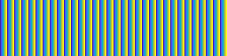

-------------------------

#### copying, resizing and reshaping

```cpp
feng::matrix<double> m{ 64, 256 };
for ( auto r = 12; r != 34; ++r )
    for ( auto c = 12; c != 34; ++c )
        m[r][c] = 1.0;
m.save_as_bmp( "./images/0020_create.bmp" );
```

created matrix m:


```cpp
feng::matrix<double> n = m; //copying
n.save_as_bmp( "./images/0021_create.bmp" );
```

copied matrix n:


```cpp
n.resize( 63, 244 );
n.save_as_bmp( "./images/0022_create.bmp" );
```

resized matrix n:


```cpp
m.reshape( m.col(), m.row() );
m.save_as_bmp( "./images/0023_create.bmp" );
```

reshaped matrix m:


----------

#### matrix slicing

```cpp
feng::matrix<double> m{ 64, 256 };
std::fill( m.upper_diag_begin(1), m.upper_diag_end(1), 1.0 );
std::fill( m.diag_begin(), m.diag_end(), 1.0 );
std::fill( m.lower_diag_begin(1), m.lower_diag_end(1), 1.0 );
m.save_as_bmp( "./images/0000_slicing.bmp" );
```


```cpp
feng::matrix<double> n{ m, 0, 32, 0, 64 };
n.save_as_bmp( "./images/0001_slicing.bmp" );
```


```cpp
feng::matrix<double> p{ m, {16, 48}, {0, 64} };
p.save_as_bmp( "./images/0002_slicing.bmp" );
```


#### Views and iterator invalidation

`feng::make_view(m, {r0, r1}, {c0, c1})` returns a `matrix_view` (read-only) and `feng::make_mutable_view(m, {r0, r1}, {c0, c1})` returns a `mutable_matrix_view` that writes the owner's elements; a mutable view converts to a const view. Both borrow from an lvalue owner only: a view of a temporary owner, such as `make_view(feng::matrix<double>{3, 3}, {0, 1}, {0, 1})`, does not compile, and `make_mutable_view` of a const owner does not compile either. The ranges must satisfy `r0 <= r1 <= m.row()` and `c0 <= c1 <= m.col()`, with exactly two values per brace list, or the call aborts (in every build); an empty range gives an empty view, and nothing is clamped or normalized. A view carries the parent's row stride (`v.row_stride() == m.col()`), so `v[r]`, `v.row_begin(r)`, `v.col_begin(c)` and `v.begin()` walk the parent's memory directly; `feng::matrix<double> n{ v };` copies the viewed rectangle.

```cpp
feng::matrix<double> m{ 4, 5 };
auto w = feng::make_mutable_view( m, {1, 3}, {2, 5} ); // 2x3 block of m
std::fill( w.begin(), w.end(), 1.0 );                  // writes m[1..2][2..4]
feng::matrix_view<double, std::allocator<double>> const v = w; // read-only view of the same block
```

A view is not a lifetime guarantee: it holds a pointer to the owner and to its elements. Views and the column, diagonal and anti-diagonal iterators (and the raw row pointers) are invalidated by

- the owner's destruction;
- reallocation of the owner: `resize`, `reshape`, `clear`, `clone`, a copy into it, a move from it, and `swap`;
- assignment to the owner (copy or move);
- any change of the owner's shape.

Using an invalidated view or iterator is undefined behaviour. Column and diagonal iterators compare by their logical position, so `col_end(c)` never forms an address past the owner's storage, and an out-of-range column or diagonal index aborts. Building with `-DFENG_MATRIX_CHECKED_ITERATORS` adds the owner's origin and extent to the stride and view iterators and aborts on any dereference or position outside the range (the sanitizer and tagged lanes of `tools/check.sh` build this way); it changes the iterator layout, so all translation units of a program must agree on it. See the `## S4` section of [docs/migration.md](docs/migration.md).

#### meshgrid

meshgrid returns 2-D grid coordinates based on the coordinates contained in interger x and y.

```cpp
auto const& [X, Y] = feng::meshgrid( 3, 5 );
std::cout << X << std::endl;
std::cout << Y << std::endl;
```

This will produce

```
0       1       2
0       1       2
0       1       2
0       1       2
0       1       2

0       0       0
1       1       1
2       2       2
3       3       3
4       4       4
```

while the code below

```cpp
auto const& [X, Y] = feng::meshgrid( 384, 512 );
X.save_as_bmp( "./images/0000_meshgrid_x.bmp", "grey" );
Y.save_as_bmp( "./images/0000_meshgrid_y.bmp", "grey" );
```

generates two images


#### arange

```cpp
arange<Type>([start, ]stop, [step, ])
```

Return evenly spaced row matrix within a given interval.

```cpp
auto m = feng::arange<double>( 256*256 );
m.reshape( 256, 256 );
m.save_as_bmp( "./images/0000_arange.bmp" );
```


#### clip

For an normal matrix `m`

```cpp
    feng::matrix<double> m{ 64, 256 };
    std::generate( m.begin(), m.end(),  [](){ double init = 0.0; return [init]() mutable { init += 0.1; return init; }; }() );
    m.save_as_bmp( "./images/0000_clip.bmp" );
```


it can be transformed to range `[0, 1]` by applying `sin` on it

```cpp
    m = feng::sin(m);
    m.save_as_bmp( "./images/0001_clip.bmp" );
```


then this matrix can be clipped to range `[0.1, 0.9]`

```cpp
    auto const& cm0 = feng::clip( 0.1, 0.9 )( m );
    cm0.save_as_bmp( "./images/0002_clip.bmp" );
```


or even to range `[0.4, 0.6]`

```cpp
    auto const& cm1 = feng::clip( 0.4, 0.6 )( m );
    cm1.save_as_bmp( "./images/0003_clip.bmp" );
```


----------------------------------------


### iterations


#### elementwise apply

```cpp
feng::matrix<double> m{ 64, 256 };
std::generate( m.begin(), m.end(),  [](){ double init = 0.0; return [init]() mutable { init += 0.1; return init; }; }() );
m.save_as_bmp( "./images/0000_apply.bmp" );
```

before apply:


```cpp
m.apply( [](auto& x) { x = std::sin(x); } );
m.save_as_bmp( "./images/0001_apply.bmp" );
```

after apply:

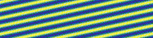

---------------------

#### iteration from head to tail

```cpp
feng::matrix<double> m{ 64, 256 };
std::generate( m.begin(), m.end(),  [](){ double init = 0.0; return [init]() mutable { init += 0.1; return init; }; }() );
m.save_as_bmp( "./images/0000_create.bmp" );
```


------
#### iteration from tail to head

```cpp
feng::matrix<double> m{ 64, 256 };
std::generate( m.rbegin(), m.rend(),  [](){ double init = 0.0; return [init]() mutable { init += 0.1; return init; }; }() );
m.save_as_bmp( "./images/0006_create.bmp" );
```


------
#### iteration through a selected row

```cpp
feng::matrix<double> m{ 64, 256 };
std::generate( m.row_begin(17), m.row_end(17),  [](){ double init = 0.0; return [init]() mutable { init += 0.1; return init; }; }() );
m.save_as_bmp( "./images/0001_create.bmp" );
```


------
#### reverse iteration through a selected row

```cpp
feng::matrix<double> m{ 64, 256 };
std::generate( m.row_rbegin(17), m.row_rend(17),  [](){ double init = 0.0; return [init]() mutable { init += 0.1; return init; }; }() );
m.save_as_bmp( "./images/0003_create.bmp" );
```


------
#### iteration through a selected column

```cpp
feng::matrix<double> m{ 64, 256 };
std::generate( m.col_begin(17), m.col_end(17),  [](){ double init = 0.0; return [init]() mutable { init += 0.1; return init; }; }() );
m.save_as_bmp( "./images/0004_create.bmp" );

```


------
#### reverse iteration through a selected column

```cpp
feng::matrix<double> m{ 64, 256 };
std::generate( m.col_rbegin(17), m.col_rend(17),  [](){ double init = 0.0; return [init]() mutable { init += 0.1; return init; }; }() );
m.save_as_bmp( "./images/0003_create.bmp" );
```


------
#### iteration through diagonal

```cpp
feng::matrix<double> m{ 64, 256 };
std::generate( m.diag_begin(), m.diag_end(),  [](){ double init = 0.0; return [init]() mutable { init += 0.1; return init; }; }() );
m.save_as_bmp( "./images/0011_create.bmp" );
```


------
#### reverse iteration through diagonal

```cpp
feng::matrix<double> m{ 64, 256 };
std::generate( m.diag_rbegin(), m.diag_rend(),  [](){ double init = 0.0; return [init]() mutable { init += 0.1; return init; }; }() );
m.save_as_bmp( "./images/0012_create.bmp" );
```


------
#### iteration through upper diagonal

```cpp
feng::matrix<double> m{ 64, 256 };
std::generate( m.upper_diag_begin(17), m.upper_diag_end(17),  [](){ double init = 0.0; return [init]() mutable { init += 0.1; return init; }; }() );
m.save_as_bmp( "./images/0007_create.bmp" );
```


------
#### reverse iteration through upper diagonal

```cpp
feng::matrix<double> m{ 64, 256 };
std::generate( m.upper_diag_rbegin(17), m.upper_diag_rend(17),  [](){ double init = 0.0; return [init]() mutable { init += 0.1; return init; }; }() );
m.save_as_bmp( "./images/0008_create.bmp" );
```


------

#### iteration through lower diagonal

```cpp
feng::matrix<double> m{ 64, 256 };
std::generate( m.lower_diag_begin(17), m.lower_diag_end(17),  [](){ double init = 0.0; return [init]() mutable { init += 0.1; return init; }; }() );
m.save_as_bmp( "./images/0009_create.bmp" );
```


------
#### reverse iteration through lower diagonal

```cpp
feng::matrix<double> m{ 64, 256 };
std::generate( m.lower_diag_rbegin(17), m.lower_diag_rend(17),  [](){ double init = 0.0; return [init]() mutable { init += 0.1; return init; }; }() );
m.save_as_bmp( "./images/0010_create.bmp" );
```


------


#### iteration through anti diagonal

```cpp
feng::matrix<double> m{ 64, 256 };
std::generate( m.anti_diag_begin(), m.anti_diag_end(),  [](){ double init = 0.0; return [init]() mutable { init += 0.1; return init; }; }() );
m.save_as_bmp( "./images/0017_create.bmp" );
```


------

#### reverse iteration through anti diagonal

```cpp
feng::matrix<double> m{ 64, 256 };
iag_rbegin(), m.anti_diag_rend(),  [](){ double init = 0.0; return [init]() mutable { init += 0.1; return init; }; }() );
m.save_as_bmp( "./images/0018_create.bmp" );
```


------

#### iterator through upper anti diagonal


```cpp
feng::matrix<double> m{ 64, 256 };
std::generate( m.upper_anti_diag_begin(17), m.upper_anti_diag_end(17),  [](){ double init = 0.0; return [init]() mutable { init += 0.1; return init; }; }() );
m.save_as_bmp( "./images/0013_create.bmp" );
```


------

#### reverse iteration through upper anti diagonal

```cpp
feng::matrix<double> m{ 64, 256 };
std::generate( m.upper_anti_diag_rbegin(17), m.upper_anti_diag_rend(17),  [](){ double init = 0.0; return [init]() mutable { init += 0.1; return init; }; }() );
m.save_as_bmp( "./images/0014_create.bmp" );
```


------

#### iteration through lower anti diagonal

```cpp
feng::matrix<double> m{ 64, 256 };
std::generate( m.lower_anti_diag_begin(17), m.lower_anti_diag_end(17),  [](){ double init = 0.0; return [init]() mutable { init += 0.1; return init; }; }() );
m.save_as_bmp( "./images/0015_create.bmp" );
```


------

#### reverse iteration through lower anti diagonal

```cpp
feng::matrix<double> m{ 64, 256 };
std::generate( m.lower_anti_diag_rbegin(17), m.lower_anti_diag_rend(17),  [](){ double init = 0.0; return [init]() mutable { init += 0.1; return init; }; }() );
m.save_as_bmp( "./images/0016_create.bmp" );
```


------

### functions

#### clone -- matrix slicing


```cpp
feng::matrix<double> m{ 64, 256 };
std::fill( m.diag_begin(), m.diag_end(), 1.1 );
m.save_as_bmp( "./images/0000_clone.bmp" );
```

matrix m:


```cpp
auto n = m.clone( 0, 32, 0, 64 );
n.save_as_bmp( "./images/0001_clone.bmp" );
```

m slicing of [0:32, 0:64]:


```cpp
n.clone( m, 32, 64, 0, 64 );
n.save_as_bmp( "./images/0002_clone.bmp" );
```

m slicing of [32:64, 0:64]:


#### astype

For a normal matrix such like

```cpp
feng::matrix<double> m{ 64, 256 };
std::generate( m.begin(), m.end(),  [](){ double init = 0.0; return [init]() mutable { init += 0.1; return std::sin(init); }; }() );
m.save_as_bmp( "./images/0000_astype.bmp" );
```

There are many colors in its visualization.


`astype` can convert it to `3` colors:

```cpp
m = m * 2.0;
auto const& mm = m.astype<int>();
mm.save_as_bmp( "./images/0001_astype.bmp" );
```


-------------------

#### data -- raw memory access

```cpp
feng::matrix<double> m{ 64, 256 };
m.save_as_bmp( "./images/0000_data.bmp" );
```


original matrix


```cpp
auto ptr = m.data();
for (  auto idx = 0UL; idx != m.size(); ++idx )
    ptr[idx] = std::sin( idx*idx*0.1 );
m.save_as_bmp( "./images/0001_data.bmp" );
```

after modification

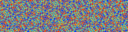

Span and mdspan adapters: `feng::as_span( m )` is a `std::span` over the contiguous row-major storage and `feng::row_span( m, r )` one over row `r` (an out-of-range `r` aborts), in every language mode. Under `__cpp_lib_mdspan` (C++23 and later) `feng::to_mdspan( m )` is a layout_right `std::mdspan` of shape `m.row()`×`m.col()`, and under `__cpp_lib_submdspan` (C++26) `feng::submdspan( m, {r0, r1}, {c0, c1} )` is a validated block of it; in C++20 use `row_span` or the views of [Views and iterator invalidation](#views-and-iterator-invalidation). The adapters borrow the matrix, so a temporary owner is rejected, and they are invalidated like views. See the `## S9` section of [docs/migration.md](docs/migration.md).


--------------------

#### det -- matrix determinant

```cpp
feng::matrix<double> m{ 128, 128 };
std::generate( m.diag_begin(), m.diag_end(), [](){ double x = 0.9; return [x]() mutable { x+= 0.156; return x; }(); } );
double det1 = m.det();
double det2 = std::accumulate( m.diag_begin(), m.diag_end(), 1.0, []( double x, double y ){ return x*y; } );
std::cout << det1 << "\t:\t" << det2 << std::endl;
```
generated output is
```
1069.00941294551	:	1069.0094129455
```

`det()` (and `feng::det( m )`) is sign(P)·∏u_kk from the partial-pivoting LU of [`lu_factor`](#linear-algebra): exactly 0 when the matrix is rank deficient, 1 for a 0×0 matrix, and NaN for a NaN or inf input. An integer matrix must be converted first, e.g. `m.astype<double>().det()`.

-------------

#### operator divide-equal

```cpp
auto m = feng::rand<double>( 197, 197 );
auto n = m;
n /= 2.0;
m /= n;
m.save_as_bmp( "images/0000_divide_equal.bmp" );
```


---------------------------------------------

#### matrix inverse

```cpp
auto const& m = feng::rand<double>( 128, 128 );
auto const& n = m.inverse();
auto const& identity = m * n;
identity.save_as_bmp( "./images/0000_inverse.bmp" );
```


`inverse()`, `feng::inverse( m )` and `feng::inv( m )` return an empty 0×0 matrix when `m` is singular or holds a NaN or inf; to see the reason use `feng::try_inverse( m )` (a `linalg_result`) or `feng::linalg_status feng::inverse( m, out )`, which leaves `out` unchanged unless the status is `ok`.


----------------------------------------

#### save matrix to images with colormap

Here we demonstrate how to save matrix to images with specified colormap.
There are 18 builtin colormaps:

+ autumn
+ bluehot
+ bone
+ cool
+ copper
+ default
+ gray
+ hotblue
+ hot
+ hsv
+ jet
+ lines
+ obscure
+ parula
+ pink
+ spring
+ summer
+ winter
+ gray

First we load the matrix from a '.txt' file

```cpp
feng::matrix<double> m;
m.load_txt( "./images/Lenna.txt" );
```

Then we can save this matrix to a '.bmp' file with `default` colormap:


``` cpp
m.save_as_bmp( "./images/0000_save_with_colormap_default.bmp" );
```

The `default` image looks like:


```cpp
m.save_as_bmp( "./images/0000_save_with_colormap_parula.bmp", "parula" );
```

The `parula` image looks like:


```cpp
m.save_as_bmp( "./images/0000_save_with_colormap_bluehot.bmp", "bluehot" );
```

The `bluehot` image looks like:


```cpp
m.save_as_bmp( "./images/0000_save_with_colormap_hotblue.bmp", "hotblue" );
```

The `hotblue` image looks like:


```cpp
m.save_as_bmp( "./images/0000_save_with_colormap_jet.bmp", "jet" );
```

The `jet` image looks like:


```cpp
m.save_as_bmp( "./images/0000_save_with_colormap_obscure.bmp", "obscure" );
```

The `obscure` image looks like:


```cpp
m.save_as_bmp( "./images/0000_save_with_colormap_gray.bmp", "gray" );
```

The `gray` image looks like:


```cpp
m.save_as_bmp( "./images/0000_save_with_colormap_hsv.bmp", "hsv" );
```

The `hsv` image looks like:


```cpp
m.save_as_bmp( "./images/0000_save_with_colormap_hot.bmp", "hot" );
```

The `hot` image looks like:


```cpp
m.save_as_bmp( "./images/0000_save_with_colormap_cool.bmp", "cool" );
```

The `cool` image looks like:


```cpp
m.save_as_bmp( "./images/0000_save_with_colormap_spring.bmp", "spring" );
```

The `spring` image looks like:


```cpp
m.save_as_bmp( "./images/0000_save_with_colormap_summer.bmp", "summer" );
```

The `summer` image looks like:


```cpp
m.save_as_bmp( "./images/0000_save_with_colormap_autumn.bmp", "autumn" );
```

The `autumn` image looks like:


```cpp
m.save_as_bmp( "./images/0000_save_with_colormap_winter.bmp", "winter" );
```

The `winter` image looks like:


```cpp
m.save_as_bmp( "./images/0000_save_with_colormap_bone.bmp", "bone" );
```

The `bone` image looks like:


```cpp
m.save_as_bmp( "./images/0000_save_with_colormap_copper.bmp", "copper" );
```

The `copper` image looks like:


```cpp
m.save_as_bmp( "./images/0000_save_with_colormap_pink.bmp", "pink" );
```

The `pink` image looks like:


```cpp
m.save_as_bmp( "./images/0000_save_with_colormap_lines.bmp", "lines" );
```

The `lines` image looks like:

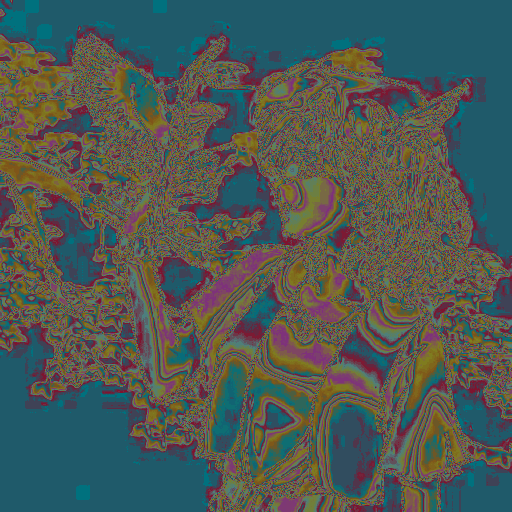


For sparse data such as particles, it is highly recommended to use colormap `bluehot`:

```cpp
feng::matrix<double> m;
m.load_txt( "./images/star.txt" );
m.save_as_bmp( "./images/0001_star_bluehot.bmp", "bluehot" );
```

The starry image generate is demonstrated below:


#### save load

To load an image from a txt file, we can use `.load_txt` method:

```cpp
feng::matrix<double> m;
m.load_txt( "./images/Lenna.txt" );
m.save_as_txt( "./images/0000_save_load.txt" );
m.save_as_binary( "./images/0000_save_load.bin" );
m.save_as_bmp( "./images/0000_save_load.bmp" );
```


The image loaded is

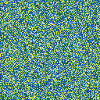

```cpp
feng::matrix<double> n;
n.load_txt( "./images/0000_save_load.txt" );
n.save_as_bmp( "./images/0001_save_load.bmp" );
```


```cpp
n.load_binary( "./images/0000_save_load.bin" );
n.save_as_pgm( "./images/0002_save_load.pgm" );
```


#### load npy

Loading a matrix created by `numpy` is straightforward:

```cpp
feng::matrix<double> mat;
mat.load_npy( "./images/64.npy");
```

The loaders validate their input and are transactional: `load_npy`, `load_txt` and `load_binary` return `false` on a missing, malformed, truncated or oversized file and leave the matrix unchanged, `feng::load_bmp` returns an empty optional, and `operator>>` sets `failbit` and keeps the matrix; none of them aborts, and each failing file loader prints one line to `std::cerr`. `load_npy` checks the magic, version, header dict, shape and payload size; the dtype must match the element type exactly (D-021: `<f8` loads into `matrix<double>`, `<f4` only into `matrix<float>`, with `i1`–`i8`, `u1`–`u8`, `c8` and `c16` likewise, no conversion), a foreign byte order is swapped, `fortran_order: True` loads the logical matrix, and a 1-D array loads as 1×n; bool, `f2`, object, structured, rank 0 and rank 3+ arrays are rejected. A dtype size or shape dimension with a leading zero (`<f08`, `(01, 2)`) is rejected. `load_txt` and `operator>>` parse every token completely with `std::from_chars`: ragged rows, trailing characters, an out-of-range value (including a floating-point underflow such as `1e-400` into `double`) and `-1` into an unsigned type are rejected, and `inf` and `nan` load. Every writer (`save_as_txt`, `save_as_binary`, `save_as_npy`, `save_as_bmp`, `save_as_png`, `save_as_pgm`) returns `false` on a directory, open, write or close failure. `m.save_as_npy( "a.npy" )` writes a v1.0 C-order file with the element type's dtype that `numpy.load` and `load_npy` read back. See the `## S5` section of [docs/migration.md](docs/migration.md).


#### save load bmp

To load an image from a bmp file, we can use `feng::load_bmp` function, which will return an oject of type `std::optional<std::array<feng::matrix<std::uint8_t>,3>>`:

```cpp
std::optional<std::array<matrix<std::uint8_t>,3>> load_bmp( std::string const& file_path ) {...}
```

We first generate an image of Lenna:

```cpp
feng::matrix<double> m;
m.load_txt( "./images/Lenna.txt" );
m.save_as_bmp( "./images/Lenna.bmp", "gray" );
```

which looks like:


Then we can try to load it directly:

```
auto const& mat_3 = feng::load_bmp( "./images/Lenna.bmp" );
```

if successfull, ``mat_3` with hold a channel-first image. To access `mat_3` we need to verify it is accessible first by:

```cpp
if ( mat_3 )
{
```


Then we can visualize its red channel:

```cpp
(*mat_3)[0].save_as_bmp( "./images/0001_save_load_julia_red.bmp", "gray" );
```


green channel:


```cpp
(*mat_3)[1].save_as_bmp( "./images/0001_save_load_julia_green.bmp", "gray" );
```


and blue channel:

```cpp
(*mat_3)[2].save_as_bmp( "./images/0001_save_load_julia_blue.bmp", "gray" );
```


#### save png
It is possible to save matrix as a png file the same way as bmp

```cpp
m.save_as_png( "./images/0000_save_with_colormap_default.png" );
m.save_as_png( "./images/0000_save_with_colormap_parula.png", "parula" );
```


#### operator minus equal

```cpp
    feng::matrix<double> image;
    image.load_txt( "images/Lenna.txt" );
    image.save_as_bmp("images/0000_minus_equal.bmp", "gray");
```


```cpp
    double const min = *std::min_element( image.begin(), image.end() );
    image -= min;
    image.save_as_bmp("images/0001_minus_equal.bmp", "jet");
```


```cpp
    image -= image;
    image.save_as_bmp("images/0002_minus_equal.bmp");
```


#### plot

`plot` is an alias name of `save_as_bmp`:

```cpp
feng::matrix<double> m;
m.load_txt( "./images/Lenna.txt" );
m.plot( "./images/0000_plot_default.bmp" );
```


```cpp
m.plot( "./images/0000_plot_jet.bmp", "jet" );
```


#### Juliet set

Having `plot`/`save_as_bmp` method implemented, it is convenient to plot a juliet set to an image.
The polynomial function is:
f_c(z) = z^n + c
Suppose we have the ranges of z, the x and y coordinates in a 2D image, the power n and the constant c, we can generate an image like this

```cpp
auto make_julia_set( std::complex<double> const& lower_left, std::complex<double> const& upper_right, std::complex<double>const& cval, unsigned long const dim = 1024, unsigned long const iterations = 1024, unsigned long const powers = 2 )
{
    std::complex<double> spacing_ratio{ (std::real(upper_right)-std::real(lower_left)) / static_cast<double>(dim),
                                        (std::imag(upper_right)-std::imag(lower_left)) / static_cast<double>(dim) };

    feng::matrix<std::complex<double>> cmat{ dim, dim };
    for ( auto r = 0UL; r != dim; ++r )
        for ( auto c = 0UL; c != dim; ++c )
            cmat[r][c] = std::complex<double>{ static_cast<double>(r), static_cast<double>(c) };

    auto const& converter = [&spacing_ratio, &lower_left, &upper_right, iterations, powers, &cval]( std::complex<double>& c )
    {
        std::complex<double> z = lower_left + std::complex<double>{ std::real(spacing_ratio)*std::real(c), std::imag(spacing_ratio)*std::imag(c) };
        c = std::complex<double>{ static_cast<double>(iterations), 0 };
        for ( auto idx = 0UL; idx != iterations; ++idx )
        {
            z = std::pow( z, powers ) + cval;
            if ( std::abs(z) > 2.0 )
            {
                c = std::complex<double>{ static_cast<double>(idx), 0 };
                break;
            }
        }
    };

    cmat.apply( converter );
    return feng::real(cmat);
}
```
where the `lower_left` and `upper_right` defines the size of the canvas, the `cval` is for the constant c, the `dim` gives the sampling density, the `iterations` gives the maximum value in the sampled positions, and the `powers` for the maximum order of the polinomial.

Then we are able to generate a series of the fractional images:
```cpp
unsigned long const n = 32;
for ( unsigned r = 0; r != n; ++r )
    for ( unsigned c = 0; c != n; ++c )
    {
        std::complex<double> zc{ double(r)/n*1.8-0.9, double(c)/n*1.8-0.9 };
        auto&&  mat = make_julia_set( std::complex<double>{-1.5, -1.0}, std::complex<double>{1.5, 1.0}, zc, 1024, 1024, 4 );
        std::string file_name = std::string{"./images/julia_set_4/0001_julia_set_"} + std::to_string(r) + std::string{"-"} + std::to_string(c) + std::string{".bmp"};
        mat.save_as_bmp( file_name, "tealhot" );
    }
```

A typical result image looks like this:

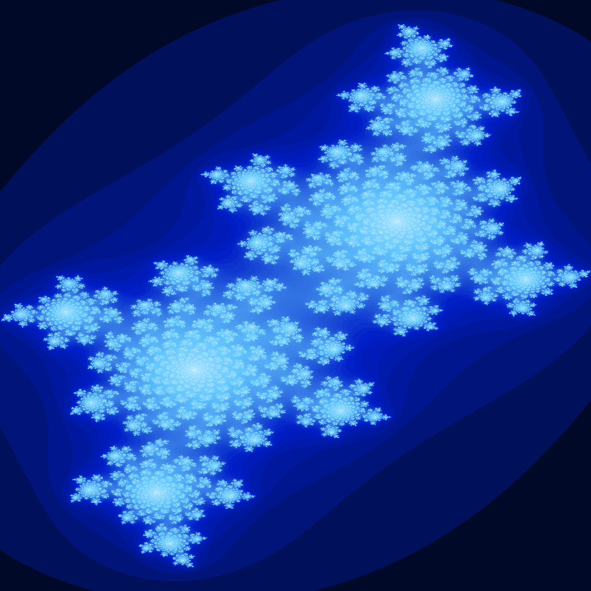


#### operator multiply equal

```cpp
auto m = feng::rand( 127, 127 );
m *= m.inverse();
m.save_as_bmp("images/0001_multiply_equal.bmp");
```


Matrix products (`operator*`, `operator*=` and `direct_multiply`) run one cache-blocked row-major kernel in serial and parallel builds; each entry is the sum over k in ascending order, so serial and parallel builds give bit-identical products. Serial builds no longer switch to Strassen recursion for dimensions of 17 and up (`strassen_multiply` stays callable). In `FENG_MATRIX_PARALLEL` builds the default worker count is work-based: an elementwise call, `for_each`, map or reduction over n elements uses min( hardware_concurrency, n / 65536 ) workers and a product M×K by K×N min( hardware_concurrency, M·K·N / 262144, M ), at least one; starting a thread costs about 19 µs, so a 4×4 add no longer starts 24 threads. Elementwise results do not depend on the worker count; parallel-build reductions of more than 131071 elements fold in that many chunks, so their floating-point rounding depends on the size and the core count (an explicit worker count fixes it). `tools/check.sh bench compare [--smoke]` builds `bench/bench.cc` against the stage start header and the working tree with `-std=c++20 -O2 -pthread`, interleaves pinned runs and judges each optimization in `bench/kept.txt` (at least 10% faster, and no stable workload more than 5% slower); the numbers are in [bench/results.md](bench/results.md). See the `## S10` section of [docs/migration.md](docs/migration.md).


#### operator plus equal

```cpp
    feng::matrix<double> image;
    image.load_txt( "images/Lenna.txt" );
    image.save_as_bmp("images/0000_plus_equal.bmp", "gray");
```


```cpp
    double const mn = *std::min_element( image.begin(), image.end() );
    double const mx = *std::max_element( image.begin(), image.end() );
    image = (image - mn)/(mx - mn);

    auto const& noise = feng::rand<double>( image.row(), image.col() );
    image += 0.1*noise;
    image.save_as_bmp("images/0001_plus_equal.bmp", "gray");
```


#### operator prefix

```cpp
auto const& m = feng::random<double>( 127, 127 );
auto const& pp = +m;
auto const& pm = -m;
auto const& shoule_be_zero = pp + pm;
shoule_be_zero.save_as_bmp("images/0000_prefix.bmp");
```


-------------------------------------------

### elementwise mathematical functions

Most [common mathematical functions](http://en.cppreference.com/w/cpp/numeric/math) are supported as elementwise matrix operator. Here only `sin` and `sinh` are demonstrated


#### elementwise sin

```cpp
feng::matrix<double> m{ 64, 256 };
std::generate( m.begin(), m.end(),  [](){ double init = 0.0; return [init]() mutable { init += 0.1; return init; }; }() );
m.save_as_bmp( "./images/0000_sin.bmp" );
```


```cpp
m = feng::sin(m);
m.save_as_bmp( "./images/0001_sin.bmp" );
```


#### elementwise sinh

```cpp
feng::matrix<double> m{ 64, 256 };
std::generate( m.begin(), m.end(),  [](){ double init = 0.0; return [init]() mutable { init += 0.1; return init/500.0; }; }() );
m.save_as_bmp( "./images/0000_sinh.bmp" );
```


```cpp
m = feng::sinh(m);
m.save_as_bmp( "./images/0001_sinh.bmp" );
```


### common functions
#### eye function

```cpp
auto const& m = feng::eye<double>( 128, 128 );
m.save_as_bmp( "./images/0000_eye.bmp" );
```


#### linspace

```cpp
auto const& m = feng::linspace<double>( 1, 10, 10 );
std::cout << "linspace<double>(1, 10, 10):\n" << m << std::endl;
```

gives out an array of size 1 x 10:

> linspace<double>(1, 10, 10):
> 1       2       3       4       5       6       7       8       9       10


```cpp
auto const& m = feng::linspace<double>( 1, 10, 10, false );
std::cout << "linspace<double>(1, 10, 10, false):\n" << m << std::endl;

```

gives out an array of size 1 x 9:

> linspace<double>(1, 10, 10, false):
> 1       1.89999999999999991     2.79999999999999982     3.69999999999999973     4.59999999999999964     5.5     6.40000000000000036     7.30000000000000071     8.20000000000000107     9.10000000000000142

And the prototype of  `linspace` is:

```cpp
matrix<T> linspace( T start, T stop, const std::uint_least64_t num = 50ULL, bool end_point=true )
```


#### magic function

```cpp
template < typename T = std::uint_least64_t, typename A = std::allocator< T > > matrix< T, A > magic( n )
```

`magic( n )` is unchanged and `magic< double >( n )` builds the same square with `double` elements. Since `magic` is a template, `&feng::magic` and passing `feng::magic` as a callable no longer compile; use `&feng::magic<>` or a lambda. See the `## S9` section of [docs/migration.md](docs/migration.md).

Calling `magic` method is quite straightforward:


```cpp
std::cout << "Magic 3\n" << feng::magic( 3 ) << std::endl;
std::cout << "Magic 4\n" << feng::magic( 4 ) << std::endl;
std::cout << "Magic 5\n" << feng::magic( 5 ) << std::endl;
std::cout << "Magic 6\n" << feng::magic( 6 ) << std::endl;
```


This will produce a series of magic matrices:

```

Magic 3
 8      1       6
3       5       7
4       9       2

Magic 4
 16     3       2       13
5       10      11      8
9       6       7       12
4       15      14      1

Magic 5
 17     24      1       8       15
23      5       7       14      16
4       6       13      20      22
10      12      19      21      3
11      18      25      2       9

Magic 6
 32     29      4       1       24      21
30      31      2       3       22      23
12      9       17      20      28      25
10      11      18      19      26      27
13      16      33      36      8       5
14      15      34      35      6       7

```

Also we can expand it a bit to do a better visualization:

```cpp
unsigned long n = 38;
unsigned long pixs = 16;

auto const& mat = feng::magic( n );

feng::matrix<double> v_mat( n*pixs, n*pixs );

for ( auto r = 0UL; r != n; ++r )
    for ( auto c = 0UL; c != n; ++c )
        for ( auto rr = 0UL; rr != pixs; ++rr )
            for ( auto cc = 0UL; cc != pixs; ++cc )
                v_mat[r*pixs+rr][c*pixs+cc] = mat[r][c];

v_mat.save_as_bmp("./images/0001_magic.bmp");

```

This produces an image looks like:


#### matrix convolution


```cpp
feng::matrix<double> m;
m.load_txt( "./images/Lenna.txt" );
m.save_as_bmp( "./images/0000_conv.bmp", "gray" );
```


`conv( A, B )` and `conv( A, B, mode )` (`conv2` is the same function) follow `scipy.signal.convolve2d` (D-004, D-030): the kernel B is reversed, out[i][j] = Σ A[p][q]·B[i−p][j−q], so `conv` of [1, 2] with [3, 4] is [3, 10, 8]. The value type is `Mat::value_type`. The default mode is `full`, the (ra+rb−1)×(ca+cb−1) result with zero-paddings:


```cpp
feng::matrix<double> filter{3, 3, {0.0, 1.0, 0.0,
                                   1.0,-4.0, 1.0,
                                   0.0, 1.0, 0.0}};
auto const& edge = feng::conv( m, filter );
edge.save_as_bmp( "./images/0001_conv.bmp", "gray" );
```


The convolution has three modes, `"full"`, `"same"` and `"valid"`; any other mode string aborts with a message.

The `valid` mode keeps only the entries computed without zero-paddings, (ra−rb+1)×(ca−cb+1) when A contains B in both dimensions; when B contains A the operands are swapped (as scipy does), and when neither contains the other the call aborts:

```cpp
auto const& edge_valid = feng::conv( m, filter, "valid" );
edge_valid.save_as_bmp( "./images/0001_conv_valid.bmp", "gray" );
```


The `same` mode returns A's shape, cropped from the full result at row (rb−1)/2 and column (cb−1)/2 (integer division), for every kernel shape, including even and 1×1 kernels:

```cpp
auto const& edge_same = feng::conv( m, filter, "same" );
edge_same.save_as_bmp( "./images/0001_conv_same.bmp", "gray" );
```


`full` mode is the default mode:

```cpp
auto const& edge_full = feng::conv( m, filter, "full" );
edge_full.save_as_bmp( "./images/0001_conv_full.bmp", "gray" );
```


Because the kernel is reversed, an asymmetric kernel gives the true convolution, not a correlation; with this Sobel kernel the result is the horizontal derivative (left minus right neighbours):

```cpp
feng::matrix<double> sobel{3, 3, {-1.0, 0.0, 1.0,
                                  -2.0, 0.0, 2.0,
                                  -1.0, 0.0, 1.0}};
auto const& edge_sobel = feng::conv( m, sobel, "same" );
edge_sobel.save_as_bmp( "./images/0001_conv_sobel.bmp", "gray" );
```


An operand with a zero dimension gives an empty 0×0 matrix in `full` and `valid` mode and zeros of A's shape in `same` mode. See the `## S8` section of [docs/migration.md](docs/migration.md).


#### fft

`feng::fft( x )` and `feng::ifft( x )` follow `numpy.fft.fft2` and `numpy.fft.ifft2`: X[k][l] = Σ x[m][n]·exp(−2πi(km/R + ln/C)), and `ifft` uses exp(+2πi(km/R + ln/C)) divided by R·C, so `ifft( fft( x ) )` ≈ x. Both run in O(N log N) for every size (radix-2 for power-of-two lengths, Bluestein otherwise, no external dependency, D-007). The result is a `feng::matrix` of complex elements: `float`, `double` and `long double` give `std::complex` of the same real type, `std::complex<T>` stays, and integer types give `std::complex<double>` (D-031); an empty input gives an empty result of the same shape.

`feng::fftshift( x )` and `feng::ifftshift( x )` are pure permutations, no transform: they roll x by (⌊R/2⌋, ⌊C/2⌋) and by (−⌊R/2⌋, −⌊C/2⌋) like `numpy.fft.fftshift` and `ifftshift`, return x's own matrix type, and `ifftshift( fftshift( x ) )` equals x for odd and even sizes. To centre a spectrum write `feng::fftshift( feng::fft( x ) )`.

```cpp
feng::matrix<double> x( 4, 6 );
// ... fill x ...
auto const X        = feng::fft( x );               // feng::matrix<std::complex<double>>
auto const centred  = feng::fftshift( X );          // zero frequency at (2, 3)
auto const back     = feng::ifft( feng::ifftshift( centred ) ); // ≈ x
```


#### make view function

```cpp
feng::matrix<double> m;
m.load_txt( "./images/Lenna.txt" );
m.save_as_bmp( "./images/0000_make_view.bmp" );
```


```cpp
auto const[r,c] = m.shape();
auto const& v = feng::make_view( m, {r>>2, (r>>2)*3}, {c>>2, (c>>2)*3} );

v.save_as_bmp( "./images/0001_make_view.bmp" );
```


And creating new matrix from a view

```cpp
auto new_matrix{v};
new_matrix.save_as_bmp( "./images/0002_make_view.bmp" );
```


A matrix view has several methods, `row()`, `col()`, `shape()` and `operator[]()`:

```cpp
feng::matrix<double> n{ v.row(), v.col() }; // row() and col() of a matrix view
for ( auto r = 0UL; r != n.row(); ++r )
    for ( auto c = 0UL; c != n.col(); ++c )
        n[r][c] = v[r][c]; // accessing matrix elements using operator [], read-only
n.save_as_bmp( "./images/0003_make_view.bmp", "gray" );
```


#### singular value decomposition

We first Load an image from hardisk and normalize it to range `[0,1]`

```cpp
// load
feng::matrix<double> m;
m.load_txt( "./images/Teacher.txt" );
// normalize
auto const mx = *std::max_element( m.begin(), m.end() );
auto const mn = *std::min_element( m.begin(), m.end() );
m = ( m - mn ) / ( mx - mn + 1.0e-10 );
// take a snapshot
m.save_as_bmp( "./images/0000_singular_value_decomposition.bmp", "gray" );
```

This image looks like:


Then we add some white noise to remove possible singularity in it:


```cpp
// adding noise
auto const[r, c] = m.shape();
m += feng::rand<double>( r, c );
// record noisy matrix
m.save_as_bmp( "./images/0001_singular_value_decomposition.bmp", "gray" );
```

The noisy image now looks like


We execute Singular Value Decomposition by calling function `std::optional<std::tuple<matrix, matrix, matrix>> singular_value_decomposition( matrix const& )`, or `svd`.
For an m×n matrix the tuple is `(u, w, v)` with thin shapes: `u` is m×k, `w` is the k×k diagonal matrix of singular values (descending) and `v` is n×k, k = min(m, n), so that `m == u * w * vᴴ` (use `feng::ctranspose( v )` for complex elements).
It is `std::nullopt` when the one-sided Jacobi iteration does not converge within 64 sweeps; `feng::svd_factor( m )` returns the factors with a status instead (see [Linear algebra](#linear-algebra)).


```cpp
// execute svd
auto const& svd = feng::singular_value_decomposition( m );
```

If the svd is successfully, we can verify the accuricy by reconstructing the noisy image by matrix multiplications


```
// check svd result
if (svd) // case successful
{
	// extracted svd result matrices: u (r x k), w (k x k, diagonal), v (c x k), k = min(r, c)
	auto const& [u, w, v] = (*svd);
	// try to reconstruct matrix using  u * w * v'
	auto const& m_ = u * w * (v.transpose());
	// record reconstructed matrix
	m_.save_as_bmp( "./images/0002_singular_value_decomposition.bmp", "gray" );
```

The reconstructed image looks like:


One interesting application of SVD is data compression. In the code above, we use full rank to restore the original noisy image.
However, we can select only 1/2 or 1/4 or even less ranks to approximate the original image.
The code below demonstrates how:

```cpp
	auto dm = std::min( r, c );
	auto factor = 2UL;
	while ( dm >= factor )
	{
		auto new_dm = dm / factor;

		feng::matrix<double> const new_u{ u, std::make_pair(0UL, r), std::make_pair(0UL, new_dm) };
		feng::matrix<double> const new_w{ w, std::make_pair(0UL, new_dm), std::make_pair(0UL, new_dm) };
		feng::matrix<double> const new_v{ v, std::make_pair(0UL, c), std::make_pair(0UL, new_dm) };

		auto const& new_m = new_u * new_w * new_v.transpose();

		new_m.save_as_bmp( "./images/0003_singular_value_decomposition_"+std::to_string(new_dm)+".bmp", "gray" );

		factor *= 2UL;
	}
}
else
{
	std::cout << "Failed to execute Singular Value Decomposition for this matrix!\n";
}

```

When using `256` ranks, the reconstructed image lookes like:


When using `128` ranks, the reconstructed image lookes like:


When using `64` ranks, the reconstructed image lookes like:


When using `32` ranks, the reconstructed image lookes like:


When using `16` ranks, the reconstructed image lookes like:


When using `8` ranks, the reconstructed image lookes like:

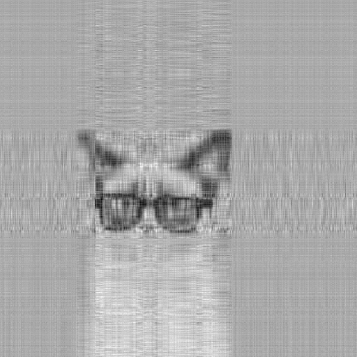

When using `4` ranks, the reconstructed image lookes like:


When using `2` ranks, the reconstructed image lookes like:

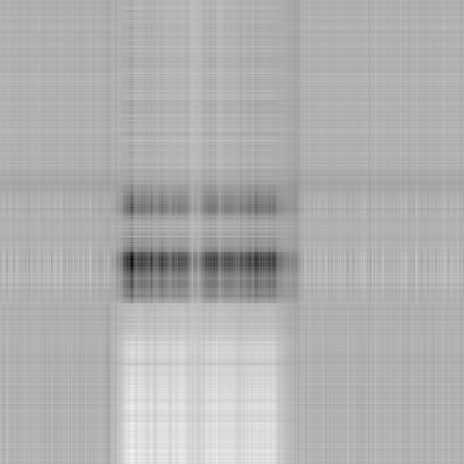

When using `1` ranks, the reconstructed image lookes like:

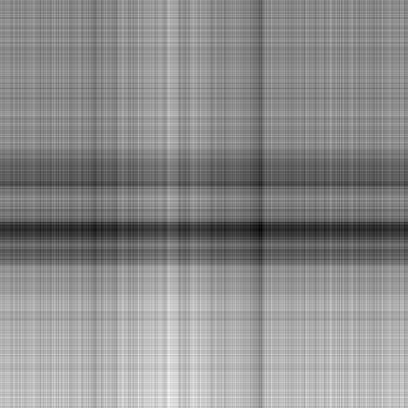

#### pooling

We are able to pooling an image with function `pooling( matrix, dim_row, dim_col, option )`, where `option` can be either of `mean`, `max`, or `min`, if no option provided, then `mean` is applied.

For an normal image

```cpp
feng::matrix<double> m;
m.load_txt( "./images/Lenna.txt" );
m.save_as_bmp( "./images/0000_pooling.bmp", "gray" );
```


A `2X2` mean pooling looks like:

```cpp
auto const& pooling_2 = feng::pooling( m, 2 );
pooling_2.save_as_bmp( "./images/0000_pooling_2.bmp", "gray" );
```


And a `4X4` pooling is

```cpp
auto const& pooling_4 = feng::pooling( m, 4 );
pooling_4.save_as_bmp( "./images/0000_pooling_4.bmp", "gray" );
```


For hyterdyne pooling of `2X4`

```cpp
auto const& pooling_2_4 = feng::pooling( m, 2, 4 );
pooling_2_4.save_as_bmp( "./images/0000_pooling_2_4.bmp", "gray" );
```


And `4X2`

```cpp
auto const& pooling_4_2 = feng::pooling( m, 4, 2 );
pooling_4_2.save_as_bmp( "./images/0000_pooling_4_2.bmp", "gray" );
```


Also `min` pooling is possible

```cpp
auto const& pooling_min = feng::pooling( m, 2, "min" );
pooling_min.save_as_bmp( "./images/0000_pooling_2_min.bmp", "gray" );
```


And `max` pooling

```cpp
auto const& pooling_max = feng::pooling( m, 2, "max" );
pooling_max.save_as_bmp( "./images/0000_pooling_2_max.bmp", "gray" );
```


#### gauss jordan elimination

for a random matrix

```cpp
auto const& m = feng::rand<double>( 64, 128);
m.save_as_bmp( "./images/0000_gauss_jordan_elimination.bmp", "gray" );
```

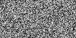


```cpp
auto const& n = feng::gauss_jordan_elimination( m ); //<- also `feng::rref(m);`, alias name from Matlab

if (n)
    (*n).save_as_bmp( "./images/0001_gauss_jordan_elimination.bmp", "gray" );
else
    std::cout << "Failed to execute Gauss-Jordan Elimination for matrix m.\n";
```

`gauss_jordan_elimination` and `rref` accept a matrix of any shape (square, tall, wide, rank deficient) and return its reduced row echelon form; a column without a pivot above max(m, n)·ε·‖m‖∞ is skipped, as in MATLAB's `rref`. They return `std::nullopt` only when the matrix holds a NaN or inf; `feng::row_echelon( m )` also gives the pivot columns and the rank.

after applying Gauss Jordan elimination, the matrix is reduced to a form of


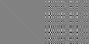


#### lu decomposition

We load a Lena from harddisk file `./images/Lenna.txt` using function `load_txt(std::string const&)`:

```cpp
    // initial matrix
    feng::matrix<double> m;
    m.load_txt( "./images/Lenna.txt" );
    m.save_as_bmp( "./images/0000_lu_decomposition.bmp", "gray" );
```


The loaded image lookes like below:


Then we scale this image to range `[0,1]` and add some uniform random noise to it (to remove singularity of the original image)

```cpp
    // adding noise
    double mn = *std::min_element( m.begin(), m.end() );
    double mx = *std::max_element( m.begin(), m.end() );
    m = (m-mn) / (mx - mn + 1.0e-10);
    auto const& [row, col] = m.shape();
    m += feng::rand<double>( row, col );
    m.save_as_bmp( "./images/0001_lu_decomposition.bmp", "gray" );
```

The noised image lookes like:


we can do LU decomposition simply with `std::optional<std::tuple<matrix, matrix>>lu_decomposition( matrix const& )` function


```cpp
    // lu decomposition
    auto const& lu = feng::lu_decomposition( m );
    if (lu)
    {
        auto const& [l, u] = lu.value();
        l.save_as_bmp( "./images/0002_lu_decomposition.bmp", "jet" );
```

the result of the LU decompositon is a Maybe monad of a tuple of two matrices, i.e., `std::optional<std::tuple<feng::matrix<Type, Allocator>, feng::matrix<Type, Allocator>>>`,
therefor, we need to check its value before using it. It is `std::nullopt` when the matrix is singular (rank below n) or holds a NaN or inf.
The factorization uses partial pivoting, and, like MATLAB's two-output `[L, U] = lu(A)`, `L` is the row-permuted lower triangular matrix Pᵀ·L₀, so `A == L * U`;
`feng::lu_factor( m )` gives the unit lower triangular factor, the pivots and the status separately (see [Linear algebra](#linear-algebra)).

Then we can draw the (permuted) lower matrix `L`


```cpp
        u.save_as_bmp( "./images/0003_lu_decomposition.bmp", "jet" );
```

And the upper matrix `U`


```cpp

        auto const& reconstructed = l * u;
        reconstructed.save_as_bmp( "./images/0004_lu_decomposition.bmp", "gray" );
```

We can multiply `L` and `U` back to see if the decomposition is correct or not.


```cpp
    }
    else
    {
        std::cout << "Error: Failed to execute lu decomposition for matrix m!\n";
    }

```

A typical use of LU Decomposition is to solve an equation in the form of `Ax=b`,
this is done by calling `auto const& x = feng::lu_solver(A,b)`, and, again, the returned value is a Maybe monad, `std::optional<matrix> lu_solver( matrix const&, matrix const& )`,
therefore we need to check its value before using it (it is `std::nullopt` for a singular `A`). `feng::solve( A, B )` solves for several right-hand sides at once and returns a `linalg_result`.


```cpp
    auto const X = feng::rand<double>( row, 1 );
    auto const b = m * X;
    auto const& ox = feng::lu_solver( m, b );

    if (ox)
    {
        auto const& diff = ox.value() - X;
        auto const mae = std::sqrt( std::inner_product(diff.begin(), diff.end(), diff.begin(), 0.0) / diff.size() );
        std::cout << "mean absolute error for lu solver is " << mae << "\n";
    }
    else
    {
        std::cout << "Error: Failed to solve equation with lu solver!\n";
    }
```

And we can also evaluate the solver's accuracy with the mean absolute value error; the output as small as


 ```
 mean absolute error for lu solver is 2.34412875135465e-10
 ```


## License

```
Copyright <2018> <Feng Wang>

Redistribution and use in source and binary forms, with or without modification, are permitted provided that the following conditions are met:

1. Redistributions of source code must retain the above copyright notice, this list of conditions and the following disclaimer.

2. Redistributions in binary form must reproduce the above copyright notice, this list of conditions and the following disclaimer in the documentation and/or other materials provided with the distribution.

3. Neither the name of the copyright holder nor the names of its contributors may be used to endorse or promote products derived from this software without specific prior written permission.

THIS SOFTWARE IS PROVIDED BY THE COPYRIGHT HOLDERS AND CONTRIBUTORS "AS IS" AND ANY EXPRESS OR IMPLIED WARRANTIES, INCLUDING, BUT NOT LIMITED TO, THE IMPLIED WARRANTIES OF MERCHANTABILITY AND FITNESS FOR A PARTICULAR PURPOSE ARE DISCLAIMED. IN NO EVENT SHALL THE COPYRIGHT HOLDER OR CONTRIBUTORS BE LIABLE FOR ANY DIRECT, INDIRECT, INCIDENTAL, SPECIAL, EXEMPLARY, OR CONSEQUENTIAL DAMAGES (INCLUDING, BUT NOT LIMITED TO, PROCUREMENT OF SUBSTITUTE GOODS OR SERVICES; LOSS OF USE, DATA, OR PROFITS; OR BUSINESS INTERRUPTION) HOWEVER CAUSED AND ON ANY THEORY OF LIABILITY, WHETHER IN CONTRACT, STRICT LIABILITY, OR TORT (INCLUDING NEGLIGENCE OR OTHERWISE) ARISING IN ANY WAY OUT OF THE USE OF THIS SOFTWARE, EVEN IF ADVISED OF THE POSSIBILITY OF SUCH DAMAGE.
```

## Dependency

This library only depends on a C++-20 standard compiler.

## Installation
This is a single-file header-only library. Put `matrix.hpp` directly into the project source tree or somewhere reachable from your project.


## [Synopsis](#header-matrix-synopsis)

## Building tests and examples

Run `make test example` (or `make`) at the root folder. It builds with portable `-std=c++20 -O2 -Wall -Wextra -DFENG_MATRIX_PARALLEL -isystem tests -pthread` into `build/test_test` and `build/test_example` (`BUILD_DIR=...` picks another directory). `make FAST=1 test example` restores the old `-Ofast -flto=auto -funroll-all-loops -march=native` flags. Run both binaries from the root folder: the tests read `./images/*.npy` and the example rewrites `./images/*`.

The checks run through `tools/check.sh <lane> [args] [--smoke]`, which builds only under `build/` and ends with `LANE <lane> PASS` or `LANE <lane> FAIL: <reason>`. Lanes: `gcc` and `clang` (C++20/23/26, debug and NDEBUG, serial and FENG_MATRIX_PARALLEL), `sanitize` (ASan+UBSan), `warnings` (`-Wall -Wextra -Werror`), `api` (one translation unit per API family, with and without `-fno-exceptions`), `examples` (runs the example in a scratch copy of `images/`), `make`, `ci`, `docs <stage>`, `tagged '<catch spec>'` and `all` (every regression lane; `tools/check.sh all --smoke` for a quick run).

## Notes and references


## Design

### Requirements


In the table below, `M` denotes a matrix of type `T` using allocator of type `A`, `m` is a value of type `A`, `a` and `b` denote values of type `M`, `u` denotes an identifier, `r` denotes a non-constant value of type `M`, and `rv` denotes a non-const rvalue of type `M`.


| Expression  | ReturnType  | Operational Sematics  | Assertion, pre-/post-condition  | Complexity  |
|---|---|---|---|---|
| `M::value_type`  | `T`   |   | `T` is Erasable from `M`  | compile time  |
| `M::reference`  | `T&`  |   |   | compile time  |
| `M::const_reference`  | `T cosnt&`   |   |   | compile time  |
| `M::difference_type`  | signed integer type  |   | identical to the difference type of `M::iterator` and `M::const_iterator`  |  compile time |
| `M::size_type`  | unsigned integer type  |   | any type that can represent non-negative value of `difference_type`  | compile time  |
| `M::allocator_type`  | `A`  |   | `M::allocator_type::value_type` is identical to `M::value_type`  | compile time  |
| `M::iterator`  | iterator type whose value type is `T`  |   | any iterator category that meets the RandomAccessIterator requirements, convertible to `M::const_iterator`  | compile time  |
| `M::reverse_iterator`  | iterator type whose value type is `T`  |   | `reverse_iterator<iterator>`  | compile time  |
| `M::const_iterator`  | constant iterator type whose value type is `T`  |   | any iterator category that meets the RandomAccessIterator requirements  | compile time  |
| `M::const_reverse_iterator` | constant iterator type whose value type is `T`   |   | `reverse_iterator<const_iterator>`  | compile time  |
| `M::row_iterator`  | iterator type whose value type is `T`  |   | any iterator category that meets the RandomAccessIterator requirements, convertible to `M::const_row_iterator`  | compile time  |
| `M::reverse_row_iterator`  | iterator type whose value type is `T`  |   | `reverse_iterator<row_iterator>`  | compile time  |
| `M::const_row_iterator`  | constant iterator type whose value type is `T`  |   | any iterator category that meets the RandomAccessIterator requirements  | compile time  |
| `M::const_reverse_row_iterator` | constant iterator type whose value type is `T`   |   | `reverse_iterator<const_row_iterator>`  | compile time  |
| `M::col_iterator`  | iterator type whose value type is `T`  |   | any iterator category that meets the RandomAccessIterator requirements, convertible to `M::const_col_iterator`  | compile time  |
| `M::reverse_col_iterator`  | iterator type whose value type is `T`  |   | `reverse_iterator<col_iterator>`  | compile time  |
| `M::const_col_iterator`  | constant iterator type whose value type is `T`  |   | any iterator category that meets the RandomAccessIterator requirements  | compile time  |
| `M::const_reverse_col_iterator` | constant iterator type whose value type is `T`   |   | `reverse_iterator<const_col_iterator>`  | compile time  |
| `M::diag_iterator`  | iterator type whose value type is `T`  |   | any iterator category that meets the RandomAccessIterator requirements, convertible to `M::const_diag_iterator`  | compile time  |
| `M::reverse_diag_iterator`  | iterator type whose value type is `T`  |   | `reverse_iterator<diag_iterator>`  | compile time  |
| `M::const_diag_iterator`  | constant iterator type whose value type is `T`  |   | any iterator category that meets the RandomAccessIterator requirements  | compile time  |
| `M::const_reverse_diag_iterator` | constant iterator type whose value type is `T`   |   | `reverse_iterator<const_diag_iterator>`  | compile time  |
| `M::diag_iterator`  | iterator type whose value type is `T`  |   | any iterator category that meets the RandomAccessIterator requirements, convertible to `M::const_diag_iterator`  | compile time  |
| `M::reverse_diag_iterator`  | iterator type whose value type is `T`  |   | `reverse_iterator<diag_iterator>`  | compile time  |
| `M::const_diag_iterator`  | constant iterator type whose value type is `T`  |   | any iterator category that meets the RandomAccessIterator requirements  | compile time  |
| `M::const_reverse_diag_iterator` | constant iterator type whose value type is `T`   |   | `reverse_iterator<const_diag_iterator>`  | compile time  |
| `M::anti_diag_iterator`  | iterator type whose value type is `T`  |   | any iterator category that meets the RandomAccessIterator requirements, convertible to `M::const_anti_diag_iterator`  | compile time  |
| `M::reverse_anti_diag_iterator`  | iterator type whose value type is `T`  |   | `reverse_iterator<anti_diag_iterator>`  | compile time  |
| `M::const_anti_diag_iterator`  | constant iterator type whose value type is `T`  |   | any iterator category that meets the RandomAccessIterator requirements  | compile time  |
| `M::const_reverse_anti_diag_iterator` | constant iterator type whose value type is `T`   |   | `reverse_iterator<const_anti_diag_iterator>`  | compile time  |
|   |   |   |   |   |
|   |   |   |   |   |
|   |   |   |   |   |
|   |   |   |   |   |


### Header `<matrix>` synopsis

```cpp
namespace xxx
{

    template < typename T, class Allocator = allocator<T> >
    struct matrix
    {
    	//types:
        typedef T 								                        value_type;
        typedef Allocator                                               allocator_type;
        typedef value_type& 					                        reference;
        typedef value_type const&                                       const_reference;
        typedef implementation-defined                                  iterator;
        typedef implementation-defined                                  const_iterator;
        typedef implementation-defined                                  row_iterator;
        typedef implementation-defined                                  const_row_iterator;
        typedef implementation-defined                                  col_iterator;
        typedef implementation-defined                                  const_col_iterator;
        typedef implementation-defined                                  diag_iterator;
        typedef implementation-defined                                  const_diag_iterator;
        typedef implementation-defined                                  anti_diag_iterator;
        typedef implementation-defined                                  const_anti_diag_iterator;
        typedef implementation-defined                                  size_type;
        typedef implementation-defined                                  difference_type;
        typedef typename allocator_trait<allocator_type>::pointer       pointer;
        typedef typename allocator_trait<allocator_type>::const_pointer const_pointer;
        typedef std::reverse_iterator<iterator>                         reverse_iterator;
        typedef std::reverse_iterator<const_iterator>                   const_reverse_iterator;
        typedef std::reverse_iterator<row_iterator>                     row_reverse_iterator;
        typedef std::reverse_iterator<const_row_iterator>               const_row_reverse_iterator;
        typedef std::reverse_iterator<col_iterator>                     col_reverse_iterator;
        typedef std::reverse_iterator<const_col_iterator>               const_col_reverse_iterator;
        typedef std::reverse_iterator<diag_iterator>                    diag_reverse_iterator;
        typedef std::reverse_iterator<const_diag_iterator>              const_diag_reverse_terator;
        typedef std::reverse_iterator<anti_diag_iterator>               anti_diag_reverse_iterator;
        typedef std::reverse_iterator<const_anti_diag_iterator>         const_anti_diag_reverse_terator;


        // construct, copy and destroy
        matrix() noexcept;
        explicit matrix ( allocator_type const& ) noexcept;
        explicit matrix ( size_type row_, size_type col_, allocator_type const& = Allocator() );
        matrix( matrix const& );
        matrix( matrix&& ) noexcept;
        matrix( matrix const&, allocator_type const& );
        matrix( matrix&&, allocator_type const& );
        ~matrix();

        matrix& operator = ( matrix const& );
        matrix& operator = ( matrix && ) noexcept( allocator_traits<allocator_type>::propagate_on_container_move_assignment::value || allocator_traits<allocator_type>::is_always_equal::value );

        allocator_type get_allocator() const noexcept;


        //iterators
        iterator                                begin() noexcept;
        const_iterator                          begin() const noexcept;
        iterator                                end() noexcept;
        const_iterator                          end() const noexcept;
        row_iterator                            row_begin(size_type) noexcept;
        const_row_iterator                      row_begin(size_type) const noexcept;
        row_iterator                            row_end(size_type) noexcept;
        const_row_iterator                      row_end(size_type) const noexcept;
        col_iterator                            col_begin(size_type) noexcept;
        const_col_iterator                      col_begin(size_type) const noexcept;
        col_iterator                            col_end(size_type) noexcept;
        const_col_iterator                      col_end(size_type) const noexcept;
        diag_iterator                           diag_begin(difference_type) noexcept;
        const_diag_iterator                     diag_begin(difference_type) const noexcept;
        diag_iterator                           diag_end(difference_type) noexcept;
        const_diag_iterator                     diag_end(difference_type) const noexcept;

        //reverse iterators
        reverse_iterator                        rbegin() noexcept;
        const_reverse_iterator                  rbegin() const noexcept;
        reverse_iterator                        rend() noexcept;
        const_reverse_iterator                  rend() const noexcept;
        row_reverse_iterator                    row_rbegin(size_type) noexcept;
        const_row_reverse_iterator              row_rbegin(size_type) const noexcept;
        row_reverse_iterator                    row_rend(size_type) noexcept;
        const_row_reverse_iterator              row_rend(size_type) const noexcept;
        col_reverse_iterator                    col_rbegin(size_type) noexcept;
        const_col_reverse_iterator              col_rbegin(size_type) const noexcept;
        col_reverse_iterator                    col_rend(size_type) noexcept;
        const_col_reverse_iterator              col_rend(size_type) const noexcept;
        diag_reverse_iterator                   diag_rbegin(difference_type) noexcept;
        const_diag_reverse_iterator             diag_rbegin(difference_type) const noexcept;
        diag_reverse_iterator                   diag_rend(difference_type) noexcept;
        const_diag_reverse_iterator             diag_rend(difference_type) const noexcept;

        //const iterators
        const_iterator                          cbegin() const noexcept;
        const_iterator                          cend() const noexcept;
        const_row_iterator                      row_cbegin(size_type) const noexcept;
        const_row_iterator                      row_cend(size_type) const noexcept;
        const_col_iterator                      col_cbegin(size_type) const noexcept;
        const_col_iterator                      col_cend(size_type) const noexcept;
        const_diag_iterator                     diag_cbegin(difference_type) const noexcept;
        const_diag_iterator                     diag_cend(difference_type) const noexcept;
        const_reverse_iterator                  crbegin() const noexcept;
        const_reverse_iterator                  crend() const noexcept;
        const_row_reverse_iterator              row_crbegin(size_type) const noexcept;
        const_row_reverse_iterator              row_crend(size_type) const noexcept;
        const_col_reverse_iterator              col_crbegin(size_type) const noexcept;
        const_col_reverse_iterator              col_crend(size_type) const noexcept;
        const_diag_reverse_iterator             diag_crbegin(difference_type) const noexcept;
        const_diag_reverse_iterator             diag_crend(difference_type) const noexcept;

        //capacity and shape
        size_type                               size() const noexcept;
        size_type                               row() const noexcept;
        size_type                               col() const noexcept;
        void                                    resize( size_type row_, size_type col_ );
        void                                    resize( size_type row_, size_type col_, value_type const& value_ );
        void                                    reshape( size_type row_, size_type col_ );
        void                                    transpose();


        //element access
        iterator                                operator[](size_type row_ );
        const_iterator                          operator[](size_type row_ ) const; //TODO
        reference                               operator()( size_type row_, size_type col_ );
        const_reference                         operator()( size_type row_, size_type col_ ) const;
        reference                               at( size_type row_, size_type col_ );
        const_reference                         at( size_type row_, size_type col_ ) const;


        //data access
        pointer                                 data() noexcept;
        const_pointer                           data() const noexcept;

        //modifiers
        void                                    clean() noexcept;
        void                                    swap( matrix& ) noexcept( allocator_traits<allocator_type>::propagate_on_container_move_assignment::value || allocator_traits<allocator_type>::is_always_equal::value );

        //loader, saver and ploter
        void                                    load( string const& file_name_ );
        void                                    save_as( string const& file_name_ );
        void                                    plot( string const& file_name_ ) const;
        void                                    plot( string const& file_name_, string const& builtin_color_scheme_name_ ) const;

        //unary operators
        matrix                                  operator+() const;
        matrix                                  operator-() const;
        matrix                                  operator~() const;
        matrix                                  operator~() const; //bool only

        //computed assignment
        //TODO: return optional<matrix>?
        matrix&                                 operator*=( matrix const& );
        matrix&                                 operator/=( matrix const& );
        matrix&                                 operator+=( matrix const& );
        matrix&                                 operator-=( matrix const& );
        matrix&                                 operator*=( value_type const );
        matrix&                                 operator/=( value_type const );
        matrix&                                 operator%=( value_type const );
        matrix&                                 operator+=( value_type const );
        matrix&                                 operator-=( value_type const );
        matrix&                                 operator^=( value_type const );
        matrix&                                 operator&=( value_type const );
        matrix&                                 operator|=( value_type const );
        matrix&                                 operator<<=( value_type const );
        matrix&                                 operator>>=( value_type const );


        //basic numeric operations
        value_type                              det() const;
        value_type                              tr() const;


    };

    //building functions
    template< typename T, typename A > matrix<T,A> make_eye( size_type row_, size_type col_, A const& alloc_ );
    template< typename T > matrix<T,std::allocator<T>> make_eye( size_type row_, size_type col_ );
    template< typename T, typename A > matrix<T,A> make_zeros( size_type row_, size_type col_, A const& alloc_ );
    template< typename T > matrix<T,std::allocator<T>> make_zeros( size_type row_, size_type col_ );
    template< typename T, typename A > matrix<T,A> make_ones( size_type row_, size_type col_, A const& alloc_ );
    template< typename T > matrix<T,std::allocator<T>> make_ones( size_type row_, size_type col_ );
    template< typename T, typename A > matrix<T,A> make_diag( matrix<T,A> const );
    template< typename T, typename A > matrix<T,A> make_triu( matrix<T,A> const );
    template< typename T, typename A > matrix<T,A> make_tril( matrix<T,A> const );
    template< typename T, typename A > matrix<T,A> make_rand( size_type row_, size_type col_, A const& alloc_ );
    template< typename T > matrix<T,std::allocator<T>> make_rand( size_type row_, size_type col_ );
    template< typename T, typename A > matrix<T,A> make_hilb( size_type n_, A const& alloc_ );
    template< typename T > matrix<T,std::allocator<T>> make_hilb( size_type n_ );
    template< typename T, typename A > matrix<T,A> make_magic( size_type n_, A const& alloc_ );
    template< typename T > matrix<T,std::allocator<T>> make_magic( size_type n_ );
    template< typename T, typename A, typename Input_Itor_1, typename Input_Iterator_2 > matrix<T, A> make_toeplitz( Input_Iterator_1 begin_, Input_Iterator_1 end_, Input_Iterator_2 begin_2_, A const alloc_ );
    template< typename T, typename A, typename Input_Itor > matrix<T, A> make_toeplitz( Input_Iterator begin_, Input_Iterator end_, A const alloc_ );
    template< typename T, typename Input_Itor_1, typename Input_Iterator_2 > matrix<T, std::allocator<T> > make_toeplitz( Input_Iterator_1 begin_, Input_Iterator_1 end_, Input_Iterator_2 begin_2_ ):
    template< typename T, typename Input_Itor > matrix<T, std::allocator<T>> make_toeplitz( Input_Iterator begin_, Input_Iterator end_ );
    template< typename T, typename A > matrix<T,A> make_horizontal_cons( matrix<T,A> const&, matrix<T,A> const& );
    template< typename T, typename A > matrix<T,A> make_vertical_cons( matrix<T,A> const&, matrix<T,A> const& );


    //binary operation
    //TODO: return optional<matrix>?
    template< typename T, typename A > matrix<T,A> operator * ( matrix<T,A> const&, matrix<T,A> const& );
    template< typename T, typename A > matrix<T,A> operator * ( matrix<T,A> const&, T const& );
    template< typename T, typename A > matrix<T,A> operator * ( T const&, matrix<T,A> const& );

    template< typename T, typename A > matrix<T,A> operator / ( matrix<T,A> const&, matrix<T,A> const& );
    template< typename T, typename A > matrix<T,A> operator / ( matrix<T,A> const&, T const& );
    template< typename T, typename A > matrix<T,A> operator / ( T const&, matrix<T,A> const& );

    template< typename T, typename A > matrix<T,A> operator + ( matrix<T,A> const&, matrix<T,A> const& );
    template< typename T, typename A > matrix<T,A> operator + ( matrix<T,A> const&, T const& );
    template< typename T, typename A > matrix<T,A> operator + ( T const&, matrix<T,A> const& );

    template< typename T, typename A > matrix<T,A> operator - ( matrix<T,A> const&, matrix<T,A> const& );
    template< typename T, typename A > matrix<T,A> operator - ( matrix<T,A> const&, T const& );
    template< typename T, typename A > matrix<T,A> operator - ( T const&, matrix<T,A> const& );

    template< typename T, typename A > matrix<T,A> operator % ( matrix<T,A> const&, T const& );
    template< typename T, typename A > matrix<T,A> operator ^ ( matrix<T,A> const&, T const& );
    template< typename T, typename A > matrix<T,A> operator & ( matrix<T,A> const&, T const& );
    template< typename T, typename A > matrix<T,A> operator | ( matrix<T,A> const&, T const& );
    template< typename T, typename A > matrix<T,A> operator << ( matrix<T,A> const&, T const& );
    template< typename T, typename A > matrix<T,A> operator >> ( matrix<T,A> const&, T const& );

    template< typename T, typename A > std::ostream& operator << ( std::ostream&, matrix<T,A> const& );
    template< typename T, typename A > std::istream& operator << ( std::istream&, matrix<T,A> const& );

    //logical (design only, not implemented: since S3 `matrix<bool>` is ill-formed, see `matrix_element`; the
    //implemented matrix-matrix ==, <, >, <= and >= return a single bool)
    template< typename T, typename A > matrix<bool,std::allocator_traits<A>::rebind_alloc<bool> > operator == ( matrix<T,A> const&, matrix<T,A> const& );
    template< typename T, typename A > matrix<bool,std::allocator_traits<A>::rebind_alloc<bool> > operator == ( matrix<T,A> const&, T const& );
    template< typename T, typename A > matrix<bool,std::allocator_traits<A>::rebind_alloc<bool> > operator == ( T const&, matrix<T,A> const& );
    template< typename T, typename A > matrix<bool,std::allocator_traits<A>::rebind_alloc<bool> > operator != ( matrix<T,A> const&, matrix<T,A> const& );
    template< typename T, typename A > matrix<bool,std::allocator_traits<A>::rebind_alloc<bool> > operator != ( matrix<T,A> const&, T const& );
    template< typename T, typename A > matrix<bool,std::allocator_traits<A>::rebind_alloc<bool> > operator != ( T const&, matrix<T,A> const& );
    template< typename T, typename A > matrix<bool,std::allocator_traits<A>::rebind_alloc<bool> > operator >= ( matrix<T,A> const&, matrix<T,A> const& );
    template< typename T, typename A > matrix<bool,std::allocator_traits<A>::rebind_alloc<bool> > operator >= ( matrix<T,A> const&, T const& );
    template< typename T, typename A > matrix<bool,std::allocator_traits<A>::rebind_alloc<bool> > operator >= ( T const&, matrix<T,A> const& );
    template< typename T, typename A > matrix<bool,std::allocator_traits<A>::rebind_alloc<bool> > operator <= ( matrix<T,A> const&, matrix<T,A> const& );
    template< typename T, typename A > matrix<bool,std::allocator_traits<A>::rebind_alloc<bool> > operator <= ( matrix<T,A> const&, T const& );
    template< typename T, typename A > matrix<bool,std::allocator_traits<A>::rebind_alloc<bool> > operator <= ( T const&, matrix<T,A> const& );
    template< typename T, typename A > matrix<bool,std::allocator_traits<A>::rebind_alloc<bool> > operator > ( matrix<T,A> const&, matrix<T,A> const& );
    template< typename T, typename A > matrix<bool,std::allocator_traits<A>::rebind_alloc<bool> > operator > ( matrix<T,A> const&, T const& );
    template< typename T, typename A > matrix<bool,std::allocator_traits<A>::rebind_alloc<bool> > operator > ( T const&, matrix<T,A> const& );
    template< typename T, typename A > matrix<bool,std::allocator_traits<A>::rebind_alloc<bool> > operator < ( matrix<T,A> const&, matrix<T,A> const& );
    template< typename T, typename A > matrix<bool,std::allocator_traits<A>::rebind_alloc<bool> > operator < ( matrix<T,A> const&, T const& );
    template< typename T, typename A > matrix<bool,std::allocator_traits<A>::rebind_alloc<bool> > operator < ( T const&, matrix<T,A> const& );
    template< typename T, typename A > matrix<bool,std::allocator_traits<A>::rebind_alloc<bool> > operator && ( matrix<T,A> const&, matrix<T,A> const& );
    template< typename T, typename A > matrix<bool,std::allocator_traits<A>::rebind_alloc<bool> > operator && ( matrix<T,A> const&, T const& );
    template< typename T, typename A > matrix<bool,std::allocator_traits<A>::rebind_alloc<bool> > operator && ( T const&, matrix<T,A> const& );
    template< typename T, typename A > matrix<bool,std::allocator_traits<A>::rebind_alloc<bool> > operator || ( matrix<T,A> const&, matrix<T,A> const& );
    template< typename T, typename A > matrix<bool,std::allocator_traits<A>::rebind_alloc<bool> > operator || ( matrix<T,A> const&, T const& );
    template< typename T, typename A > matrix<bool,std::allocator_traits<A>::rebind_alloc<bool> > operator || ( T const&, matrix<T,A> const& );


    //numeric functions
    template< typename T, typename A, typename F > matrix<T,A> element_wise_apply ( matrix<T,A> const&, F const& f_ );

    //Linear Equations

    //mldivide 	Solve systems of linear equations Ax = B for x
    template< typename T, typename A, typename F > matrix<T,A> mldivide ( matrix<T,A> const&, matrix<T,A> const& );
    //mrdivide 	Solve systems of linear equations xA = B for x
    template< typename T, typename A, typename F > matrix<T,A> mrdivide ( matrix<T,A> const&, matrix<T,A> const& );
    //linsolve 	Solve linear system of equations
    template< typename T, typename A, typename F > matrix<T,A> mrdivide ( matrix<T,A> const&, matrix<T,A> const& );
    //inv 	Matrix inverse
    template< typename T, typename A, typename F > matrix<T,A> inv ( matrix<T,A> const& );
    //pinv 	Moore-Penrose pseudoinverse of matrix
    template< typename T, typename A, typename F > matrix<T,A> pinv ( matrix<T,A> const& );
    //lscov 	Least-squares solution in presence of known covariance
    template< typename T, typename A, typename F > matrix<T,A> lscov ( matrix<T,A> const&, matrix<T,A> const& );
    template< typename T, typename A, typename F > matrix<T,A> lscov ( matrix<T,A> const&, matrix<T,A> const&, matrix<T,A> const& );
    //lsqnonneg 	Solve nonnegative linear least-squares problem
    template< typename T, typename A, typename F > matrix<T,A> lsqnonneg ( matrix<T,A> const&, matrix<T,A> const& );
    template< typename T, typename A, typename F > matrix<T,A> lsqnonneg ( matrix<T,A> const&, matrix<T,A> const&, matrix<T,A> const& );
    //sylvester 	Solve Sylvester equation AX + XB = C for X
    template< typename T, typename A, typename F > matrix<T,A> sylvester ( matrix<T,A> const&, matrix<T,A> const&, matrix<T,A> const& );

    //Eigenvalues ans Singular Values

    //eig 	Eigenvalues and eigenvectors
    template< typename T, typename A, typename F > std::tuple<matrix<T,A>,matrix<T,A>> eig( matrix<T,A> const& );
    //eigs 	Subset of eigenvalues and eigenvectors -- TODO
    //balance 	Diagonal scaling to improve eigenvalue accuracy
    //svd 	Singular value decomposition
    template< typename T, typename A, typename F > std::tuple<matrix<T,A>,matrix<T,A>,matrix<T,A>> svd( matrix<T,A> const& );
    //svds 	Subset of singular values and vectors -- TODO
    //gsvd 	Generalized singular value decomposition
    template< typename T, typename A, typename F > std::tuple<matrix<T,A>,matrix<T,A>,matrix<T,A>,matrix<T,A>> gsvd( matrix<T,A> const&, matrix<T,A> const& );
    //ordeig 	Eigenvalues of quasitriangular matrices
    template< typename T, typename A, typename F > matrix<T,A> ordeig( matrix<T,A> const& );
    template< typename T, typename A, typename F > matrix<T,A> ordeig( matrix<T,A> const&, matrix<T,A> const& );


}

//linear algebra
/*
ordqz 	Reorder eigenvalues in QZ factorization
ordschur 	Reorder eigenvalues in Schur factorization
polyeig 	Polynomial eigenvalue problem
qz 	QZ factorization for generalized eigenvalues
hess 	Hessenberg form of matrix
schur 	Schur decomposition
rsf2csf 	Convert real Schur form to complex Schur form
cdf2rdf 	Convert complex diagonal form to real block diagonal form
lu 	LU matrix factorization
ldl 	Block LDL' factorization for Hermitian indefinite matrices
chol 	Cholesky factorization
cholupdate 	Rank 1 update to Cholesky factorization
qr 	Orthogonal-triangular decomposition
qrdelete 	Remove column or row from QR factorization
qrinsert 	Insert column or row into QR factorization
qrupdate 	Rank 1 update to QR factorization
planerot 	Givens plane rotation
transpose 	Transpose vector or matrix
ctranspose 	Complex conjugate transpose
mtimes 	Matrix Multiplication
mpower 	Matrix power
sqrtm 	Matrix square root
expm 	Matrix exponential
logm 	Matrix logarithm
funm 	Evaluate general matrix function
kron 	Kronecker tensor product
cross 	Cross product
dot 	Dot product
bandwidth 	Lower and upper matrix bandwidth
tril 	Lower triangular part of matrix
triu 	Upper triangular part of matrix
isbanded 	Determine if matrix is within specific bandwidth
isdiag 	Determine if matrix is diagonal
ishermitian 	Determine if matrix is Hermitian or skew-Hermitian
issymmetric 	Determine if matrix is symmetric or skew-symmetric
istril 	Determine if matrix is lower triangular
istriu 	Determine if matrix is upper triangular
norm 	Vector and matrix norms
normest 	2-norm estimate
cond 	Condition number with respect to inversion
condest 	1-norm condition number estimate
rcond 	Reciprocal condition number
condeig 	Condition number with respect to eigenvalues
det 	Matrix determinant
null 	Null space
orth 	Orthonormal basis for range of matrix
rank 	Rank of matrix
rref 	Reduced row echelon form (Gauss-Jordan elimination)
trace 	Sum of diagonal elements
subspace 	Angle between two subspaces
cosm
sinm
tanm
ctanm
acosm
asinm
atanm
atan2m
coshm
sinhm
tanhm
acosh
asinh
atanh
expm -- expm(A) and expm(A, B)
logm
log10m
exp2m
log2m
logm
powm
sqrtm
cbrtm
hypotm
erfm
erfcm
tgammam
lgammam


//trigonometric
sin
cos
tan
cot
sec
csc

arcsin
arccos
arctan
arccot
arcsec
arccsc


//hyperbolic
sinh
cosh
tanh
coth
sech
csch
arsinh
arcosh
artanh
arsech
arcsch
arcoth
*/


//Fourier Analysis and Filtering
/*
fft
fftshift
ifft
ifftshift
conv
filter
ss2tf
*/

```
