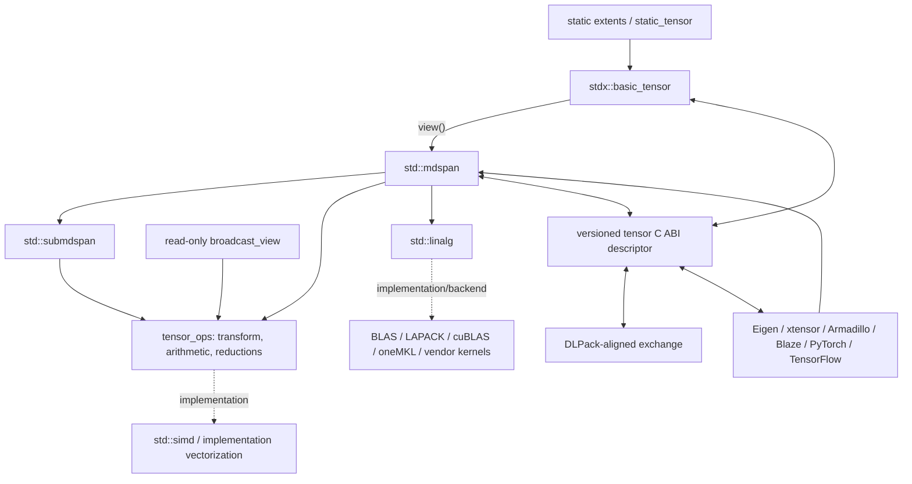
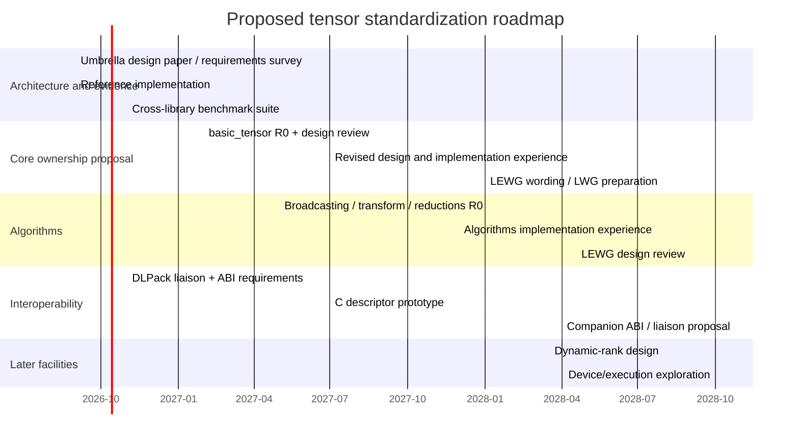

# Designing a NumPy-Like Tensor and Algebra Library for the C++ Standard Library

## Executive summary and assumptions

As of **August 16, 2026**, the C++ committee has effectively moved into the C++29 development cycle: N5050 is described by the editors as both the final draft for C++26 and the initial working draft for C++29, and the June 2026 Brno meeting explicitly listed work on C++29 features as its primary objective. A new tensor facility therefore has, at best, a **C++29 core-facility target**, with broader NumPy-like functionality more realistically extending into C++32 unless the proposal is deliberately decomposed. citeturn20search10turn20search0

The central recommendation of this study is **not to propose “NumPy for C++” as one monolithic Standard Library facility**. The standards landscape has changed substantially: C++ already has `std::mdspan` as its non-owning multidimensional vocabulary, `std::submdspan` for slicing, padded and strided layout mappings, an increasingly substantial `<linalg>` facility whose algorithms explicitly consume `mdspan`, and `<simd>` as a portable vectorization vocabulary. The current `<linalg>` draft includes BLAS-1/2/3 operations, matrix-vector and matrix-matrix products, packed BLAS layouts, scaled/conjugated/transposed views, and execution-policy overloads. citeturn0search0turn0search12turn18search2turn19view0turn22view0turn22view1

The most standardizable design is therefore a **thin owning tensor layer plus multidimensional algorithms and interoperability**, not a competing numerical universe:

> **`std::tensor` should be to `std::mdspan` approximately what `std::vector` is to `std::span`: ownership, lifetime and allocation on one side; views and algorithms on the other.**

That principle also follows earlier WG21 work: P1684 explicitly identified the missing owning multidimensional counterpart to `mdspan`, while P1673 deliberately designed `<linalg>` as free algorithms separated from data structures so that optimized implementations and different container types can share the same algorithms. citeturn0search18turn0search1turn0search7

My proposed architecture is therefore:

1. **Core owning tensor:** allocator-aware, fixed rank at compile time but with individually dynamic extents, zero-copy conversion to `mdspan`, initially supporting packed row-major and column-major storage.
2. **Tensor algorithms:** NumPy-compatible trailing-dimension broadcasting, generic elementwise transforms, a small core of named arithmetic operations, reductions, shape transformations, copying/conversion, and explicit output-taking forms.
3. **Reuse rather than duplicate `<linalg>`:** matrices produced by the tensor owner become `mdspan`s and flow directly into `std::linalg::matrix_product`, `matrix_vector_product`, norms, triangular operations, and related facilities. The current draft explicitly specifies that `<linalg>` accesses arrays through `mdspan`. citeturn19view0turn22view0
4. **No standardized expression-template DAG in the first proposal.** Eager value-returning APIs plus explicit `*_into` APIs should define semantics; implementations remain free to use expression templates, SIMD, loop fusion, BLAS calls, or other optimizations under the as-if rule. Libraries such as xtensor and Blaze demonstrate both the power and considerable semantic/implementation complexity of lazy expression systems. citeturn1search6turn1search4turn21search10
5. **No dynamic-rank owner in the initial normative paper.** `std::mdspan` fundamentally has compile-time rank, so `tensor<T, 4>` with four runtime extents composes naturally with it, while a NumPy-style object whose rank itself changes at runtime needs a second vocabulary and should be a follow-on proposal. citeturn0search3turn0search6
6. **No runtime `dtype` object in the core C++ API.** `T` is the dtype. Type-erased, runtime-dtype tensors belong in a later interoperability/dynamic-tensor layer.
7. **A binary interoperability specification should be a separate companion effort**, centered on a versioned, plain-C memory descriptor inspired heavily by DLPack rather than freezing the binary representation of `std::tensor`. DLPack already has a mature C descriptor carrying data, device, rank, dtype, shape, element strides and byte offset, together with versioned managed lifetime and stream-exchange machinery. The current DLPack header declares ABI major version 1, minor version 3. citeturn15search0turn4search1
8. **GPU ownership and execution are extension points, not V1 semantics.** Device tensors involve execution contexts, synchronization and pointers that are not necessarily host-dereferenceable; DLPack's current-work-stream mechanism and the different memory/execution models of CUDA and oneAPI illustrate why pretending that all device storage is just `T*` would be incorrect. citeturn15search0turn5search0turn10search0

**Explicit assumptions.**

| Question left unspecified | Assumption used in this blueprint |
|---|---|
| Target language version | Source compatibility with **C++23**, designed for adoption in **C++29**; exploit C++26 facilities where available. |
| “STL” | Interpreted as the ISO **C++ Standard Library**, not only the historical STL container/iterator subset. |
| Primary workloads | Scientific computing, numerical simulation, signal/image processing and ML-adjacent dense tensor calculations. |
| First proposal | CPU-centric dense owning tensor plus views/algorithms; interoperability is designed concurrently but can advance in a separate paper/specification. |
| Rank | Compile-time rank in V1; extents may be compile-time or runtime. Dynamic rank is follow-up work. |
| Default memory order | `std::layout_right`, matching ordinary C/C++ multidimensional-array and NumPy default C-order intuition; `layout_left` is first-class. NumPy documents C order as normally having the last index vary fastest. citeturn17view2 |
| Sparse tensors | Not part of V1. |
| Autograd | Not part of the Standard Library tensor abstraction. |
| Device memory | Describable through interop, but not directly owned/executed by core V1. |
| Runtime dtype/quantization | ABI/interchange concern initially; not an owning tensor concern. |
| Exception policy | Allocation and shape errors use ordinary C++ exception conventions; unchecked indexing remains a precondition violation like existing contiguous containers. |
| Numerical semantics | Follow C++ scalar arithmetic unless an algorithm explicitly says otherwise; do not silently import NumPy's complete dtype-promotion lattice. |
| Reference implementation | Open, permissively licensed, independently benchmarked against several existing libraries. |

The proposed **first-adoption boundary** is deliberately narrower than NumPy:

| Facility | First normative proposal | Follow-on | Explicitly out of core |
|---|---|---|---|
| Dense owning N-D tensor | Yes | — | — |
| Static rank + runtime extents | Yes | — | — |
| Dynamic rank | No | Yes | — |
| `layout_right` / `layout_left` owner | Yes | — | — |
| Positive arbitrary strided views | Via `mdspan` | — | — |
| Padded owning layouts | Possibly later | Yes | — |
| Negative strides | ABI can represent; core view unresolved | Yes | — |
| NumPy broadcasting | Yes | More advanced broadcasting later | — |
| Basic slicing | Reuse `submdspan` | Ergonomic wrappers | — |
| Boolean/fancy indexing | No | Possible | — |
| Elementwise transform / basic ufuncs | Yes | Large ufunc catalog | — |
| Reductions | Core subset | Rich axis/dynamic-rank API | — |
| BLAS-like algebra | Reuse `<linalg>` | Higher tensor contractions | — |
| `einsum`, `tensordot` | No | Possible | — |
| Random distributions | Reuse `<random>` initially | Tensor helpers | — |
| File I/O | No | Probably ecosystem | Yes for V1 |
| Sparse | No | Separate proposal | — |
| Autograd/computation graphs | No | — | Yes |
| GPU owning tensor | No | Possible executor/device proposal | — |
| Distributed tensors | No | — | Yes |
| Runtime dtype / `any_tensor` | No | Yes | — |
| Sub-byte packed elements | ABI only initially | Possible | — |

This scope is intentionally informed by NumPy's own complexity. NumPy's basic slicing can remain a view by changing metadata such as strides, while advanced indexing creates copies; broadcasting has its own precise shape algebra; and NumPy now has substantial separate work around dtype promotion. Attempting to standardize all three dimensions simultaneously would greatly enlarge the semantic surface of a first C++ proposal. citeturn17view1turn17view0turn14search0

## Standards landscape and design evidence

The proposal should begin from the premise that **the Standard Library already has most of the low-level vocabulary needed for a tensor owner**.

`std::mdspan` separates a multidimensional view into an extents type, a layout mapping and an accessor policy. This separation is extremely important: index-space shape, logical-to-physical mapping and element access can vary independently without making the owner or algorithms understand every storage technology. P0009 made that decomposition central to `mdspan`. citeturn0search6

`std::submdspan` then supplies slicing without inventing another NumPy-specific slice object hierarchy. The facility takes one slice specifier per source dimension and computes the resulting subview and layout mapping. citeturn0search12turn18search7

The post-C++26 working draft goes considerably further. It contains `layout_left_padded` and `layout_right_padded`; `layout_right_padded`, for example, behaves like `layout_right` except that its padding stride may exceed the corresponding extent. `<linalg>` additionally has `layout_blas_packed`, a specialized layout for packed BLAS matrix representations. citeturn18search2turn19view0

One terminological issue therefore needs to be resolved early in the paper: **“packed” can mean three unrelated things**.

| Meaning of “packed” | Recommended terminology |
|---|---|
| Ordinary dense tensor with no unused holes | **contiguous/exhaustive dense layout** |
| BLAS symmetric/triangular packed matrix | `std::linalg::layout_blas_packed` |
| Several sub-byte logical values in each storage byte | **bit-packed dtype/storage** |

The latter is especially important for ML interoperability. DLPack's present dtype vocabulary includes float8, float6 and float4 encodings and has a flag distinguishing packed versus padded sub-byte types. That should not force a first C++ owner to pretend a four-bit logical value is an ordinary C++ object addressable as `T&`. citeturn15search0

The current `<linalg>` direction strongly argues against creating another matrix API inside `<tensor>`. It contains elementwise addition, dot products, norms, GEMV and GEMM-class algorithms, and `matrix_product(A,B,C)` has both ordinary and execution-policy overloads. These algorithms operate on matrix/vector concepts whose concrete access ultimately goes through multidimensional views. citeturn19view0turn22view0turn22view1

Likewise, portable vectorization is no longer something a tensor proposal needs to expose as vendor-specific intrinsics. The current C++ working draft contains the SIMD library, while ongoing WG21 SIMD work discusses object representation and ABI constraints. The tensor interface should therefore permit implementations to use SIMD aggressively **without making SIMD width part of tensor type identity or ABI**. citeturn19view1turn9search11

There is also a reason to be selective about `constexpr`. Current WG21 analysis of further `constexpr`-ification notes that constant evaluation can constrain implementation techniques such as type-punning, reinterpretation and SIMD-intrinsic based implementation strategies. Tensor metadata and genuinely compile-time tensors are excellent `constexpr` candidates; mandating that every optimized dynamic numerical kernel be constant-evaluable is not automatically a win. citeturn9search29

The strongest ecosystem evidence can be summarized as follows.

| Library / facility | Structural lesson for a standard tensor proposal | What should be borrowed | What should not be copied wholesale |
|---|---|---|---|
| **NumPy** | Buffer + dtype + shape/stride metadata; precise broadcasting and view/copy semantics. Basic slicing is view-oriented; advanced indexing is copying. citeturn17view1turn17view0 | Broadcasting semantics, explicit shape operations, predictable view/copy distinction. | Python's runtime typing, every indexing mode, complete ufunc catalog. |
| **`std::mdspan` / `<linalg>`** | Policies cleanly separate extents, mappings and access; algebra algorithms can be data-structure-independent. citeturn0search6turn19view0 | Make this the foundation rather than replacing it. | Do not turn `mdspan` itself into an owner. |
| **xtensor** | NumPy-style broadcasting and lazy computation work well in C++, but expression ownership has to distinguish borrowed lvalues from owned rvalues. citeturn1search6turn1search4 | Broadcasting experience, external-data adaptation, extensive reference prototype tests. | Exposing an expression-template closure model as V1 Standard Library semantics. |
| **Eigen Tensor** | Owning `Tensor`, fixed-size tensor and `TensorMap` demonstrate useful separation of owner and external view; row- and column-major layouts exist, and expression evaluation is lazy. citeturn2search2turn2search8 | Source interoperability via `mdspan`/`Map`, static-shape optimization. | Eigen-specific expression hierarchy and alignment ABI assumptions. |
| **Armadillo** | Dense matrices are column-major; delayed evaluation and BLAS/LAPACK integration show the value of high-level syntax backed by established kernels. citeturn8search0turn7search0 | Backend delegation and alias-aware evaluation. | Matrix/cube-specific API as the general N-D tensor model. |
| **Blaze** | Smart expression templates combine high-level expressions with tuned kernels rather than blindly fusing every expression. Research on Blaze was motivated in part by cases where conventional ET evaluation did not reach optimized BLAS performance. citeturn21search10 | Kernel-aware optimization strategy. | Making expression types and optimization heuristics normative. |
| **PyTorch** | A tensor is fundamentally metadata over dtype/device/storage/sizes/strides; current PyTorch also has an ABI-stable `stable::Tensor` direction. citeturn11search2turn11search0 | Device-aware ABI vocabulary and adapters. | Autograd, dispatch keys and framework runtime semantics. |
| **TensorFlow** | `Tensor` can be built around an allocator or external `TensorBuffer`, emphasizing explicit buffer ownership. citeturn3search3 | External-buffer ownership lessons. | TensorFlow graph/runtime semantics. |
| **DLPack** | Mature versioned C ABI for shape, signed strides, dtype, device and managed lifetime, including stream exchange. citeturn15search0turn4search1 | Treat as the interoperability baseline. | An incompatible parallel ecosystem unless WG21 has a concrete reason. |
| **ONNX** | Tensor serialization has type, shape and data, including external-data facilities and symbolic dimensions at the model level. citeturn3search6turn3search10 | Serialization adapters. | Treating ONNX as an arbitrary-stride in-memory ABI—it is not one. |
| **cuBLAS / cuBLASLt** | Legacy cuBLAS is fundamentally BLAS/GPU-oriented, while cuBLASLt exposes richer layout/type/algorithm descriptors. citeturn10search0 | Backend adapters selected from layout metadata. | CUDA handles or streams in a portable `std::tensor` type. |
| **oneMKL / oneAPI** | BLAS interfaces explicitly distinguish row-major and column-major usage; USM APIs operate on device-accessible pointers. citeturn5search0turn5search4 | Preserve enough layout/device information for zero-copy lowering. | Making SYCL queue ownership a core tensor requirement. |

The resulting architecture should look like this:



A subtle but consequential conclusion follows from the comparison: **NumPy compatibility should mean compatibility of useful semantics, not API transliteration**. NumPy's implementation model is dynamically typed and runtime-ranked. Standard C++ derives much of its value from static type/rank information and generic compile-time dispatch. NumPy's NEP 50 also had to undertake a dedicated redesign of promotion semantics; the resulting rules deliberately distinguish weakly typed Python scalars from NumPy dtypes. That is evidence that promotion is a first-class language/ecosystem policy, not something C++ should casually inherit. citeturn14search0turn14search2

## Proposed semantic model and API blueprint

All API examples below deliberately use **`stdx`**, not `std`, to distinguish proposed vocabulary from facilities that exist today.

The core semantic type should be an **allocator-aware, value-semantic owner whose rank is part of its C++ type**:

```cpp
namespace stdx {

template<class Layout, class Extents>
concept owning_tensor_layout =
    requires {
        typename Layout::template mapping<Extents>;
    } &&
    Layout::template mapping<Extents>::is_always_unique() &&
    Layout::template mapping<Extents>::is_always_exhaustive();

template<
    class T,
    class Extents,
    class Layout = std::layout_right,
    class Allocator = std::allocator<T>>
requires owning_tensor_layout<Layout, Extents>
class basic_tensor {
public:
    using value_type      = T;
    using extents_type    = Extents;
    using layout_type     = Layout;
    using mapping_type    = typename Layout::template mapping<Extents>;
    using allocator_type  = Allocator;
    using size_type       = std::size_t;
    using reference       = T&;
    using const_reference = const T&;

    static constexpr std::size_t rank() noexcept {
        return Extents::rank();
    }

    constexpr basic_tensor()
        requires (Extents::rank_dynamic() == 0);

    explicit basic_tensor(
        const Extents& extents,
        const Allocator& alloc = {});

    basic_tensor(
        const Extents& extents,
        const T& initial_value,
        const Allocator& alloc = {});

    template<std::ranges::input_range R>
    basic_tensor(
        std::from_range_t,
        R&& source,
        const Extents& extents,
        const Allocator& alloc = {});

    basic_tensor(const basic_tensor&);
    basic_tensor(basic_tensor&&)
        noexcept(/* allocator-dependent */);

    basic_tensor& operator=(const basic_tensor&);
    basic_tensor& operator=(basic_tensor&&)
        noexcept(/* allocator-dependent */);

    ~basic_tensor();

    [[nodiscard]] constexpr const Extents& extents() const noexcept;
    [[nodiscard]] constexpr size_type extent(size_type r) const noexcept;
    [[nodiscard]] constexpr size_type size() const noexcept;
    [[nodiscard]] constexpr bool empty() const noexcept;

    [[nodiscard]] constexpr T* data() noexcept;
    [[nodiscard]] constexpr const T* data() const noexcept;

    [[nodiscard]] constexpr const mapping_type& mapping() const noexcept;
    [[nodiscard]] constexpr allocator_type get_allocator() const;

    [[nodiscard]] constexpr auto view() noexcept;
    [[nodiscard]] constexpr auto view() const noexcept;

    template<class... Index>
    constexpr reference operator[](Index... i);

    template<class... Index>
    constexpr const_reference operator[](Index... i) const;

    template<class... Index>
    constexpr reference at(Index... i);

    template<class... Index>
    constexpr const_reference at(Index... i) const;

    void swap(basic_tensor&)
        noexcept(/* allocator-dependent */);
};

template<
    class T,
    std::size_t Rank,
    class Layout = std::layout_right,
    class Allocator = std::allocator<T>>
using tensor =
    basic_tensor<T,
                 std::dextents<std::size_t, Rank>,
                 Layout,
                 Allocator>;

template<class T, std::size_t... Extents>
using static_tensor =
    basic_tensor<T,
                 std::extents<std::size_t, Extents...>>;

} // namespace stdx
```

This design gives three useful points on the static/dynamic spectrum without inventing unrelated classes:

```cpp
stdx::static_tensor<double, 3, 4> a;      // rank and every extent static

using E = std::extents<std::size_t,
                       3,
                       std::dynamic_extent>;
stdx::basic_tensor<double, E> b(E{100});  // rank 2; first dim static

stdx::tensor<double, 4> c(
    std::dextents<std::size_t, 4>{8, 16, 32, 64}); // rank static, all extents runtime
```

This matches `mdspan`'s fundamental model rather than placing a dynamic-rank container underneath a fixed-rank view vocabulary. Earlier `mdspan` proposals and the standardized extents design intentionally make rank a compile-time property while allowing dynamic extents. citeturn0search0turn0search3

**The owner should initially constrain its mapping to unique, exhaustive layouts.** In practice this means `layout_right` and `layout_left` are the crucial V1 cases. Arbitrary `layout_stride` belongs primarily to views. Padded owners are feasible later, but they complicate construction/destruction and allocation semantics because `required_span_size()` can exceed the number of logical tensor elements. C++ already has padded mappings available for views, so omitting padded ownership initially does not close the design space. citeturn18search2turn18search4

### API-design alternatives

| Design question | Alternative | Assessment |
|---|---|---|
| Owner name | `mdarray` | Strong historical continuity with P1684 and `mdspan`. citeturn0search18 |
|  | `tensor` / `basic_tensor` | **Recommended working name:** clearer to numerical/ML users and naturally distinguishes owner from `mdspan`. Naming should remain an explicit committee poll. |
|  | `ndarray` | Familiar to NumPy users, but overly tied to one ecosystem and easy to confuse with language arrays. |
| Rank model | Dynamic rank only | NumPy-like, but poor fit for `mdspan` and static C++ dispatch. |
|  | Static rank, dynamic extents | **Recommended V1.** |
|  | Separate static and dynamic unrelated containers | Duplicates algorithms and adapters. |
| Evaluation | Every operator returns lazy ET | Maximum fusion opportunity but high lifetime/compile-time complexity. xtensor's closure semantics show why rvalue/lvalue ownership has to be carefully encoded. citeturn1search4 |
|  | Operators/functions eager; `_into` explicit | **Recommended V1.** Stable semantics and predictable lifetimes; implementation may still fuse internally. |
|  | Entirely lazy range/view model | Attractive theoretically, but broadcasting and reduction are not ordinary one-dimensional range transformations. |
| Flattening | Tensor itself models `range` | Creates ambiguity between logical index order and physical storage order. |
|  | Explicit `storage_span()` and logical-element range | **Recommended.** Call site states what ordering it expects. |
| Broadcasting | Materialize expanded tensor | Simple but defeats a central optimization of broadcasting. |
|  | Zero-stride mutable view | Unsafe alias semantics; also incompatible with `layout_stride`'s positive-stride/uniqueness requirements. citeturn18search1 |
|  | Read-only broadcast expression/view | **Recommended.** |
| Promotion | NumPy lattice | Familiar to Python users but foreign to ordinary C++ scalar semantics. |
|  | C++ scalar-expression result type | **Recommended V1.** |
| Runtime dtype | Built into every owner | Large complexity and weakens static typing. |
|  | `T` is dtype; type erasure is separate | **Recommended.** |

**Ranges and iterators need particular restraint.** A column-major tensor and a row-major tensor have the same logical index space but different physical storage order. Giving both a seemingly innocent `begin()` can leave users unsure whether iteration means lexicographic tensor order or physical memory order. The V1 API should instead make this explicit:

```cpp
auto storage_span(stdx::basic_tensor<...>& t) -> std::span<T>;

auto tensor_elements(TensorView t); // logical lexicographic traversal
```

`storage_span()` is the performance-oriented physical sequence and is only available where the owner is contiguous/exhaustive. `tensor_elements()` is a logical sequence, potentially strided. The tensor itself therefore need not be an ordinary one-dimensional C++ range.

**Borrowing should be explicit.** `view()` returns an `mdspan` and does not extend the lifetime of its owner. Algorithms taking views therefore have ordinary C++ borrowing semantics. This is safer to standardize than silently embedding owner lifetime rules in expression nodes. xtensor's lazy closures deliberately store lvalue references but copies of rvalues to solve exactly this lifetime problem; that is useful implementation experience, but it is also evidence that expression ownership is a substantial semantic commitment. citeturn1search4turn1search6

Move semantics should follow allocator-aware container practice: a move can steal storage when allocator semantics permit it; otherwise elementwise movement can be required. Copying is deep. A view never owns the allocation.

**Broadcasting should follow NumPy's rule exactly in V1.** Compare shapes from the trailing dimensions; a pair of dimensions is compatible if they are equal or one equals one; omitted leading dimensions behave as dimensions of size one. NumPy documents this rule directly and applies it without physically copying broadcast scalar/singleton data. citeturn17view0

The challenge is representation. Standard `layout_stride` requires positive strides and imposes uniqueness-related constraints, so a classic broadcast representation using stride zero is not a valid general `layout_stride::mapping`. citeturn18search1

The proposal should therefore define a read-only abstraction:

```cpp
namespace stdx::tensor_ops {

template<class X, class TargetExtents>
class broadcast_view;   // exposition / implementation type

template<class X, class TargetExtents>
[[nodiscard]]
constexpr auto broadcast_to(X source, const TargetExtents& target);

}
```

`broadcast_view` must not expose a writable reference: multiple logical output coordinates may identify the same source element. This eliminates a whole class of aliasing bugs.

**Basic slicing should not be reinvented.** A `tensor` converts to `mdspan`, after which `std::submdspan` handles ordinary slices:

```cpp
stdx::tensor<double, 2> a(/* ... */);

auto middle_columns =
    std::submdspan(
        a.view(),
        std::full_extent,
        std::pair{2uz, 8uz});
```

NumPy similarly treats basic slicing as view formation, while advanced integer/boolean indexing is a copying operation. The latter should therefore be deferred to a later `gather`/advanced-indexing proposal rather than contaminating the semantics of the ordinary slice API. citeturn17view1turn17view2

**Elementwise API.** The Standard Library does not need hundreds of ufunc names to validate the architecture. A small generic substrate should come first:

```cpp
namespace stdx::tensor_ops {

// Allocation-free primitive.
template<class Out, class F, class... In>
    requires tensor_writable<Out> &&
             (tensor_readable<In> && ...)
constexpr void
transform_into(Out out, F op, In... in);

// Allocating convenience form.
template<class F, tensor_readable... In>
[[nodiscard]]
auto transform(F op, In... in);

// Named common operations.
template<tensor_readable A, tensor_readable B>
[[nodiscard]] auto add(A a, B b);

template<tensor_writable Out,
         tensor_readable A,
         tensor_readable B>
void add_into(Out out, A a, B b);

template<tensor_readable A, tensor_readable B>
[[nodiscard]] auto multiply(A a, B b);

template<class To, tensor_readable X>
[[nodiscard]] auto astype(X x);

} // namespace stdx::tensor_ops
```

`add(a,b)` would broadcast and allocate its result. `add_into(out,a,b)` validates that `out` has the required broadcast shape and performs no result allocation. `transform` covers `<cmath>` operations without needing a tensor overload of every scalar function immediately:

```cpp
auto y = stdx::tensor_ops::transform(
    [](double x) { return std::exp(x); },
    x.view());
```

An implementation can fuse, SIMD-vectorize or special-case these operations, but **the expression-template representation is not observable**.

A useful later extension is an explicitly lazy namespace:

```cpp
auto e = stdx::tensor_views::transform(f, x.view());
```

That would make laziness visible at the call site instead of silently changing the value category and lifetime behavior of `x + y`.

**Reductions expose the deepest fixed-rank API problem.** If an axis is selected at runtime and removing it changes rank, the C++ return type also has to change at runtime—which is impossible for an ordinary fixed-rank return type. The V1 API should therefore prefer compile-time axis selection:

```cpp
namespace stdx::tensor_ops {

template<std::size_t... Axes,
         tensor_readable X,
         class Accumulator = default_accumulator_t<X>>
[[nodiscard]]
auto sum(X x);

template<std::size_t... Axes, tensor_readable X>
[[nodiscard]]
auto product(X x);

template<std::size_t... Axes, tensor_readable X>
[[nodiscard]]
auto min(X x);

template<std::size_t... Axes, tensor_readable X>
[[nodiscard]]
auto max(X x);

// All axes:
template<tensor_readable X>
[[nodiscard]]
auto sum(X x) -> /* scalar */;

// Runtime axes are possible when output shape is supplied explicitly.
template<tensor_writable Out, tensor_readable X>
void sum_into(
    Out out,
    X x,
    std::span<const std::size_t> axes);

} // namespace stdx::tensor_ops
```

A later dynamic-rank tensor can naturally add:

```cpp
dynamic_tensor<T> sum(dynamic_tensor_view<T>,
                      span<const size_t> axes);
```

This is one of the strongest reasons not to force dynamic rank into the first owner merely to emulate Python syntax.

**Linear algebra should be composition rather than duplication:**

```cpp
stdx::tensor<double, 2> A(/* m, k */);
stdx::tensor<double, 2> B(/* k, n */);
stdx::tensor<double, 2> C(/* m, n */);

std::linalg::matrix_product(
    A.view(),
    B.view(),
    C.view());
```

`matrix_product` and execution-policy overloads are already present in the current `<linalg>` draft. citeturn22view0

A future N-D `matmul` can implement NumPy's batched/broadcasting semantics on top of this substrate, but introducing a second matrix multiplication mechanism in V1 would be unnecessary.

**Random generation should initially compose with `<random>` rather than define a hidden global RNG:**

```cpp
std::mt19937_64 engine(seed);
std::normal_distribution<double> normal(0.0, 1.0);

stdx::tensor_ops::generate_into(
    x.view(),
    [&] { return normal(engine); });
```

The RNG object therefore remains explicit and follows ordinary C++ reproducibility/composability rules.

**Dtype should stay principally in the C++ type system.** `tensor<float, 3>` and `tensor<std::complex<double>, 2>` need no runtime dtype field. C++ already has optional fixed-width extended floating aliases including `std::float16_t` and `std::bfloat16_t` in `<stdfloat>` when the implementation supports the corresponding extended type. citeturn22view2

Useful traits would be:

```cpp
template<class X>
using tensor_value_t =
    typename std::remove_cvref_t<X>::value_type;

template<class X>
inline constexpr std::size_t tensor_rank_v =
    std::remove_cvref_t<X>::rank();

template<class Op, class... T>
using tensor_result_scalar_t =
    std::remove_cvref_t<
        std::invoke_result_t<Op, T...>>;
```

For ordinary arithmetic, the default result type should follow the scalar C++ expression. Thus a tensor operation should not invent a second arithmetic language. An explicit `astype<T>` and explicit accumulator type provide the escape hatches for numerical code requiring controlled behavior.

NumPy's accepted NEP 50 deliberately makes Python scalar values weakly typed and attempts to make NumPy scalar and 0-D array behavior consistent; those concepts simply do not map cleanly onto ordinary statically typed C++ expressions. citeturn14search0turn14search2

## Layout, performance, execution, safety and correctness

The logical tensor model should be:

\[
\text{tensor} =
(\text{element type},
 \text{extents},
 \text{mapping},
 \text{accessor/storage owner})
\]

for C++, while the external ABI adds runtime dtype and device information.

The principal layout cases are:

| Layout | Logical-to-physical property | V1 owning support | View support | Key use |
|---|---|---:|---:|---|
| `layout_right` | Last dimension is the dense inner dimension | **Yes; default** | Yes | C/C++/NumPy C-order style |
| `layout_left` | First dimension is the dense inner dimension | **Yes** | Yes | Fortran/BLAS/Armadillo-style interoperability |
| `layout_stride` | Arbitrary valid positive unique strides | No owner initially | **Yes** | Slices, external matrices |
| `layout_right_padded` | Right layout with padding in an outer stride | Later | Yes | Alignment/cache/block padding |
| `layout_left_padded` | Left layout with padding | Later | Yes | Column-major padded storage |
| `layout_blas_packed` | Specialized packed symmetric/triangular matrix representation | No general tensor owner | Through `<linalg>` | BLAS packed operands |
| Signed-stride external layout | May include negative stride | ABI yes | Future C++ mapping | Reversed external views |
| Zero-stride broadcast | Non-unique mapping | ABI/read-only expression | `broadcast_view` | Broadcasting |
| Bit-packed sub-byte layout | Logical element does not correspond to a normal `T` object | ABI/interchange only | Future | Quantized ML formats |

The standard draft requires positive stride values for `layout_stride`; this makes arbitrary signed-stride NumPy-style memory deliberately a separate problem rather than something that can simply be hidden inside an existing `mdspan`. citeturn18search1

NumPy's view model provides an important conceptual precedent: the data buffer can stay fixed while stride and other metadata change. Basic slicing can therefore be zero-copy, and reshape is a view when the stride transformation permits it but requires copying in other cases. citeturn17view1

**Allocation strategy.** An ordinary V1 owner should allocate one storage block with its allocator. There should be no mandated small-buffer optimization. Mandating SBO would enlarge the object's binary representation, create cliffs based on tensor size, complicate move guarantees and constrain implementations for relatively little general numerical benefit.

Allocator-awareness is enough to cover arena allocation, pinned host allocators, huge-page-aware allocators and polymorphic memory resources without putting such technologies directly in the type semantics. Device memory, however, should not be implied merely because an allocator can return some pointer-like handle; core V1 assumes its `T` objects are ordinary C++ objects accessible through the standard host execution model.

**No public `capacity()` is necessary in V1.** Unlike a vector, a multidimensional numerical object usually changes shape through reshape/reallocation operations rather than incremental `push_back`. Leaving capacity out prevents a one-dimensional dynamic-container concept from leaking into the tensor abstraction. Implementations can retain or reuse allocations where permitted by observable behavior.

**Contiguous and non-contiguous paths should be explicit internally.**

For an exhaustive dense input, implementations can reduce multidimensional iteration to one physical loop and vectorize aggressively. For strided inputs, they should detect the densest dimension and choose its traversal as the inner loop where semantic ordering permits. Transposed or sliced views must remain zero-copy even if slower; materialization should only happen when an API explicitly requests it or when the algorithm's documented semantics produce a new owner.

Cache-sensitive matrix/tensor kernels should block or tile internally. `std::linalg` already exists specifically to allow standard-library implementations to dispatch to optimized BLAS implementations or hardware-vendor kernels instead of forcing generic source loops. P1673 motivates the standard interface in part by the ability to exploit optimized implementations. citeturn0search1turn0search22

**SIMD belongs below the semantic API.** `<simd>` gives implementations an increasingly portable way to vectorize arithmetic while still allowing specialized intrinsics. It should not appear in `tensor<T,...>`'s template parameters. This avoids making a CPU's SIMD width part of serialized types, application ABI, overload resolution or user algorithms. citeturn19view1turn9search11

An implementation strategy might conceptually be:

```cpp
if (all_inputs_contiguous &&
    output_contiguous &&
    operation_vectorizable) {

    // SIMD-width chunks, then scalar tail.

} else if (common_unit_stride_dimension_exists) {

    // Vectorize the common dense inner dimension.

} else {

    // Generic multidimensional / gather-style traversal.
}
```

The Standard should specify results and complexity, not this particular implementation.

**Expression templates should be permitted, not prescribed.** xtensor demonstrates true lazy array expressions, while Blaze's Smart Expression Template work demonstrated that naive expression fusion is not automatically superior to selecting tuned kernels. The correct optimization for `A * B + C`, for example, may be one GEMM-like backend call rather than expanding the multiplication into an elementwise expression tree. citeturn1search6turn21search10

This is why an eager surface plus `_into` forms is a particularly good standardization compromise:

```cpp
auto c = add(a, b);          // one result allocation
add_into(c.view(), a, b);    // caller manages allocation
```

A compiler/library is still free to optimize either.

**Multithreading should be explicit at the algorithm layer.** The current `<linalg>` specification already provides execution-policy overloads for operations such as matrix-vector and matrix-matrix multiplication. Tensor algorithms can follow the same pattern instead of making the tensor container itself own a thread pool or scheduler. citeturn22view0turn22view1

A later algorithm paper could therefore add:

```cpp
transform_into(exec, out, f, x, y);
sum_into(exec, out, x, axes);
```

The default no-policy overload supplies the portable semantic baseline.

**GPU/accelerator support needs a deliberate boundary.** CUDA's cuBLAS API has handles, streams and GPU-oriented storage semantics, with legacy operations strongly tied to column-major BLAS conventions while cuBLASLt exposes richer matrix-layout/type descriptors. oneMKL's SYCL interfaces use device-accessible USM pointers and explicitly expose row-major and column-major BLAS namespaces. citeturn10search0turn5search0turn5search4

The core proposal should therefore not say:

```cpp
stdx::tensor<float, 2, cuda_layout> x;
```

because layout and device are orthogonal concepts.

Instead:

- CPU `stdx::tensor` owns standard C++ objects.
- `mdspan` accessor policies remain a possible source-level route to specialized memory views.
- The C ABI descriptor records a device domain and device ID.
- Accelerator-aware libraries adapt those descriptors into CUDA/SYCL/etc. execution contexts.
- A future WG21 execution/device paper may introduce portable device ownership once its synchronization and lifetime model is mature enough.

**Bounds checking should follow established Standard Library separation.**

```cpp
a[i, j, k];    // precondition: indices in range
a.at(i, j, k); // checks, throws std::out_of_range
```

This lets optimized kernels avoid a mandatory branch for every element while preserving an always-checked interface. Debug/hardened implementations may diagnose unchecked precondition violations without changing release semantics.

Shape arithmetic needs stronger protection. Multiplying runtime extents to determine allocation size can overflow before allocation, so the owner constructor should perform checked size calculations and reject an unrepresentable storage size, preferably with `std::length_error`. Existing `mdspan` mappings already impose representability preconditions on required span sizes; the owner should turn its allocation-facing equivalent into a user-diagnosable error rather than silently wrapping. citeturn18search5turn18search6

**NaNs and infinities should not trigger implicit tensor-specific behavior.** Ordinary arithmetic propagates whatever behavior the scalar C++ type specifies. Provide composable predicates instead:

```cpp
auto finite = stdx::tensor_ops::transform(
    [](auto x) { return std::isfinite(x); },
    a.view());

bool all_finite = stdx::tensor_ops::all(finite);
```

A future `check_finite` convenience algorithm is reasonable, but every tensor operation should not scan twice just to reject values that IEEE-style numerical algorithms routinely permit.

Likewise, V1 should not define `nansum`, `nanmean`, masked arrays and missing-value semantics. Those are independent numerical-policy layers.

**Integer overflow follows C++ scalar semantics.** In particular, tensor arithmetic should not silently introduce saturating or arbitrary-precision arithmetic. A user requiring a wider accumulator should specify it:

```cpp
auto s = stdx::tensor_ops::sum<
    /* axes */,
    std::int64_t>(small_integer_tensor.view());
```

**Complex numbers should be first-class.** `std::complex<T>` is an ordinary tensor element type, and `<linalg>` already has conjugation-related facilities such as conjugated/transposed views. citeturn19view0

For generic arithmetic, result scalar types should be derived from the C++ scalar operation whenever possible. This preserves customization for user-defined numerical types and avoids maintaining an independent promotion database inside `<tensor>`.

**Aliasing rules require normative attention.** The minimum safe rule set should be:

| Operation class | Proposed alias rule |
|---|---|
| Pure value-returning operation | No output alias issue; new owner. |
| Elementwise `_into` | Exact in-place operand/output mapping permitted when each output element only depends on corresponding input coordinates. |
| Broadcasting into aliased source | Either explicitly supported with an as-if temporary or forbidden by precondition; V1 should choose one per algorithm. |
| Reduction | Output must not destructively overlap unread input unless explicitly specified. |
| Copy between overlapping mappings | Specify overlap-safe behavior or provide a distinct unchecked primitive. |
| `<linalg>` | Preserve the alias rules already established by `<linalg>` rather than adding tensor-wide alternatives. |

The standard should resist vague wording such as “undefined if the views overlap” everywhere. Alias behavior is central to numerical usability and should be individually stated.

**Numerical reproducibility also needs explicit documentation.** SIMD and parallel reductions can reassociate floating-point operations, so an execution-policy overload may not produce bit-for-bit identical rounding to a scalar left fold. The proposal should distinguish mathematical result requirements from reproducibility guarantees and, if necessary, later add a reproducible-reduction policy rather than accidentally forbidding parallel/vector implementations.

## ABI, interoperability and ecosystem adapter specification

The C++ class should **not have a standardized binary object representation**.

There is no single universal C++ binary ABI corresponding to the source-language standard. Major environments rely on distinct ABI ecosystems such as the Itanium C++ ABI and Microsoft's compatibility policies, and WG21 discussions repeatedly note how difficult ABI breakage is once binary compatibility becomes an ecosystem promise. citeturn9search0turn9search1turn9search26

That argues for a two-layer contract:

**C++ source interoperability**

```text
tensor owner → mdspan → generic/library adapter
```

and **binary/framework interoperability**

```text
tensor/framework object
        ↓
versioned C-compatible tensor descriptor
        ↓
other compiler / runtime / framework / device adapter
```

C interoperability is a particularly appropriate boundary because C headers and C linkage have long served as the common inter-language ABI mechanism. WG21's C-header interoperability work explicitly recognizes interoperability with ISO C and the de-facto C ABI as a principal purpose. citeturn9search17

### Proposed Standard Tensor Exchange ABI

This should be viewed as a **companion specification**, provisionally called **STX ABI**, rather than as the in-memory layout of `stdx::tensor`.

The design should intentionally resemble DLPack. DLPack already represents a tensor as a data pointer, device, dimension count, dtype, signed 64-bit shape, element strides and byte offset; its current versioned managed wrapper carries lifetime and flags, and its major/minor version semantics distinguish layout-breaking ABI changes from enumeration additions. citeturn15search0

A first descriptor could be:

```c
/* C-compatible sketch: stdx_tensor_abi.h */

#ifndef STDX_TENSOR_ABI_H
#define STDX_TENSOR_ABI_H

#include <stdint.h>

#define STDX_TENSOR_ABI_MAJOR 1u
#define STDX_TENSOR_ABI_MINOR 0u

/* dtype.code values */
#define STDX_DTYPE_INT       0u
#define STDX_DTYPE_UINT      1u
#define STDX_DTYPE_FLOAT     2u
#define STDX_DTYPE_COMPLEX   3u
#define STDX_DTYPE_BFLOAT    4u
#define STDX_DTYPE_BOOL      5u
#define STDX_DTYPE_OPAQUE  255u

/* view.flags */
#define STDX_TENSOR_READ_ONLY       (1ull << 0)
#define STDX_TENSOR_IS_COPY         (1ull << 1)
#define STDX_TENSOR_SUBBYTE_PACKED  (1ull << 2)

/*
 * Device-domain values would be registry-controlled.
 * A vendor-extension range should be reserved.
 */
#define STDX_DEVICE_CPU        1
#define STDX_DEVICE_CUDA       2
#define STDX_DEVICE_ROCM       3
#define STDX_DEVICE_ONEAPI     4
#define STDX_DEVICE_METAL      5
#define STDX_DEVICE_EXTENSION  0x40000000

typedef struct stdx_tensor_dtype_v1 {
    uint8_t  code;
    uint8_t  bits;
    uint16_t lanes;
} stdx_tensor_dtype_v1;

typedef struct stdx_tensor_extension_v1 {
    uint32_t kind;
    uint32_t struct_size;
    const struct stdx_tensor_extension_v1* next;
} stdx_tensor_extension_v1;

typedef struct stdx_tensor_view_v1 {
    /* Allows readers to ignore fields appended by future revisions. */
    uint32_t struct_size;

    uint16_t abi_major;
    uint16_t abi_minor;

    uint64_t flags;

    /*
     * Base allocation / device handle.
     * The logical element at all-zero indices begins at
     * data + byte_offset for byte-addressable host storage.
     */
    void* data;
    uint64_t byte_offset;

    /*
     * 0 means unknown. When known, enables stronger import validation.
     */
    uint64_t allocation_bytes;

    int32_t device_domain;
    int32_t device_id;

    int32_t rank;
    uint32_t reserved0;

    stdx_tensor_dtype_v1 dtype;

    /*
     * Length == rank.
     * Shape values must be nonnegative.
     */
    const int64_t* shape;

    /*
     * Strides are measured in logical elements, not bytes.
     * Signed:
     *   > 0 ordinary striding
     *   = 0 broadcast / repeated address
     *   < 0 reversed dimension
     */
    const int64_t* strides;

    /*
     * Optional extension chain for synchronization,
     * memory-space details, sparse metadata, etc.
     */
    const stdx_tensor_extension_v1* next;

    uint64_t reserved1[4];
} stdx_tensor_view_v1;

typedef struct stdx_managed_tensor_v1 {
    uint32_t struct_size;
    uint16_t abi_major;
    uint16_t abi_minor;

    void* manager_ctx;

    /*
     * Called exactly once by the consumer when the exported
     * tensor and its shape/stride metadata are no longer needed.
     * Must not propagate a C++ exception across this boundary.
     */
    void (*release)(struct stdx_managed_tensor_v1* self);

    stdx_tensor_view_v1 view;

    uint64_t reserved[4];
} stdx_managed_tensor_v1;

#endif
```

The major choices here are deliberate.

**Strides are signed and measured in elements.** DLPack also uses element strides and `int64_t`. The Standard C++ mapping vocabulary is allowed to stay stricter while the interchange descriptor can faithfully describe reversed or broadcast memory supplied by other systems. citeturn15search0

**A byte offset separates allocation base from logical origin.** This matters for sliced buffers and negative-stride views.

**Allocation size is optional.** DLPack does not make general allocation-span information part of its basic `DLTensor`; adding an optional byte bound would let importers perform stronger safety checks when a producer knows it. This is a proposed extension, not a criticism of DLPack.

**Shape and stride metadata have the lifetime of the managed wrapper.** A borrowed-call variant can offer shorter lifetime with no allocation, analogous to DLPack's newer C exchange routines. DLPack's current API explicitly has a temporary non-owning exchange path where shape and stride storage need only remain live until control returns. citeturn15search0

**Native endian should be the V1 in-memory requirement.** DLPack similarly specifies native-endian dtype exchange and expects non-native endian arrays to be rejected at export. citeturn15search0

**The descriptor should not standardize arbitrary C++ object types.** Its portable dtype registry covers trivially transportable numerical representations. A `tensor<MyPolynomial,2>` remains perfectly valid C++ but is not automatically binary-interoperable.

**Synchronization should be an extension, not a `void* stream` field with undefined meaning.** CUDA streams, SYCL queues and other accelerator execution contexts do not share one universal handle contract. DLPack's modern exchange layer treats current-work-stream discovery as a protocol operation rather than merely tensor metadata; that is a valuable precedent. citeturn15search0

A synchronization extension could therefore look conceptually like:

```c
#define STDX_EXT_EXECUTION_CONTEXT 1u

typedef struct stdx_execution_context_extension_v1 {
    stdx_tensor_extension_v1 header;

    uint32_t execution_domain;
    uint32_t reserved0;

    void* context;

    /*
     * Ensure subsequent work in consumer_context observes
     * the tensor producer's preceding writes.
     */
    int32_t (*acquire)(
        void* producer_context,
        void* consumer_context);

    uint64_t reserved[4];
} stdx_execution_context_extension_v1;
```

No callback crossing this C ABI is permitted to throw a C++ exception. DLPack states the same requirement for its C exchange callbacks. citeturn15search0turn4search1

A **plugin model should not initially include a standardized global kernel registry**. Standardizing opcodes for every ufunc/GEMM/device operation would create a second compute-runtime standard and would ossify quickly. Instead:

- the standard/interchange layer standardizes tensor description, ownership and synchronization negotiation;
- implementation-specific backends can dispatch to MKL, OpenBLAS, cuBLAS, oneMKL, Accelerate or other kernels;
- frameworks use adapters at the descriptor boundary;
- future capability extensions can be chained without changing the base struct.

The best outcome may ultimately be to **align the STX descriptor directly with DLPack or formally adopt a compatible subset**. Creating an almost-identical but incompatible ABI would be one of the project's largest avoidable risks.

### Eigen adapter pattern

A packed row-major Eigen matrix can become an `mdspan` with no copy:

```cpp
#include <Eigen/Core>
#include <mdspan>

template<class T>
auto as_mdspan(
    Eigen::Matrix<
        T,
        Eigen::Dynamic,
        Eigen::Dynamic,
        Eigen::RowMajor>& m)
{
    using extents_t = std::dextents<std::size_t, 2>;

    return std::mdspan<
        T,
        extents_t,
        std::layout_right>(
            m.data(),
            static_cast<std::size_t>(m.rows()),
            static_cast<std::size_t>(m.cols()));
}
```

The column-major equivalent maps naturally to `std::layout_left`:

```cpp
template<class T>
auto as_mdspan(
    Eigen::Matrix<
        T,
        Eigen::Dynamic,
        Eigen::Dynamic,
        Eigen::ColMajor>& m)
{
    using extents_t = std::dextents<std::size_t, 2>;

    return std::mdspan<
        T,
        extents_t,
        std::layout_left>(
            m.data(),
            static_cast<std::size_t>(m.rows()),
            static_cast<std::size_t>(m.cols()));
}
```

Eigen's tensor documentation explicitly supports row-major and column-major storage, while `TensorMap` maps externally managed memory. citeturn2search2

For non-packed matrices, Eigen's `Stride` type represents runtime inner and outer strides and even permits negative runtime strides. That can be converted to the closest representable `layout_stride` mapping when its strides satisfy `mdspan`'s positive-stride conditions; otherwise the signed-stride ABI or a future signed mapping is required. citeturn15search1turn18search1

Going in the other direction:

```cpp
template<class T>
auto as_eigen_map(
    std::mdspan<
        T,
        std::dextents<std::size_t, 2>,
        std::layout_right> m)
{
    using matrix_t =
        Eigen::Matrix<
            T,
            Eigen::Dynamic,
            Eigen::Dynamic,
            Eigen::RowMajor>;

    return Eigen::Map<matrix_t>(
        m.data_handle(),
        static_cast<Eigen::Index>(m.extent(0)),
        static_cast<Eigen::Index>(m.extent(1)));
}
```

This is source interoperability, not a binary ABI contract.

### PyTorch adapter pattern

PyTorch tensors expose dtype, device, sizes, strides and data-pointer metadata; the current PyTorch documentation also describes an ABI-stable `stable::Tensor` surface, but ordinary ATen remains the familiar source-level C++ integration mechanism. citeturn11search0turn11search2

For a CPU `float32` tensor of a compile-time expected rank, a zero-copy `mdspan` adapter is conceptually:

```cpp
#include <ATen/ATen.h>
#include <array>
#include <mdspan>
#include <stdexcept>

template<std::size_t Rank>
auto as_mdspan(at::Tensor& x)
{
    if (!x.device().is_cpu()) {
        throw std::invalid_argument(
            "as_mdspan requires CPU-accessible storage");
    }

    if (x.scalar_type() != at::kFloat) {
        throw std::invalid_argument(
            "example adapter requires float32");
    }

    if (static_cast<std::size_t>(x.dim()) != Rank) {
        throw std::invalid_argument(
            "unexpected tensor rank");
    }

    using extents_t =
        std::dextents<std::size_t, Rank>;
    using mapping_t =
        std::layout_stride::mapping<extents_t>;

    std::array<std::size_t, Rank> extents{};
    std::array<std::size_t, Rank> strides{};

    for (std::size_t r = 0; r < Rank; ++r) {
        const auto e = x.size(static_cast<int64_t>(r));
        const auto s = x.stride(static_cast<int64_t>(r));

        if (e < 0 || s <= 0) {
            throw std::invalid_argument(
                "mapping is not representable by std::layout_stride");
        }

        extents[r] = static_cast<std::size_t>(e);
        strides[r] = static_cast<std::size_t>(s);
    }

    extents_t exts(extents);
    mapping_t mapping(exts, strides);

    return std::mdspan<
        float,
        extents_t,
        std::layout_stride>(
            x.data_ptr<float>(),
            mapping);
}
```

For exporting an owning C++ tensor into ATen without a copy, the lifetime must be retained explicitly. ATen has `from_blob` forms for externally owned memory including shape/stride information and a deleter. A conceptual adapter is:

```cpp
template<class Tensor>
at::Tensor to_torch(std::shared_ptr<Tensor> owner)
{
    static_assert(Tensor::rank() == 2);
    static_assert(
        std::is_same_v<typename Tensor::value_type, float>);

    std::vector<int64_t> sizes{
        static_cast<int64_t>(owner->extent(0)),
        static_cast<int64_t>(owner->extent(1))
    };

    std::vector<int64_t> strides{
        static_cast<int64_t>(owner->mapping().stride(0)),
        static_cast<int64_t>(owner->mapping().stride(1))
    };

    auto options =
        at::TensorOptions()
            .dtype(at::kFloat)
            .device(at::kCPU);

    return at::from_blob(
        owner->data(),
        sizes,
        strides,
        [owner = std::move(owner)](void*) mutable {
            owner.reset();
        },
        options);
}
```

For an ABI boundary rather than a same-toolchain source adapter, **DLPack/STX should be preferred over directly sharing C++ library objects**. PyTorch's stable C++ work is useful inside its ecosystem, but it cannot define an ABI for every other C++ numerical library. citeturn11search0turn15search0

The wider interoperability strategy is:

| Ecosystem | Recommended bridge | Zero-copy potential | Notes |
|---|---|---:|---|
| Eigen | `Map` ↔ `mdspan` | High | Straightforward for packed row/column major; `Eigen::Stride` helps for strided cases. citeturn15search1turn2search2 |
| xtensor | External-data adapter ↔ `mdspan`/descriptor | High | xtensor explicitly supports plugging external data structures into its expression engine. citeturn1search20 |
| Armadillo | Dense matrix memory ↔ rank-2 `layout_left` adapter | High for suitable dense storage | Armadillo dense matrices are column-major. citeturn8search0 |
| Blaze | Library-specific dense vector/matrix view ↔ rank-1/2 adapter | Potentially high | Keep Smart ET machinery outside the standard abstraction. Blaze centers on dense/sparse vectors and matrices and tuned kernels. citeturn21search0 |
| PyTorch | ATen adapter for source interoperability; DLPack/STX for broad ABI | High | Sizes/strides/device/dtype are directly represented in tensor metadata. citeturn11search2turn15search0 |
| TensorFlow | `TensorBuffer`/contiguous data adapter; exchange ABI | Medium/high depending storage | External `TensorBuffer` construction provides an ownership hook. citeturn3search3 |
| ONNX | Serialize/materialize canonical tensor | Usually copy/serialization | TensorProto is model/data interchange rather than arbitrary-stride live memory. citeturn3search6turn3search10 |
| cuBLAS | `<linalg>`/implementation backend or accelerator adapter | High on compatible device memory | Legacy API is BLAS-style; cuBLASLt carries richer layout descriptors. citeturn10search0 |
| oneMKL / oneAPI | `<linalg>` backend, USM/device adapter | High | oneMKL exposes row- and column-major BLAS interfaces and USM-based APIs. citeturn5search0turn5search4 |
| DLPack | Direct ABI conversion | Very high | Closest existing industry-standard tensor descriptor to the proposed C ABI. citeturn15search0turn4search5 |

ONNX deserves particular separation from the memory ABI. Its `TensorProto` encodes shape, element type and tensor elements, while its external-data facility can store tensor contents in external files with offsets and lengths. This makes it an excellent model/serialization adapter but not a substitute for a live arbitrary-stride memory descriptor. citeturn3search6turn3search10

## Standardization, validation, migration, governance and risk roadmap

The committee strategy should begin with an **umbrella design paper**, but the normative work should be split into independently reviewable pieces.

A sensible header/module decomposition is:

| Facility | Proposed home | Rationale |
|---|---|---|
| `basic_tensor`, `tensor`, `static_tensor`, traits | `<tensor>` | Small owning vocabulary. |
| `broadcast_to`, `transform`, reductions, shape algorithms | `<tensor>` initially, or a later `<tensor_algorithm>` if size warrants | Keep first user experience discoverable. |
| Slicing | Existing `<mdspan>` / `std::submdspan` | Do not duplicate. |
| BLAS/linear algebra | Existing `<linalg>` | Current standard direction already uses `mdspan`. citeturn19view0 |
| SIMD | Existing `<simd>` | Implementation tool rather than tensor surface. |
| Random engines/distributions | Existing `<random>` | Tensor only needs fill/generate composition. |
| C ABI descriptor | Separate companion header/specification, provisionally `stdx_tensor_abi.h` | Prevents C++ ABI freezing and enables C/non-C++ consumers. |
| Dynamic rank / runtime dtype | Future proposal | Separate semantic model. |

The Standard Library should not introduce a versioned namespace such as `std::v1::tensor`. Evolution should use the normal Standard Library process, additional overloads/types, and feature-test macros such as a hypothetical:

```cpp
__cpp_lib_tensor
__cpp_lib_tensor_algorithms
```

The binary exchange specification, by contrast, **does** require explicit major/minor ABI versions because unknown process boundaries cannot be recompiled simultaneously. DLPack's current versioning rules are a successful model: major versions indicate ABI-layout changes, while minor versions can add understood codes without necessarily changing structure layout. citeturn15search0

### NumPy migration model

The migration documentation should emphasize semantic equivalence rather than spelling equivalence.

| NumPy | Proposed C++ |
|---|---|
| `np.zeros((3,4), dtype=np.float32)` | `stdx::tensor<float,2> a({3,4}, 0.0f);` |
| `a[i,j]` | `a[i,j]` |
| `a[:, 2:8]` | `std::submdspan(a.view(), std::full_extent, std::pair{2uz,8uz})` |
| `a.T` for matrix | `std::linalg::transposed(a.view())` |
| `a + b` | `stdx::tensor_ops::add(a.view(), b.view())` |
| `np.exp(a)` | `tensor_ops::transform([](auto x){ return std::exp(x); }, a.view())` |
| `np.sum(a)` | `tensor_ops::sum(a.view())` |
| `np.sum(a, axis=1)` | `tensor_ops::sum<1>(a.view())` |
| `a.astype(np.float64)` | `tensor_ops::astype<double>(a.view())` |
| `A @ B` | allocate `C`; `std::linalg::matrix_product(A.view(), B.view(), C.view())` |
| `np.broadcast_to(a, shape)` | `tensor_ops::broadcast_to(a.view(), extents)` |
| NumPy fancy indexing | Later `gather`/advanced-indexing API, normally produces a new tensor |

The matrix multiplication mapping above is not hypothetical at the `<linalg>` level: the current draft's `matrix_product` computes `C = AB` and has execution-policy overloads. citeturn22view0

A compact end-to-end example would be:

```cpp
using matrix =
    stdx::tensor<double, 2>;

matrix A({128, 256});
matrix B({256, 64});
matrix C({128, 64});

// Fill using ordinary C++ facilities.
std::mt19937_64 rng(42);
std::normal_distribution<double> normal;

stdx::tensor_ops::generate_into(
    A.view(), [&] { return normal(rng); });

stdx::tensor_ops::generate_into(
    B.view(), [&] { return normal(rng); });

// Standard linear algebra.
std::linalg::matrix_product(
    A.view(),
    B.view(),
    C.view());

// NumPy-style broadcast:
// bias has shape [64].
stdx::tensor<double, 1> bias({64}, 0.1);

auto Y = stdx::tensor_ops::add(
    C.view(),
    bias.view());

// Reduction whose output rank is statically known.
auto column_sums =
    stdx::tensor_ops::sum<0>(Y.view());
```

### Conformance and benchmark program

A proposal of this scale should not advance based only on API aesthetics. It needs a **public validation suite before LEWG adoption**.

The conformance suite should cover the following classes of behavior:

| Area | Required tests |
|---|---|
| Shapes | Rank-0, zero-length dimensions, singleton dimensions, large extents, overflow in extent products. |
| Layouts | Right/left, strided subviews, transposition, padded-view adapters. |
| Slicing | Every dimension removed/retained, empty slices, nested subviews. |
| Broadcasting | Every NumPy trailing-dimension compatibility pattern, scalars/rank-0, singleton expansion, incompatible shapes. |
| Lifetimes | Owner move/copy/swap, views after legal operations, imported managed-buffer lifetimes. |
| Type system | Integer, fixed-width integer, float, optional `float16_t`/`bfloat16_t`, `long double`, complex, user-defined arithmetic type. |
| Promotion | Every builtin arithmetic pair supported by named operations. |
| Aliasing | Exact in-place, partial overlap, broadcast overlap, reductions. |
| Error handling | Out-of-range `at`, invalid broadcast, shape overflow, ABI version mismatch. |
| `constexpr` | Static tensor construction and small algorithms where promised. |
| ABI | C producer/C++ consumer and vice versa; version negotiation; unknown extensions; callback lifetime. |
| Sanitizers | ASan, UBSan, TSan where applicable. |
| Exception safety | Throwing element constructors/copies and allocation failure. |

The performance suite should be explicit about **what it is attempting to prove**. The goal is not “beat Eigen in every benchmark”; the goal is that the abstraction imposes no systematic tax that prevents optimized implementations.

Measure:

| Benchmark family | Metrics |
|---|---|
| Construction / destruction | ns, allocations, bytes allocated |
| Contiguous unary transform | GB/s, ns/element |
| Contiguous binary transform | GB/s |
| Broadcasting | ns/output element, allocations |
| Reduction | GB/s and scaling with size |
| Strided / transposed traversal | effective bandwidth |
| Tiny static tensors | latency and generated code size |
| GEMV / GEMM | FLOP/s relative to backend peak/reference |
| Type conversion | GB/s |
| Copy / transpose | GB/s |
| Compilation | compile time and template-instantiation memory |
| Binary footprint | object/text size |
| Parallel execution | speedup and crossover size |
| Adapter path | zero-copy verification and descriptor creation cost |

Comparators should include at minimum handwritten loops, `std::mdspan` loops, Eigen, xtensor, Armadillo and Blaze where operations overlap. Backend-level matrix tests should distinguish generic implementation performance from BLAS-backed performance, because Armadillo and Blaze explicitly integrate optimized kernels and the entire point of `<linalg>` is to permit similarly optimized standard-library implementations. citeturn7search0turn21search0turn0search1

The portability matrix should contain at least:

| Dimension | Coverage target |
|---|---|
| Compiler | GCC, Clang, MSVC |
| Standard library | libstdc++, libc++, Microsoft STL |
| OS | Linux, Windows, macOS |
| CPU ISA | x86-64, AArch64; add RISC-V as mature infrastructure permits |
| SIMD | scalar baseline plus available native vector targets |
| Build modes | release, debug/hardened |
| Diagnostics | ASan, UBSan, TSan where meaningful |
| Language modes | C++23 compatibility prototype and C++26/29-feature mode |
| External adapters | Eigen, xtensor, Armadillo, PyTorch |
| Accelerator validation | CUDA and oneAPI/SYCL as non-normative adapter tests |
| ABI | C11/C17 caller, C++ callers from more than one compiler family |

### Committee roadmap

The roadmap should take advantage of the fact that the committee is now doing C++29 work, but it should not make C++29 adoption an all-or-nothing condition. The current WG21 editor report places the codebase at the transition from the final C++26 draft to the initial C++29 working draft. citeturn20search10



**The first six months** should produce a requirements/design paper rather than normative wording. It should explicitly document prior WG21 multidimensional work—especially `mdspan`, P1684's owning-array direction, P1673 `<linalg>`, `submdspan`, padded layouts and SIMD—so reviewers can see that the proposal is filling a gap rather than rebuilding previously standardized facilities. citeturn0search18turn0search1turn0search12turn18search2

**The first normative paper** should focus almost entirely on ownership:

> `basic_tensor`, allocator semantics, extents, layout constraints, indexing, `view()`, exception guarantees, move/copy behavior and static/runtime extent construction.

This paper should be capable of adoption even if broadcasting or ABI design remains controversial.

**The second normative paper** should add generic N-D algorithms and NumPy-compatible broadcasting.

**The third workstream** should investigate interoperability in partnership with existing DLPack/framework stakeholders rather than publishing a new ABI in isolation. Given the degree of overlap with DLPack's current structure and C exchange API, proving why WG21 needs a distinct representation must be an explicit deliverable. citeturn15search0turn4search5

**Dynamic rank should come after implementation experience.** At that point there will be concrete answers about whether it should be:

```cpp
stdx::dynamic_tensor<T>
stdx::dynamic_tensor_view<T>
```

or a type-erased descriptor-backed abstraction.

### Governance and licensing

The project should be developed in a public repository with three independently reviewable artifacts:

```text
/spec        WG21 papers and wording experiments
/include     reference implementation
/tests       conformance and interoperability tests
/bench       performance suite
/adapters    Eigen / xtensor / PyTorch / DLPack / etc.
/abi         C ABI experiments
```

Design decisions should be recorded as small decision documents: rank model, evaluation strategy, promotion, aliasing, negative strides, broadcast mutability, ABI versioning and device synchronization should each have an auditable rationale.

The reference implementation should use a **permissive license suitable for direct experimentation by standard-library vendors**. A dual choice such as Boost Software License 1.0 or Apache-2.0 would make reuse straightforward; Apache-2.0 has the additional advantage of explicit patent terms. DLPack itself is Apache-2.0, while Armadillo is also distributed under Apache-2.0, showing that permissive licensing is already common in this interoperability space. citeturn4search5turn7search1

WG21 paper text and the eventual ISO specification are governed separately from the prototype license; the reference implementation must therefore avoid importing code whose licensing would make experimentation or downstream incorporation difficult.

Governance should require:

- public issue and design-review history;
- benchmark data that can be reproduced independently;
- at least two compiler/stdlib environments before claims of portability;
- no normative dependence on one vendor's BLAS, SIMD or accelerator runtime;
- compatibility review by maintainers/users of at least several major numerical ecosystems;
- a clear separation between “required by standard semantics” and “prototype optimization.”

### Risk register and open issues

| Risk / open issue | Severity | Why it matters | Recommended mitigation |
|---|---:|---|---|
| **Scope explosion** | Critical | “NumPy-like” can grow into indexing, sparse, random, I/O, FFT, statistics, autograd and GPUs. | Freeze V1 around owner + basic multidimensional algorithms; reuse `<linalg>`. |
| **Dynamic rank conflicts with `mdspan` model** | High | A runtime rank cannot naturally produce an `mdspan` type whose rank is a compile-time property. citeturn0search3 | Static-rank V1; dynamic-rank follow-up. |
| **Name conflict / bikeshedding** | Medium | `tensor`, `mdarray`, `ndarray` each carry different expectations. | Treat naming as a late design poll; prototype with `basic_tensor`. |
| **Expression-template commitment** | High | Lazy nodes introduce lifetime, aliasing, diagnostics and compile-time costs. xtensor needs explicit closure rules; Blaze research shows tuned kernels can outperform naive ET strategies. citeturn1search4turn21search10 | Keep ETs non-normative; eager + `_into` semantics. |
| **Broadcast representation** | High | Standard `layout_stride` cannot represent zero-stride broadcast mappings. citeturn18search1 | Read-only `broadcast_view` distinct from `mdspan`. |
| **Negative strides** | High | NumPy/Eigen/external systems can express them, `layout_stride` cannot. Eigen documents runtime negative strides. citeturn15search1turn18search1 | ABI uses signed strides; consider later `layout_signed_stride` or copy/adaptation rule. |
| **Runtime-axis reduction return type** | High | Removing runtime-selected dimensions implies runtime rank. | Compile-time axis APIs + output-taking runtime-axis forms in V1. |
| **Promotion controversy** | High | NumPy has needed dedicated NEPs to stabilize promotion semantics. citeturn14search0 | Use C++ scalar result rules first; explicit `astype` and accumulator types. |
| **C++ ABI expectations** | Critical | Users may assume “standard type” means cross-compiler binary interchange, which it does not. Platform ABI ecosystems differ. citeturn9search0turn9search1 | Explicitly separate C++ API from versioned C exchange ABI. |
| **Reinventing DLPack** | Critical | An incompatible near-copy would fragment the ecosystem. DLPack already carries nearly the complete runtime tensor descriptor. citeturn15search0 | Liaison/adoption/compatibility study before freezing STX ABI. |
| **GPU pointer semantics** | Critical | Device pointers need synchronization and execution context; host dereference may be invalid. DLPack explicitly models work streams, while CUDA/oneAPI use different execution models. citeturn15search0turn10search0turn5search0 | Keep device ownership out of core V1; descriptor + extensions. |
| **Over-constraining `constexpr`** | Medium | Requiring constant evaluation can remove optimized implementation techniques. citeturn9search29 | `constexpr` metadata/static operations aggressively; optimized runtime kernels selectively. |
| **Padding and allocator complexity** | Medium | A mapping's required storage can exceed logical element count. citeturn18search2 | Exhaustive packed owner V1; padded owners later. |
| **Aliasing correctness** | High | Views, in-place arithmetic and broadcasting make overlap common. | Per-algorithm normative alias rules; extensive tests. |
| **Parallel reduction reproducibility** | High | Floating-point reassociation changes rounding. | Specify execution semantics explicitly; leave reproducible reductions as a separate policy. |
| **Compile-time cost** | High | Numerical libraries with deep template trees can substantially affect build times. | Benchmark compilation and template depth as first-class performance metrics. |
| **Backend dependence** | Medium | BLAS/vendor implementations vary in type/layout/device support. | Backends remain implementation choices; standard semantics remain backend-independent. |
| **Sub-byte dtypes** | Medium | No ordinary `T&` model exists for multiple logical elements per byte. DLPack already supports such formats. citeturn15search0 | ABI first; proxy/reference design only in a later proposal. |
| **Overlap with `<linalg>`** | Critical | Duplicate matrix APIs would split the standard ecosystem. `<linalg>` is already extensive and `mdspan` based. citeturn19view0turn22view0 | Tensor proposal normatively composes with `<linalg>`. |
| **Advanced indexing semantic burden** | Medium | NumPy basic indexing returns views while advanced indexing returns copies. citeturn17view1 | Keep advanced gather/mask indexing out of V1. |

The most important unresolved design questions for the first R0 paper are therefore not “which FFT should we provide?” or “should tensor use CUDA?” They are much more fundamental:

**First**, is compile-time rank an acceptable first-standardization boundary? This report strongly recommends yes because it preserves direct `mdspan` composition.

**Second**, should the owning type be named `mdarray` to continue WG21 precedent, or `tensor` to give the new numerical abstraction a clearer identity? P1684 gives `mdarray` historical weight; ecosystem terminology gives `tensor` usability weight. citeturn0search18

**Third**, should V1 owner layouts be only exhaustive layouts? This report recommends yes, with arbitrary striding remaining a view property and padded ownership following later.

**Fourth**, should broadcasting be part of the first algorithm paper? Yes. It is the one NumPy semantic that most fundamentally changes how N-D elementwise algorithms compose, and its rules are compact and mature. citeturn17view0

**Fifth**, should expression templates be user-visible? This report recommends no. They should be an implementation technique or an explicitly lazy future view layer.

**Sixth**, should mixed-dtype operations mimic NumPy? No for V1. The default should be ordinary C++ scalar-expression semantics, with explicit conversion/accumulation controls.

**Seventh**, should the Standard define a new tensor C ABI? It should investigate and specify the requirements, but the most responsible initial position is **DLPack compatibility first, invention second**. DLPack's current descriptor and exchange API already solve an unusually large fraction of the requested problem, including versioning, device identification, signed shape/strides, managed lifetime, read-only/copied flags and current-work-stream exchange. citeturn15search0turn4search1

The strongest committee proposition can therefore be summarized in one sentence:

> **Standard C++ should standardize an owning, allocator-aware, fixed-rank multidimensional tensor that is natively viewable as `std::mdspan`, add a compact set of generic NumPy-style broadcasting and reduction algorithms around that vocabulary, reuse `<linalg>` and `<simd>` rather than competing with them, and pursue runtime-rank/device/binary interoperability as separately layered facilities centered on a DLPack-compatible C descriptor.**

That approach is substantially more likely to remain useful for decades than either extreme: a minimal owner with no numerical semantics, or a wholesale attempt to reproduce the entire Python/NumPy execution model in the C++ Standard Library.